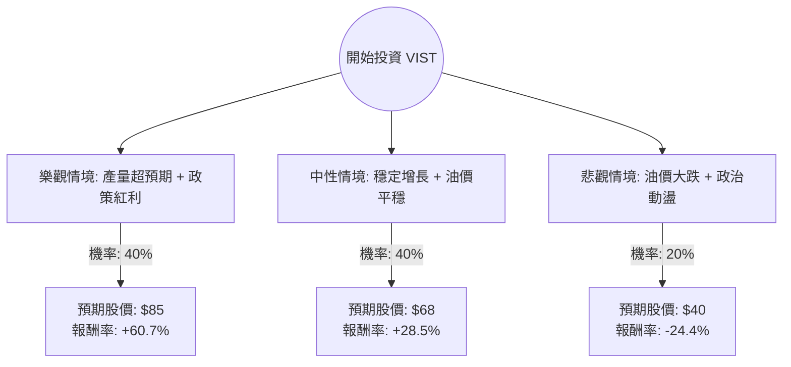

這份分析報告將結合您提供的財務數據與最新的市場動態（特別是阿根廷 Vaca Muerta 地區的開發進度與宏觀經濟環境），利用**決策樹（Decision Tree）**與**期望值分析（Expected Value Analysis）**評估 Vista Energy (VIST) 的投資價值。

---

### 一、 核心背景與市場動態分析 (Web Search Summary)

1.  **公司定位**：Vista Energy 是阿根廷第二大頁岩油生產商，核心資產位於世界級的 **Vaca Muerta** 盆地。其開採成本（Lifting Cost）極具競爭力。
2.  **宏觀環境**：阿根廷米萊（Milei）政府推動能源市場自由化，取消出口限制並逐步放開國內油價，這對 VIST 的利潤率有極大提振。
3.  **財務表現**：
    *   **低估值**：P/E 僅 7.76，相較於其高成長性（Sales Q/Q 55.76%）顯得非常便宜。
    *   **高效率**：ROE 高達 37.1%，顯示管理層資本配置能力極強。
    *   **成長動能**：公司計劃到 2026 年將產量翻倍，且目前現金流足以支撐資本支出。
4.  **主要風險**：阿根廷的匯率波動、高通膨以及國際油價（WTI）的劇烈波動。

---

### 二、 決策樹分析 (Decision Tree)

我們將未來一年的投資表現分為三種情境：**樂觀（牛市）**、**中性（基準）**與**悲觀（熊市）**。

#### 節點詳細說明：

1.  **樂觀情境 (Bull Case) - 40%**：
    *   **條件**：Vaca Muerta 基礎設施（管道）提前完工，出口量大增；阿根廷經濟改革成功；油價維持在 $80 以上。
    *   **目標價**：$85（參考分析師最高目標價並考慮溢價）。
2.  **中性情境 (Base Case) - 40%**：
    *   **條件**：公司按計畫達成產量目標；油價維持在 $70-$75；估值修復至 P/E 10x。
    *   **目標價**：$68（接近分析師平均目標價 $76.08 的保守估計）。
3.  **悲觀情境 (Bear Case) - 20%**：
    *   **條件**：全球經濟衰退導致油價跌破 $60；阿根廷政策反覆或社會動盪。
    *   **目標價**：$40（回測 52 週低點支撐位）。

---

### 三、 期望值計算 (Expected Value Analysis)

#### 1. 核心假設
*   **當前股價 (P0)**：$52.90
*   **持有期限**：12 個月
*   **報酬率計算公式**：$R = (Target Price - P0) / P0$

#### 2. 各情境報酬率計算
*   **樂觀 (R_bull)**：$(85 - 52.9) / 52.9 = +60.68\%$
*   **中性 (R_base)**：$(68 - 52.9) / 52.9 = +28.54\%$
*   **悲觀 (R_bear)**：$(40 - 52.9) / 52.9 = -24.39\%$

#### 3. 總期望報酬率 (Expected Return) 計算
$$E(R) = (P_{bull} \times R_{bull}) + (P_{base} \times R_{base}) + (P_{bear} \times R_{bear})$$
$$E(R) = (0.4 \times 60.68\%) + (0.4 \times 28.54\%) + (0.2 \times -24.39\%)$$
$$E(R) = 24.27\% + 11.42\% - 4.88\%$$
$$E(R) = \mathbf{30.81\%}$$

---

### 四、 綜合評估與最終結論

#### 1. 數據亮點分析
*   **PEG 0.69**：這是一個極其強大的買入訊號，代表股價相對於盈餘成長率被嚴重低估（通常 < 1 被視為便宜）。
*   **營收成長 (Sales Q/Q 55.76%)**：顯示公司正處於爆發式成長期。
*   **技術面**：股價位於 SMA20, 50, 200 之上，呈現多頭排列，且距離 52 週高點不遠，顯示動能強勁。

#### 2. 風險提示
*   **債務比 (Debt/Eq 1.24)**：雖然在能源產業不算極端，但仍需關注利息支出。
*   **地區風險**：阿根廷的政治環境是最大的變數，雖然目前趨向親商，但歷史波動不可忽視。

#### 3. 最終判斷：**適合投資 (Strong Buy)**

**理由：**
1.  **期望值極高**：計算出的年度期望報酬率高達 **30.81%**，遠高於標普 500 的平均回報。
2.  **安全邊際充足**：P/E 7.76 提供了強大的下行保護，即使在悲觀情境下，其核心資產 Vaca Muerta 的低成本優勢也能維持營運。
3.  **成長路徑清晰**：VIST 不僅是單純的油價波動標的，更具備「產量翻倍」的內生性成長邏輯。
4.  **分析師共識**：Recom 指數為 1.15（強烈建議買入），目標價 $76.08 顯示目前仍有約 43% 的潛在漲幅。

**建議操作：**
可在當前價位（$52.9）分批進場，若股價因阿根廷宏觀情緒回落至 $48-$50 區間可加碼。停損位可設在 $42（跌破 SMA200 且接近熊市預期）。