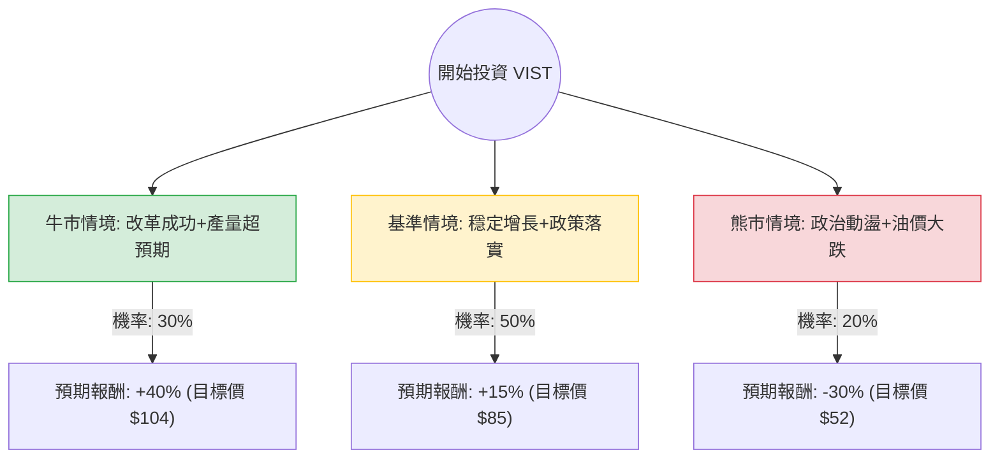

這份分析報告將針對 **Vista Energy (VIST)** 進行深入評估。VIST 是一家在阿根廷 Vaca Muerta 地區運營的獨立油氣公司。我們將結合您提供的數據與最新的市場動態（如阿根廷政治改革、產量增長預期）進行決策樹與期望值分析。

---

### 一、 核心假設與市場背景分析

在建立決策樹之前，我們基於數據與最新資訊設定以下核心假設：

1.  **宏觀政治環境（阿根廷）**：米萊（Javier Milei）政府推動的《綜合改革法案》（Omnibus Law）及 RIGI（大型投資激勵機制）對能源產業有利，預期將放寬出口限制與匯率管制。
2.  **產業趨勢（Vaca Muerta）**：該地區是全球最具競爭力的頁岩油氣田之一。VIST 的開採成本持續下降，且基礎設施（如輸油管線）正在擴張。
3.  **財務表現**：
    *   **低估值**：P/E 11.06，Forward P/E 9.69，PEG 僅 0.68，顯示相對於其高成長性，股價仍屬便宜。
    *   **高效率**：ROE 34.94% 極其強勁。
    *   **動能**：半年漲幅 100%，股價處於 52 週高點附近，技術面強勢但需防回檔。
4.  **油價波動**：假設布蘭特原油維持在 $75 - $85 美元區間。

---

### 二、 決策樹分析 (Decision Tree)

以下使用 Markdown 繪製決策樹，模擬未來一年的投資情境：

#### 決策樹節點詳細說明：

1.  **牛市情境 (Bull Case) - 30% 機率**：
    *   **條件**：阿根廷通膨受控，外匯管制完全解除；VIST 提前達成 2026 年產量目標（每日 10 萬桶）；國際油價飆升。
    *   **預期報酬**：+40%（基於 PEG 回歸 1.0 的估值修復）。
2.  **基準情境 (Base Case) - 50% 機率**：
    *   **條件**：政策穩步推進，基礎設施如期完工；公司維持目前的 EPS 增長率（預期明年 +17%）。
    *   **預期報酬**：+15%（接近分析師平均目標價 $81.25，並考慮到盈餘增長）。
3.  **熊市情境 (Bear Case) - 20% 機率**：
    *   **條件**：阿根廷社會動盪導致改革受阻；全球經濟衰退導致油價跌破 $65；高債務比（Debt/Eq 1.31）在融資受限時產生壓力。
    *   **預期報酬**：-30%（回測 SMA200 或更低支撐位）。

---

### 三、 期望值分析 (Expected Value Analysis)

#### 1. 計算過程
期望值 (EV) = Σ (各情境機率 × 各情境報酬率)

*   **牛市貢獻**：$30\% \times 40\% = 0.12$
*   **基準貢獻**：$50\% \times 15\% = 0.075$
*   **熊市貢獻**：$20\% \times (-30\%) = -0.06$

**總期望報酬率 (Total EV)** = $0.12 + 0.075 - 0.06 = \mathbf{13.5\%}$

#### 2. 風險調整後評估
雖然期望值為正（13.5%），但需注意其 **波動率**。VIST 的半年漲幅已達 100%，短期內技術指標（SMA20, 50, 200 均大幅正乖離）顯示超買風險。

---

### 四、 最終結論

**判斷：適合投資 (建議「分批買入」或「等待拉回」)**

#### 理由：
1.  **極具吸引力的估值 (PEG 0.68)**：儘管股價已翻倍，但盈餘增長速度（Sales Q/Q +54.7%）支撐了股價，目前 P/E 僅 11 倍，遠低於美股能源巨頭。
2.  **強大的營運效率**：ROE 34.9% 顯示管理層在資本配置上極為出色，且 Oper. Margin 達 30.25%，具備良好的抗風險能力。
3.  **政策紅利期**：阿根廷能源產業正處於從「管制」轉向「市場化」的轉折點，VIST 作為純度最高的 Vaca Muerta 標的，是主要受益者。
4.  **技術面警訊**：目前股價距離 SMA200 達 54.53%，短期追高風險較大。

**操作建議：**
*   **現價不宜重倉**：因期望值 13.5% 相對於其高波動性（Bear Case -30%）不算極高。
*   **策略**：建議在股價回測 **SMA20 (約 $65-$68 區間)** 時建立首筆頭寸，或採用定期定額方式參與其長期增長紅利。

---
*免責聲明：本分析僅供參考，不構成投資建議。投資者應自行承擔市場風險。*