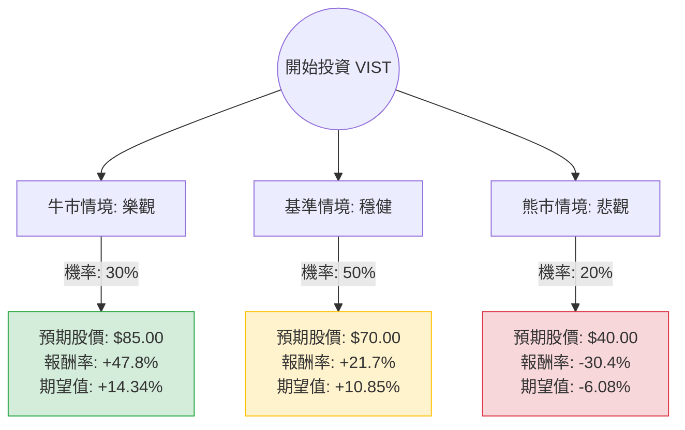

針對美股 **Vista Energy (VIST)** 的投資評估，我結合了您提供的基本面數據與最新的市場動態（包含 2024 年第三季財報表現、阿根廷宏觀環境及 Vaca Muerta 頁岩油田進展）進行分析。

---

### 一、 核心背景與市場動態分析

在進入決策樹之前，我們先彙整關鍵的外部資訊：
1.  **產量與財務強勁**：VIST 2024 Q3 總產量年增 47%，調整後 EBITDA 年增 37%。其在 Vaca Muerta 的開採效率已達世界級水準。
2.  **政策紅利**：阿根廷總統 Milei 推動的《基本法》與 RIGI（大型投資激勵機制）有利於能源出口與匯率放寬，這對 VIST 的長期現金流回流至關重要。
3.  **基礎設施建設**：Vaca Muerta Sur 油管計畫預計於 2025 年起逐步緩解運輸瓶頸，這將支撐 VIST 實現 2026 年日產 10 萬桶的目標。
4.  **風險因素**：國際油價（Brent）波動、阿根廷通膨與匯率不穩定、以及 EPS 下一年度預期下滑（-25.96%）反映了高基期後的資本支出壓力。

---

### 二、 決策樹分析 (Decision Tree)

以下決策樹基於未來 12 個月的投資預期：

---

### 三、 期望值計算與核心假設

#### 1. 核心假設
*   **當前股價 (Current Price)**: $57.50
*   **牛市情境 (Bull Case)**: 阿根廷 RIGI 政策完全落實，油價維持在 $80 以上，VIST 提前達成產量目標。給予 Forward P/E 15x（目前僅 11.8x）。
*   **基準情境 (Base Case)**: 產量符合預期，油價在 $70-$75 震盪，基礎設施建設進度正常。股價接近分析師平均目標價 $76.57，保守取 $70。
*   **熊市情境 (Bear Case)**: 國際油價跌破 $65，或阿根廷政局動盪導致資本管制加劇。股價回測 52 週低點支撐區約 $40。

#### 2. 計算過程
期望值 (EV) = $\sum (\text{Probability} \times \text{Return})$

*   **牛市節點**: $0.30 \times 47.8\% = 14.34\%$
*   **基準節點**: $0.50 \times 21.7\% = 10.85\%$
*   **熊市節點**: $0.20 \times (-30.4\%) = -6.08\%$

**總體期望報酬率 (Total Expected Return)**:
$14.34\% + 10.85\% - 6.08\% = \mathbf{19.11\%}$

---

### 四、 財務數據深度解讀 (補充基本面)

*   **估值極具吸引力**：P/E 8.39 倍，PEG 僅 0.87。這顯示市場尚未完全反映其高成長性（EPS Q/Q 達 78.53%）。
*   **營運效率極高**：ROE 37.11% 與 Profit Margin 32.74% 遠高於同業平均，顯示其在 Vaca Muerta 擁有極低的開採成本（Lifting Cost）。
*   **債務風險可控**：雖然 Debt/Eq 為 1.24，但考慮到能源產業的資本密集特性與其強勁的現金流（Oper. Margin 29.84%），財務壓力尚在安全範圍。
*   **技術面強勢**：股價位於 SMA20, 50, 200 之上，呈現多頭排列，且距離 52W High 僅差 8%，顯示動能強勁。

---

### 五、 最終結論

**判斷：適合投資 (Strong Buy / Accumulate)**

#### 理由：
1.  **正向期望值**：19.11% 的預期報酬率顯著高於市場平均風險溢酬，且基準情境與牛市情境的發生機率合計達 80%。
2.  **高成長與低估值並存**：VIST 擁有科技股般的成長速度（Sales Q/Q +55%），卻僅有傳統價值股的估值（P/E < 9）。
3.  **宏觀環境改善**：阿根廷能源出口轉型是國家級戰略，VIST 作為純度最高的 Vaca Muerta 標的，將是最大受益者。
4.  **安全邊際**：即便 EPS 明年預期下滑，其 PEG 仍低於 1，顯示股價已被過度折價。

**建議操作：**
目前股價 $57.5 接近歷史高點，建議採「分批買入」策略。若股價因國際油價波動回測 $52-$55 (SMA50 附近) 是極佳的加碼點。目標價看至 **$76 - $80**。