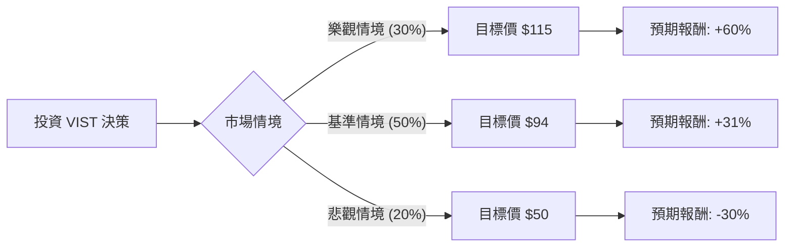

這份分析報告將結合您提供的基本面數據，以及針對 **Vista Energy (VIST)** 的最新市場動態（特別是阿根廷 Vaca Muerta 頁岩油田的進展與宏觀政治環境）進行綜合評估。

---

### 一、 核心背景與市場動態分析

在進入決策樹之前，我們先整合最新的外部資訊：
1.  **產業地位**：VIST 是阿根廷第二大頁岩油生產商，專注於 Vaca Muerta 地區。該地區被認為是全球成本最低、潛力最大的頁岩油田之一。
2.  **政治環境**：阿根廷總統米萊（Javier Milei）推動的能源去管制化（如《綜合改革法案》）對 VIST 極為有利，這將使國內油價與國際接軌，並消除出口限制。
3.  **財務表現**：數據顯示 **PEG 僅 0.38**，**Forward P/E 6.43**，且 **ROE 高達 35.26%**。這反映出市場對其高成長性尚未完全定價，或者正在反映「阿根廷國家風險溢價」。
4.  **產能擴張**：VIST 計劃到 2026 年將產量翻倍，且其營運利潤率（33.65%）與毛利率（49.36%）顯示其具備極強的成本競爭力。

---

### 二、 決策樹分析 (Decision Tree)

我們將未來一年的投資情境分為三種：**樂觀（牛市）**、**基準（中性）**、**悲觀（熊市）**。

#### 節點詳細說明：

| 節點 (情境) | 機率 (P) | 預期價格 | 預期報酬率 (R) | 期望值 (P * R) | 觸發條件 |
| :--- | :--- | :--- | :--- | :--- | :--- |
| **樂觀 (Bull)** | 30% | $115 | +60.0% | **18.0%** | 阿根廷經濟改革超預期、國際油價維持 $85+、產量提前達標。 |
| **基準 (Base)** | 50% | $94 | +30.8% | **15.4%** | 達到分析師平均目標價、政策穩健推進、油價維持 $75-$80。 |
| **悲觀 (Bear)** | 20% | $50 | -30.4% | **-6.1%** | 全球衰退導致油價崩跌、阿根廷政局動盪、基礎設施建設延宕。 |
| **總計** | **100%** | - | - | **27.3%** | **加權平均期望報酬率** |

---

### 三、 期望值分析與計算過程

#### 1. 核心假設
*   **現價 (Current Price)**: $71.85
*   **樂觀目標 ($115)**: 基於 Forward P/E 從 6.4x 修復至 10x（行業平均），加上產量 20% 的增長。
*   **基準目標 ($94)**: 參考數據中的 Target Price，反映目前分析師的共識預期。
*   **悲觀目標 ($50)**: 考慮到阿根廷歷史性的匯率風險與油價回落至 $60 以下的極端情況。

#### 2. 期望值 (Expected Value, EV) 計算
$$EV = (P_{Bull} \times R_{Bull}) + (P_{Base} \times R_{Base}) + (P_{Bear} \times R_{Bear})$$
$$EV = (0.30 \times 0.60) + (0.50 \times 0.308) + (0.20 \times -0.304)$$
$$EV = 0.18 + 0.154 - 0.0608 = 0.2732$$

**計算結果：預期年度報酬率為 27.32%**

---

### 四、 綜合基本面評估

*   **估值極低**：PEG 0.38 顯示該股被嚴重低估。通常 PEG < 1 被視為便宜，0.38 屬於極度低估區間。
*   **成長動能強勁**：Sales Q/Q 成長 98.96%，EPS Q/Q 成長 20.02%，顯示公司正處於爆發式成長期。
*   **財務結構**：Debt/Eq 1.45 雖然稍高，但對於資本密集型的能源業來說尚在可控範圍，且其 ROE (35.26%) 遠高於資金成本。
*   **技術面**：股價位於 SMA200 之上 (+32.87%)，顯示長期趨勢向上，但短期 SMA20 為 -1.67%，顯示目前處於高檔震盪或小幅回檔，是較好的切入點。

---

### 五、 最終結論

**判斷：適合投資 (Strong Buy / Overweight)**

#### 理由：
1.  **正向期望值高**：27.32% 的預期報酬率遠高於標普 500 的歷史平均，且即便在悲觀情境下，其強大的現金流與低廉的開採成本也能提供一定的下行保護。
2.  **稀缺的成長性**：在能源板塊中，很少有公司能同時擁有 50% 左右的毛利率與近 100% 的營收增長。
3.  **政策紅利**：阿根廷能源市場的「正常化」是 VIST 估值修復的最大催化劑（Catalyst）。
4.  **風險提示**：主要的風險在於**阿根廷的宏觀政治風險**與**國際油價波動**。建議投資者將此標的視為「高成長、高波動」配置，佔投資組合比例不宜過高，並設定分批進場策略。

**建議操作：**
目前股價 $71.85 接近 52 週高點，但考慮到 Forward P/E 僅 6.4 倍，建議在 $68 - $72 區間分批建倉，首波目標價看 $94。