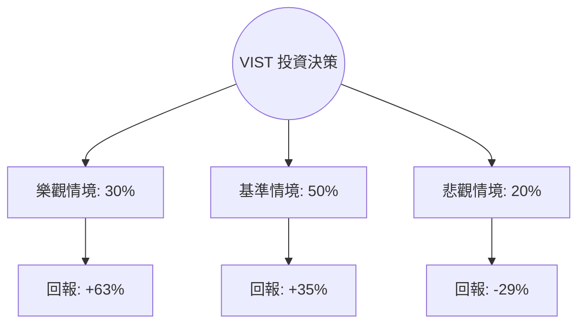

# VIST (Vista Energy) 量化投資分析報告

作為量化投資分析師，針對 **Vista Energy (VIST)** 的評估核心在於其作為阿根廷 Vaca Muerta（死牛）頁岩油田最純粹、效率最高的標的，如何在全球能源價格波動與阿根廷宏觀政經轉型中取得平衡。以下是基於概率思考的深度分析。

---

### 1. 核心驅動因素與風險 (Drivers & Risks)

#### **關鍵催化劑 (Catalysts)**
1.  **Vaca Muerta 產能釋放與基礎設施改善**：VIST 的核心資產位於全球第二大頁岩氣和第四大頁岩油儲量區。隨著 Oldelval 管道擴建工程（Duplicar 項目）分階段完工，出口瓶頸將大幅緩解，預計 2025-2026 年日產量將從目前的約 7 萬桶油當量 (boe/d) 邁向 10 萬桶目標。
2.  **阿根廷能源市場去管制化 (RIGI 制度)**：米萊 (Milei) 政府推動的《基本法》及 RIGI 投資獎勵制度，旨在實現國內油價與國際接軌（Export Parity）。若資本管制（CEPO）進一步放寬，將大幅降低 VIST 的資金成本並提升估值倍數。
3.  **極低的開採成本與高利潤率**：VIST 的舉升成本 (Lifting Cost) 持續下降（約 $4.5/boe），使其在布蘭特原油價格即使跌至 $60 時仍能保持強勁的正向現金流。

#### **主要風險點 (Risks)**
1.  **宏觀政治風險**：阿根廷通膨壓力與社會動盪可能阻礙改革進程。若外匯管制取消進度不如預期，資金匯回受阻將壓制 ADR 表現。
2.  **大宗商品價格波動**：作為純 E&P（勘探與生產）公司，VIST 對布蘭特原油價格高度敏感。全球經濟衰退導致的油價暴跌是主要下行風險。
3.  **資本支出壓力**：為達成 2026 目標，公司需維持高額 Capex，這解釋了目前 P/FCF 較高的原因（約 89.88），若融資環境惡化將影響擴張進度。

---

### 2. 情境設定與機率賦予 (Scenario Modeling)

基於未來 12 個月的展望，設定以下三種互斥且窮盡 (MECE) 的情境：

#### **樂觀情境 (Bull Case)**
*   **發生條件**：阿根廷成功取消外匯管制；布蘭特原油維持在 $85 以上；公司產量增速超預期，提前達成 8.5 萬 boe/d。
*   **預估機率**：**30%**
*   **目標價格與預期回報**：**$115 (+63%)**。基於 Forward P/E 擴張至 10x（接軌美股同行）及 EPS 增長。

#### **基準情境 (Base Case)**
*   **發生條件**：政策改革穩步推進但仍有摩擦；油價維持在 $70-$80 區間；基礎設施按計劃完工。
*   **預估機率**：**50%**
*   **目標價格與預期回報**：**$95 (+35%)**。接近分析師平均目標價，反映產量增長與現有估值修復。

#### **悲觀情境 (Bear Case)**
*   **發生條件**：阿根廷改革受阻或政局逆轉；全球衰退導致油價跌破 $60；發生重大地緣政治風險導致資本流出新興市場。
*   **預估機率**：**20%**
*   **目標價格與預期回報**：**$50 (-29%)**。回測 200 日均線支撐位，估值回落至歷史低位 P/E 5-6x。

---

### 3. 期望值計算與決策樹 (EV Calculation & Decision Tree)

#### **決策樹結構**

```mermaid
graph TD
    Start((VIST 投資決策)) --> Bull[樂觀情境: 30%]
    Start --> Base[基準情境: 50%]
    Start --> Bear[悲觀情境: 20%]
    
    Bull --> BullRet[回報: +63%]
    Base --> BaseRet[回報: +35%]
    Bear --> BearRet[回報: -29%]
```

#### **總期望值計算**
*   **EV** = (0.30 * 0.63) + (0.50 * 0.35) + (0.20 * -0.29)
*   **EV** = 0.189 + 0.175 - 0.058 = **30.6%**

#### **風險回報比分析**
*   **上行潛力 (Upside)**：平均約 +45% (Bull & Base 加權)
*   **下行空間 (Downside)**：-29%
*   **風險回報比**：1 : 1.55。期望值為正且高達 30.6%，顯示該標的具備極佳的數學贏面。

---

### 4. 決策總結 (Decision Summary)

| 情境 | 發生機率 (%) | 預期報酬率 (%) | 關鍵驅動/觸發因素 |
| :--- | :--- | :--- | :--- |
| **樂觀 (Bull)** | 30% | +63% | 外匯管制取消、油價 >$85、產量超預期 |
| **基準 (Base)** | 50% | +35% | 政策穩步推進、油價 $75 左右、基礎設施達標 |
| **悲觀 (Bear)** | 20% | -29% | 改革失敗、油價 <$60、宏觀系統性風險 |
| **整體期望值** | **100%** | **+30.6%** | **加權平均預期回報** |

**最終結論：**
1. **投資建議**：**強烈買入 (Strong Buy)**
2. **核心逻辑**：VIST 目前的 PEG 僅為 0.4，Forward P/E 7.09x，嚴重低估了其 30% 以上的 ROE 與近 100% 的營收增速。即便考慮到阿根廷的國家風險溢價，其正向期望值 (30.6%) 遠高於市場平均水平，且下行風險受限於極低的生產成本。
3. **風控建議**：若布蘭特原油收盤連續三天跌破 $65，或阿根廷政府出現重大違約/政策倒退訊號，應觸發減碼。技術面上，若股價跌破 $58 (SMA200 附近) 則視為悲觀情境確認，應執行止損。

【結束指令】