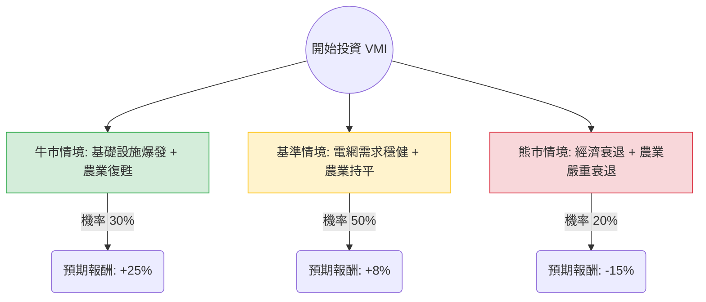

這份分析報告將針對 **Valmont Industries (VMI)** 進行深入評估。VMI 是一家全球領先的基礎設施與農業設備製造商，主要業務涵蓋電力傳輸結構（電線桿）、照明與交通桿件，以及農業灌溉系統（Valley 品牌）。

以下結合您提供的數據與最新的市場動態（包含基礎設施法案影響、農業週期與近期財報表現）進行決策樹與期望值分析。

---

### 一、 核心假設與市場背景分析

在建立決策樹前，我們基於以下關鍵因素設定假設：

1.  **基礎設施需求（利多）**：美國《基礎設施投資與就業法案》(IIJA) 持續發酵，電網現代化與 5G 基礎設施對 VMI 的鋼結構產品有強勁需求。
2.  **農業週期（中性偏空）**：全球農民淨收入預期下降，可能壓抑大型灌溉設備的資本支出，但國際市場（如巴西、中東）的增長可能抵消部分美國本土的疲軟。
3.  **財務估值**：目前 P/E 約 28.6 倍，Forward P/E 降至 20.3 倍，顯示市場預期明年盈利將顯著增長（EPS next Y 預期增長 11.3%）。
4.  **技術面**：股價近期表現極強（月漲幅 25%），目前處於 52 週高點附近，SMA20/50/200 均呈現多頭排列，但也面臨超買回檔風險。

---

### 二、 決策樹分析圖 (Decision Tree)

我們預測未來 12 個月的投資回報情境：

#### 節點詳細說明：

1.  **牛市情境 (Optimistic Case) - 30% 機率**
    *   **條件**：電網更新速度超預期，且聯準會降息刺激農業貸款，帶動灌溉設備需求回升。
    *   **預期報酬**：+25%（目標價約 $633）。
2.  **基準情境 (Base Case) - 50% 機率**
    *   **條件**：基礎設施訂單穩健，抵消農業部門的緩慢增長。公司維持目前的利潤率（Gross Margin 30%）。
    *   **預期報酬**：+8%（目標價約 $547，略高於分析師平均目標價 $527）。
3.  **熊市情境 (Pessimistic Case) - 20% 機率**
    *   **條件**：全球經濟硬著陸，政府基礎設施支出縮減，且大宗商品價格下跌導致農民停止投資。
    *   **預期報酬**：-15%（股價回測 SMA200 支撐位，約 $430）。

---

### 三、 期望值分析 (Expected Value Analysis)

#### 1. 計算過程
期望值 (EV) = Σ (各情境機率 × 各情境報酬率)

*   **牛市貢獻**：$30\% \times 25\% = 7.5\%$
*   **基準貢獻**：$50\% \times 8\% = 4.0\%$
*   **熊市貢獻**：$20\% \times (-15\%) = -3.0\%$

**總期望報酬率 (Total EV) = 7.5% + 4.0% - 3.0% = 8.5%**

#### 2. 風險調整後評估
*   **目前股價**：$506.75
*   **預期一年後股價**：$506.75 \times (1 + 8.5\%) \approx \$549.82$
*   **股息收益**：0.55%
*   **總預期回報**：**9.05%**

---

### 四、 最終結論

#### **判斷：適合投資 (但建議分批買入或等待回調)**

**理由如下：**

1.  **基本面強韌**：ROE 高達 21.46%，且債務結構合理（Debt/Eq 0.55），顯示公司具備良好的資本配置能力與抗風險能力。
2.  **產業趨勢利多**：VMI 處於「電網現代化」的核心賽道。隨著 AI 數據中心對電力需求的激增，輸電基礎設施的長期需求具有高度確定性。
3.  **估值尚屬合理**：雖然短期漲幅較大，但 Forward P/E 20.32 倍相對於其在工業板塊的領導地位並不極端，PEG 1.38 顯示股價增長與盈利增長基本匹配。
4.  **期望值為正**：9.05% 的預期總回報雖然不算極高，但在工業股中屬於穩健表現，且下行風險（熊市機率）相對受控。

**投資建議：**
由於 VMI 目前股價極度接近 52 週高點（僅差 2.4%），且短期內 Perf Month 達 25%，技術面上存在**超買壓力**。
*   **進場策略**：不建議在目前價位一次性梭哈。建議在股價回調至 **$480 - $490**（接近 SMA20 支撐）時分批佈局。
*   **監控指標**：需密切關注未來一季的「農業部門營收」是否止跌回升，以及美國政府基礎設施撥款的實際落地速度。