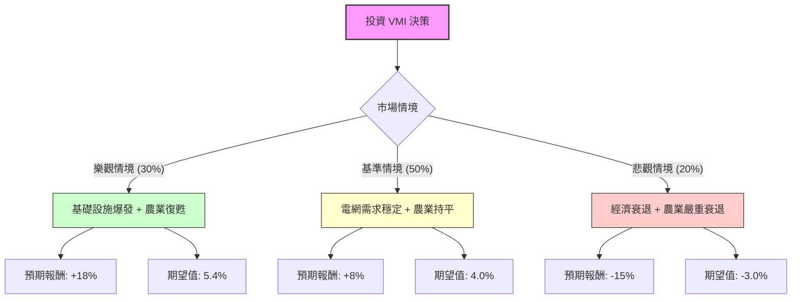

這份分析報告將結合您提供的基本面數據，以及針對 **Valmont Industries (VMI)** 的最新市場動態（基礎設施法案、農業週期、電網更新需求）進行綜合評估。

---

### 一、 核心背景與市場動態分析

在進入決策樹之前，我們先梳理影響 VMI 股價的關鍵因素：

1.  **基礎設施業務（利多）**：VMI 是電力傳輸塔、照明和通訊桿塔的領導者。美國《基礎設施投資與就業法案》(IIJA) 的資金正持續撥付，加上全美電網現代化與再生能源併網需求，為其提供長期穩定的訂單。
2.  **農業業務（中性偏弱）**：VMI 的 Valley 品牌在灌溉系統市佔率極高。然而，目前全球大宗商品價格（玉米、大豆）回落，導致農民淨收入預期下降，短期內可能壓抑灌溉設備的資本支出。
3.  **財務體質（強勁）**：
    *   **Forward P/E (18.66)** 遠低於 **Trailing P/E (27.89)**，顯示市場預期明年盈利將大幅增長。
    *   **ROE (20.41%)** 表現優異，顯示管理層資本運用效率高。
    *   **Debt/Eq (0.57)** 處於健康水平，具備抗風險能力。

---

### 二、 決策樹分析 (Decision Tree)

我們將未來一年的投資情境分為三種：**樂觀（牛市）**、**基準（平穩）**、**悲觀（熊市）**。

#### 決策樹節點詳細說明：

1.  **樂觀情境 (Probability: 30%)**：
    *   **假設**：美國電網更新速度超預期，且國際農業市場（如巴西、埃及）訂單抵消美國本土疲軟。
    *   **預期報酬**：股價挑戰 $545 (約 +18%)。
2.  **基準情境 (Probability: 50%)**：
    *   **假設**：基礎設施業務維持 5-8% 增長，農業業務小幅下滑但利潤率因成本控制而改善。
    *   **預期報酬**：股價達到分析師平均目標價 $500 (約 +8%)。
3.  **悲觀情境 (Probability: 20%)**：
    *   **假設**：高利率環境持續更久壓抑公共建設預算，且農產品價格崩跌導致灌溉設備需求凍結。
    *   **預期報酬**：股價回測支撐位 $393 (約 -15%)。

---

### 三、 期望值分析 (Expected Value Analysis) 計算過程

#### 1. 核心假設
*   **當前股價 ($P_0$)**：$463.12
*   **目標價參考**：分析師平均目標價 $490.25，52週高點 $487.58。
*   **盈利增長**：參考數據中 EPS next Y 增長 10.92%，Forward P/E 18.66 倍屬合理區間。

#### 2. 計算公式
$$EV = \sum (Probability_i \times Return_i)$$

#### 3. 計算步驟
*   **樂觀節點**：$0.30 \times 18\% = 5.4\%$
*   **基準節點**：$0.50 \times 8\% = 4.0\%$
*   **悲觀節點**：$0.20 \times (-15\%) = -3.0\%$

**總期望報酬率 (Total EV)**：
$$5.4\% + 4.0\% - 3.0\% = 6.4\%$$

---

### 四、 綜合評估與最終結論

#### 1. 財務數據亮點與隱憂
*   **亮點**：VMI 的 **PEG 為 1.4**，對於一家具有護城河的工業龍頭來說，估值尚屬合理。**Quick Ratio (1.58)** 與 **Current Ratio (2.35)** 顯示流動性極佳，無短期債務風險。
*   **隱憂**：**P/B (5.58)** 偏高，且股價目前距離 52 週高點僅差約 6.8%，短期內向上突破的動能需要更強勁的財報催化。

#### 2. 最終判斷：**適合投資 (建議：分批買入 / 逢低佈局)**

#### 3. 判斷理由：
1.  **正向期望值**：計算出的 6.4% 期望報酬率雖然不算極高，但在當前高波動市場中，VMI 作為具有「防禦性成長」特質的工業股，其風險回報比（Risk-Reward Ratio）是合理的。
2.  **政策紅利支撐**：VMI 的核心增長引擎（電網基礎設施）受宏觀經濟波動影響較小，具有高度的營收確定性。
3.  **估值修復空間**：Forward P/E 顯著低於當前 P/E，顯示隨著未來一年 EPS 的實現，股價具備自然推升的動力。
4.  **技術面參考**：目前股價高於 SMA200 (18.22%)，顯示長期趨勢向上，但近期 SMA20 (-1.15%) 顯示短期有小幅回檔，這反而提供了較好的進場點。

**建議操作策略**：
由於目前股價接近 52 週高點且農業部門仍有不確定性，不建議一次性重倉。建議在 **$440 - $455** 區間分批建立頭寸，長期持有以獲取基礎設施轉型帶來的紅利。