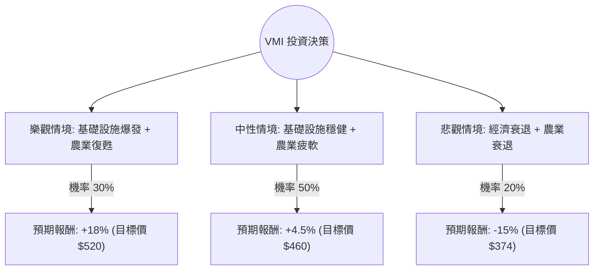

這份分析報告將結合您提供的 **Valmont Industries (VMI)** 基本面數據，以及最新的市場動態（包含 2024 年財報預期、基礎設施法案影響及農業市場趨勢），透過**決策樹分析**與**期望值分析**評估其投資價值。

---

### 一、 市場動態與核心假設 (Market & Industry Analysis)

在進入計算前，根據最新資訊整理以下核心背景：

1.  **基礎設施段 (Infrastructure) - 利多**：
    *   受益於美國《基礎設施投資與就業法案》(IIJA)，電網現代化、電信塔與交通設施需求強勁。
    *   能源轉型帶動輸電線路需求，VMI 在此領域具有領導地位。
2.  **農業段 (Agriculture) - 挑戰**：
    *   2024 年美國淨農場收入預計下降，這會抑制農民對灌溉設備（Valley Irrigation）的資本支出。
    *   國際市場（如巴西）需求波動較大。
3.  **財務狀況**：
    *   **估值**：目前 P/E 37.87 偏高，但 Forward P/E 20.63 顯示市場預期未來獲利將大幅改善。
    *   **動能**：股價接近 52 週高點（-1.79%），技術面呈現強勢多頭（SMA200 +19.9%）。

---

### 二、 決策樹分析 (Decision Tree Analysis)

我們以未來一年的投資回報為目標，設定三種情境：**樂觀（牛市）**、**中性（基準）**、**悲觀（熊市）**。

#### 決策樹節點詳細說明：

| 情境 | 機率 (P) | 預期報酬 (R) | 說明 |
| :--- | :--- | :--- | :--- |
| **樂觀 (Bull)** | 30% | +18% | 電網更新需求超預期，且農業部門因糧價回升提前復甦。估值維持高位。 |
| **中性 (Base)** | 50% | +4.5% | 基礎設施抵銷農業疲軟。股價達到分析師平均目標價 ($459.25)。 |
| **悲觀 (Bear)** | 20% | -15% | 高利率持續壓抑公用事業支出，農業收入大幅下滑，股價回測 SMA200 支撐。 |

---

### 三、 期望值計算 (Expected Value Calculation)

#### 1. 計算公式：
$EV = (P_{Bull} \times R_{Bull}) + (P_{Base} \times R_{Base}) + (P_{Bear} \times R_{Bear})$

#### 2. 計算過程：
*   **樂觀貢獻**：$0.30 \times 18\% = 5.4\%$
*   **中性貢獻**：$0.50 \times 4.5\% = 2.25\%$
*   **悲觀貢獻**：$0.20 \times (-15\%) = -3.0\%$

**總期望報酬率 (Total EV) = 5.4% + 2.25% - 3.0% = 4.65%**

#### 3. 核心假設：
*   **折現率/機會成本**：目前無風險利率（美債 10 年期）約 4.2% - 4.5%。
*   **估值修復**：假設 Forward P/E 20.63 能如期兌現，代表 EPS 需增長約 11.39%（與數據相符）。
*   **安全邊際**：目前股價 $440 距離目標價 $459 僅剩約 4.3% 空間，安全邊際較窄。

---

### 四、 最終結論

#### **判斷：短期「不適合」立即追高投資 / 長期「觀望」**

**理由如下：**

1.  **期望值吸引力不足**：
    計算出的期望報酬率為 **4.65%**，僅略高於或等於目前的無風險利率（美債收益率）。在承擔股市波動風險的情況下，此報酬率不具備足夠的風險補償（Risk Premium）。
2.  **估值處於高位**：
    股價已反映大部分利多（接近 52 週高點），且 P/E 達 37.87。雖然 Forward P/E 較低，但這建立在「未來一年 EPS 增長」的假設上，容錯率低。
3.  **農業部門拖累**：
    儘管基礎設施強勁，但 VMI 的農業灌溉業務正處於週期性低谷，這將限制股價短期內的爆發力。
4.  **技術面風險**：
    股價距離 SMA200（200日均線）高出近 20%，短期內存在回調修正乖離率的壓力。

**建議操作：**
*   **空手者**：建議等待股價回落至 $400 - $410 區間（增加安全邊際），或待農業部門出現明確復甦信號後再行介入。
*   **持股者**：目前趨勢仍向上（SMA20/50/200 多頭排列），可繼續持有，但建議將止盈/止損位設在 $420 附近以保護利潤。

---
*免責聲明：以上分析僅供參考，不構成任何投資建議。投資者應自行承擔市場風險。*