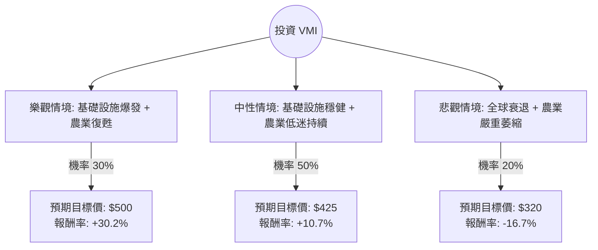

這份報告針對 **Valmont Industries (VMI)** 進行深入分析。VMI 是一家全球領先的基礎設施（電力、交通、無線通訊）與農業灌溉設備供應商。

透過結合您提供的財務數據與最新的市場動態（包含 2024 年第三季財報與產業趨勢），我將使用**決策樹分析**與**期望值分析**來評估其投資價值。

---

### 1. 核心假設與市場背景分析

在建立決策樹之前，我們必須基於現狀設定核心假設：

*   **基礎設施業務（利多）：** 受惠於美國《基礎設施投資和就業法案》(IIJA) 以及全球電網現代化需求，VMI 的電桿與通訊塔需求強勁。
*   **農業業務（利空/挑戰）：** 由於大宗商品價格下跌導致農民淨收入下降，灌溉設備（Valley 品牌）需求目前處於週期性低迷。
*   **財務狀況：** Forward P/E 僅 16.06，低於歷史均值；ROE 高達 21.09%，顯示管理層資本利用效率極高。
*   **技術面：** 目前股價（$384）低於 52 週高點約 20%，且 SMA20/50/200 均呈現負值，顯示短期處於修正波段，但這也可能提供價值投資的切入點。

---

### 2. 決策樹分析 (Decision Tree)

我們將未來一年的表現分為三種情境：**樂觀（牛市）**、**中性（基準）**、**悲觀（熊市）**。

#### 節點詳細說明：

1.  **樂觀情境 (30%)：**
    *   **條件：** 美國電網更新速度加快，且 2025 年農產品價格回升帶動灌溉設備需求。
    *   **預期股價：** $500 (接近分析師目標價 $490.25 並考慮溢價)。
    *   **期望值貢獻：** $500 \times 0.3 = 150$

2.  **中性情境 (50%)：**
    *   **條件：** 基礎設施訂單抵消了農業部門的疲軟。公司維持 EPS 增長，執行庫藏股計畫。
    *   **預期股價：** $425 (回歸至 Forward P/E 18-19 倍的合理估值)。
    *   **期望值貢獻：** $425 \times 0.5 = 212.5$

3.  **悲觀情境 (20%)：**
    *   **條件：** 高利率環境持續更久壓抑公共建設預算，且農業週期進入深度衰退。
    *   **預期股價：** $320 (回測 52 週低點支撐區)。
    *   **期望值貢獻：** $320 \times 0.2 = 64$

---

### 3. 期望值分析 (Expected Value Analysis) 計算過程

根據上述決策樹，我們計算 VMI 一年後的**預期股價 (Expected Price)**：

$$E(P) = (P_{Bull} \times Prob_{Bull}) + (P_{Base} \times Prob_{Base}) + (P_{Bear} \times Prob_{Bear})$$

*   **計算：**
    *   $E(P) = (500 \times 0.3) + (425 \times 0.5) + (320 \times 0.2)$
    *   $E(P) = 150 + 212.5 + 64 = \mathbf{426.5}$

*   **預期報酬率計算：**
    *   當前股價 ($P_0$) = $384.03
    *   預期報酬率 = $(426.5 - 384.03) / 384.03 \approx \mathbf{11.06\%}$
    *   加上股息收益率 (Dividend Yield) = $0.72\%$
    *   **總預期年化報酬率 $\approx 11.78\%$**

---

### 4. 綜合評估與最終結論

#### 數據亮點總結：
*   **估值吸引力：** Forward P/E 16.06 倍對於一家擁有護城河且 ROE > 20% 的工業股來說非常具吸引力。
*   **成長動能：** EPS Q/Q 增長 135.47%，顯示公司成本控制與產品組合優化（Infrastructure 佔比提升）極為成功。
*   **風險控管：** 債務股本比 (Debt/Eq) 0.58 處於健康水平，流動比率 2.35 顯示短期無財務壓力。

#### 最終判斷：**適合投資 (Buy / Accumulate)**

#### 理由：
1.  **正向期望值：** 經過機率加權後的預期報酬率約為 **11.78%**，優於長期市場平均，且下行風險（悲觀情境）相對可控。
2.  **安全邊際：** 目前股價 $384 距離分析師平均目標價 $490 有約 27% 的上漲空間。即便在農業部門疲軟的情況下，基礎設施的剛性需求為股價提供了強大的底部支撐。
3.  **技術面切入點：** 雖然 SMA 指標顯示短期走勢偏弱，但這正是價值投資者分批進場的良機，因為基本面（EPS 增長與高 ROE）並未惡化。

**建議策略：**
建議在 $370 - $385 區間分批建倉。若農業部門在 2025 年上半年出現復甦訊號，該股具備挑戰 $500 大關的潛力。