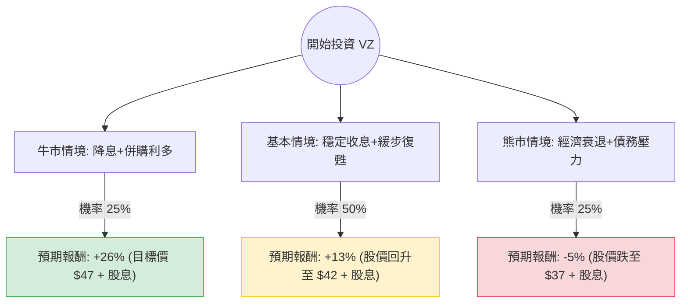

這份分析報告將結合您提供的基本面數據與最新的市場動態（如：收購 Frontier Communications、聯準會降息預期、5G 市場競爭），利用**決策樹（Decision Tree）**與**期望值分析（Expected Value Analysis）**評估 Verizon (VZ) 的投資價值。

---

### 一、 核心假設與市場背景分析

在建立決策樹前，我們先定義影響 VZ 未來 12 個月表現的核心變數：

1.  **宏觀環境（利率）**：VZ 債務負擔重（Debt/Eq 1.62），且作為高股息股，對利率極其敏感。聯準會（Fed）進入降息週期將降低其利息支出並提升股息吸引力。
2.  **企業併購（Frontier 收購案）**：VZ 宣佈以 200 億美元收購 Frontier，旨在強化光纖寬頻佈局。短期內會增加債務壓力，長期則看好固網與行動網路的綜效。
3.  **營運表現**：ARPU（每用戶平均收入）的增長與 5G 商業化進度。目前 EPS 增長緩慢（EPS next Y 1.45%），屬於典型的價值/收息股。

---

### 二、 決策樹分析圖 (Decision Tree)

我們以「未來一年的總報酬（股價變動 + 股息收益）」作為評估指標。

#### 節點詳細說明：

| 情境 | 機率 (P) | 預期股價變動 | 股息收益 | 總報酬 (R) | 期望值 (P * R) |
| :--- | :--- | :--- | :--- | :--- | :--- |
| **牛市 (Bull)** | 25% | +19.3% (達目標價 $47.17) | 6.9% | +26.2% | **6.55%** |
| **基本 (Base)** | 50% | +6.3% (回升至 $42.00) | 6.9% | +13.2% | **6.60%** |
| **熊市 (Bear)** | 25% | -11.9% (回測 $34.80) | 6.9% | -5.0% | **-1.25%** |
| **總計** | **100%** | - | - | - | **11.90%** |

---

### 三、 期望值計算過程與邏輯

#### 1. 期望值 (Expected Value, EV) 計算：
$$EV = (0.25 \times 26.2\%) + (0.50 \times 13.2\%) + (0.25 \times -5.0\%)$$
$$EV = 6.55\% + 6.60\% - 1.25\% = \mathbf{11.90\%}$$

#### 2. 核心假設邏輯：
*   **牛市情境 (25%)**：Fed 降息幅度超預期，資金流向高殖利率藍籌股。Frontier 收購案被市場視為擴張利多而非債務負擔，股價衝向分析師目標價 $47.17。
*   **基本情境 (50%)**：VZ 維持穩定的現金流與派息。雖然增長緩慢（PEG 3.0 偏高），但低本益比（P/E 8.42）提供安全邊際。股價隨大盤溫和修復至 $42 附近。
*   **熊市情境 (25%)**：高利率維持時間長於預期，或收購 Frontier 導致信用評等面臨壓力。競爭對手（T-Mobile）持續侵蝕市佔率，股價回測 2023 年低點。

---

### 四、 基本面數據補充分析

*   **估值優勢**：P/E 8.42 遠低於標普 500 平均，且 P/FCF（股價自由現金流比）僅 7.89，顯示其派發 6.9% 股息的壓力不大，現金流極其強健。
*   **財務風險**：Debt/Eq 1.62 與 Quick Ratio 0.64 顯示短期流動性偏緊，這是電信業的通病，但在高息環境下仍是主要風險點。
*   **技術面**：目前股價低於 SMA20, 50, 200，顯示短期趨勢偏弱，正處於築底或下行階段，適合分批佈局而非追高。

---

### 五、 最終結論

**判斷：適合投資 (適合「收息型」與「價值型」投資者)**

#### 理由：
1.  **正向期望值**：計算出的年度預期報酬率為 **11.9%**，優於許多固定收益產品，且具備股價回升的潛力。
2.  **強大的股息護城河**：6.9% 的股息率提供了極高的容錯空間。即便股價平盤，投資者仍能獲得優於通膨的收益。
3.  **降息週期利多**：隨著通膨放緩，利率下行是大概率事件，這將直接減輕 VZ 的利息負擔並推升其估值。
4.  **戰略擴張**：收購 Frontier 雖然短期增加債務，但補齊了 VZ 在光纖寬頻（Fiber）的短板，有利於與 T-Mobile 競爭全套網路服務。

**建議操作：**
由於技術指標（SMA）顯示目前處於弱勢，建議採取**分批買入（Dollar Cost Averaging）**策略，重點關注 $38.5 - $39.5 的支撐區間。此標的不適合追求短期翻倍的投資者，但非常適合尋求穩定現金流與低估值修復的長期股東。