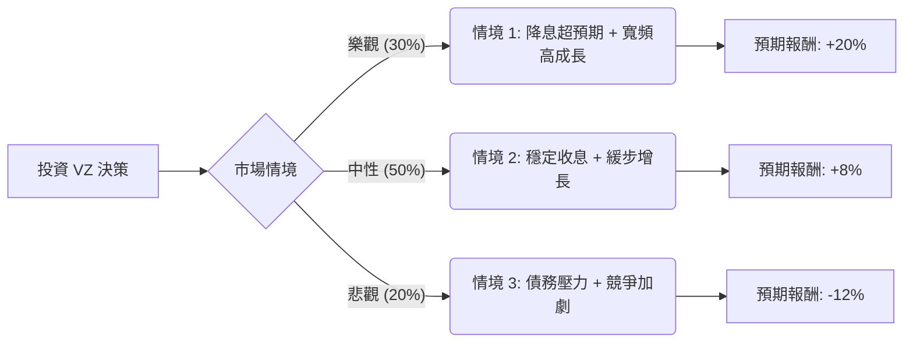

這份分析報告將結合您提供的基本面數據，以及最新的市場動態（包含 2024 年第三季財報表現、Frontier 收購案、以及聯準會降息循環的影響），利用**決策樹（Decision Tree）**與**期望值分析（Expected Value Analysis）**來評估 Verizon (VZ) 的投資價值。

---

### 一、 核心背景與市場動態分析

在進入決策樹之前，我們先彙整關鍵資訊：

1.  **最新財報表現 (Q3 2024)**：
    *   **亮點**：無線服務收入增長，寬頻用戶（尤其是固定無線接入 FWA）持續強勁增長。
    *   **隱憂**：總營收略低於市場預期，且設備收入下降。
2.  **重大收購案**：Verizon 宣布以 200 億美元收購 Frontier Communications，旨在強化光纖網路佈局，與 T-Mobile 和 AT&T 競爭。這將短期內增加債務壓力，但長期有助於收斂流失的寬頻用戶。
3.  **宏觀環境**：聯準會進入降息週期。VZ 作為高股息（5.53%）且高負債（Debt/Eq 1.74）的公司，通常會受益於降息（借貸成本下降、股息吸引力上升）。
4.  **估值**：目前 P/E 12.2，Forward P/E 9.5，處於歷史低位區間，顯示股價相對便宜。

---

### 二、 決策樹分析 (Decision Tree)

我們將未來一年的投資情境分為三種：**樂觀（Bull）**、**中性（Base）**、**悲觀（Bear）**。

#### 節點詳細說明：

| 節點 (情境) | 機率 (P) | 預期報酬 (R) | 說明 |
| :--- | :--- | :--- | :--- |
| **樂觀 (Bull Case)** | 30% | **+20%** | 降息速度快，Frontier 整合順利，FWA 用戶爆發，股價回升至 $60 附近。 |
| **中性 (Base Case)** | 50% | **+8%** | 股息維持 (5.5%) + 股價微幅上漲 (2.5%)。符合分析師目標價 $49.98。 |
| **悲觀 (Bear Case)** | 20% | **-12%** | 收購案導致負債比過高，無線市場價格戰，股價回測 $44 支撐。 |

---

### 三、 期望值計算過程 (Expected Value Calculation)

#### 1. 核心假設：
*   **持有期間**：1 年。
*   **總報酬計算**：包含「資本利得（股價漲跌）」與「股息收益（約 5.5%）」。
*   **當前股價**：$49.86。
*   **分析師目標價**：$49.98（顯示市場目前認為股價已接近合理價值，但未充分計入降息利多）。

#### 2. 計算公式：
$$EV = (P_{Bull} \times R_{Bull}) + (P_{Base} \times R_{Base}) + (P_{Bear} \times R_{Bear})$$

#### 3. 計算步驟：
*   **樂觀貢獻**：$0.30 \times 20\% = 6.0\%$
*   **中性貢獻**：$0.50 \times 8\% = 4.0\%$
*   **悲觀貢獻**：$0.20 \times (-12\%) = -2.4\%$

**總期望報酬率 (Total Expected Return) = 6.0% + 4.0% - 2.4% = 7.6%**

---

### 四、 綜合評估與最終結論

#### 1. 數據解讀：
*   **期望值 (7.6%)**：雖然 7.6% 的預期報酬不算極高，但考慮到 VZ 的低波動性與 5.5% 的穩定現金流（股息），這對於追求穩健收益的投資者具有吸引力。
*   **財務健康度**：Debt/Eq 1.74 確實偏高，但其 Oper. Margin (22.75%) 與 Profit Margin (12.43%) 顯示其獲利能力足以支撐利息支出。
*   **技術面**：目前股價接近 52 週高點，且 SMA20/50/200 均呈現多頭排列，顯示短期動能強勁。

#### 2. 最終結論：**適合投資 (適合穩健型/領息族)**

**理由：**
1.  **降息紅利**：VZ 作為典型的債券替代品，在降息循環中具備估值修復的潛力。
2.  **高股息護城河**：5.5% 的股息率在當前市場仍具競爭力，且配息紀錄穩定。
3.  **估值安全邊際**：Forward P/E 僅 9.5 倍，遠低於標普 500 平均水平，下行風險相對受控。
4.  **轉型契機**：收購 Frontier 雖然短期增加債務，但補齊了光纖短板，有利於長期與 T-Mobile 競爭。

**建議操作：**
由於目前股價已接近分析師目標價 ($49.98) 且處於 52 週高位，建議**分批買入**或等待小幅回檔至 SMA50 (約 $43-$45 區間) 再行加碼，以優化成本結構。

---
*免責聲明：以上分析僅供參考，不構成投資建議。投資股票有風險，入市需謹慎。*