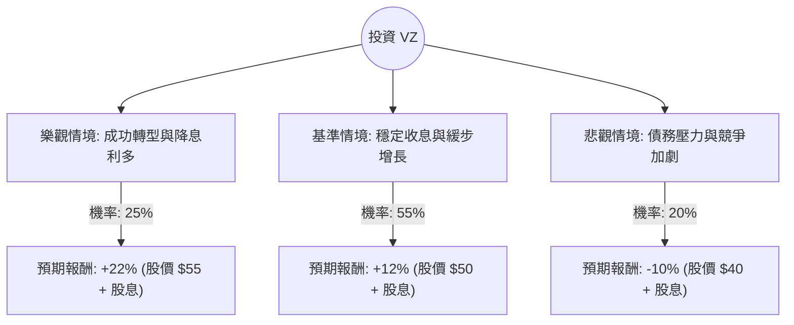

這份分析報告將結合您提供的基本面數據與最新的市場動態（包含收購 Frontier、聯準會降息預期及電信產業競爭），利用**決策樹（Decision Tree）**與**期望值分析（Expected Value Analysis）**評估 Verizon (VZ) 的投資價值。

---

### 一、 核心假設與市場背景分析

在建立決策樹之前，我們基於數據與最新資訊設定以下核心假設：

1.  **宏觀環境（利好）**：聯準會進入降息週期。VZ 作為高負債（Debt/Eq: 1.9）且高股息（5.86%）的企業，降息能減輕利息支出壓力，並提升股息吸引力。
2.  **產業動態（中性偏多）**：VZ 宣佈以 200 億美元收購 Frontier Communications，旨在強化光纖寬頻佈局。短期內會增加債務壓力，但長期有助於與 T-Mobile 和 AT&T 競爭。
3.  **財務狀況（穩健）**：Forward P/E 僅 8.98，低於歷史均值；營運利潤率 23.12% 表現優異，現金流足以支撐股息。
4.  **技術面（中性）**：股價目前在 SMA200 之上，但近期 SMA50 承壓，顯示短期處於震盪整理期。

---

### 二、 決策樹分析 (Decision Tree)

我們將未來一年的投資情境分為三種：**樂觀（牛市）**、**基準（平穩）**、**悲觀（熊市）**。

#### 節點詳細說明：

1.  **樂觀情境 (Bull Case) - 25% 機率**：
    *   **條件**：聯準會降息幅度超預期；Frontier 收購整合順利；5G 用戶增長加速。
    *   **預期報酬**：股價回升至 $55 附近（接近 2022 年高點），加上 5.86% 股息，總回報約 **22%**。

2.  **基準情境 (Base Case) - 55% 機率**：
    *   **條件**：市場維持現狀；VZ 達到分析師目標價 $51.99；股息發放正常。
    *   **預期報酬**：股價回升至 $50，加上 5.86% 股息，總回報約 **12%**。

3.  **悲觀情境 (Bear Case) - 20% 機率**：
    *   **條件**：收購案遭監管阻礙或整合失敗；高利率維持更久導致債務成本攀升；電信價格戰加劇。
    *   **預期報酬**：股價回測 52 週低點約 $40，扣除股息後，總回報約 **-10%**。

---

### 三、 期望值計算過程 (Expected Value Calculation)

期望值 (EV) 的計算公式為：
$$EV = \sum (機率 \times 預期報酬)$$

**計算步驟：**

1.  **樂觀貢獻**：$0.25 \times 22\% = 5.5\%$
2.  **基準貢獻**：$0.55 \times 12\% = 6.6\%$
3.  **悲觀貢獻**：$0.20 \times (-10\%) = -2.0\%$

**總期望報酬率：**
$$5.5\% + 6.6\% - 2.0\% = 10.1\%$$

---

### 四、 綜合評估與最終結論

#### 1. 財務數據亮點與隱憂
*   **亮點**：
    *   **估值極低**：Forward P/E 8.98 倍，遠低於標普 500 平均水平。
    *   **高股息護城河**：5.86% 的股息率在降息環境下極具吸引力。
    *   **獲利能力**：ROE 17% 顯示管理層對股東資本的運用效率尚可。
*   **隱憂**：
    *   **債務負擔**：Debt/Eq 1.9 且 Quick Ratio 僅 0.56，流動性稍嫌緊張，需依賴穩定的營運現金流。
    *   **增長緩慢**：Sales Q/Q 僅 2.85%，屬於典型的價值股而非成長股。

#### 2. 最終判斷：適合投資 (Suitable for Investment)

**判斷理由：**
1.  **正向期望值**：10.1% 的預期報酬率優於許多固定收益產品，且風險溢酬合理。
2.  **降息受益者**：VZ 作為典型的「債券替代品」股票，在利率下行週期具備估值修復（Re-rating）的潛力。
3.  **安全邊際**：目前股價 $47.06 距離分析師目標價 $51.99 仍有約 10% 的上漲空間，且 P/E 處於歷史低位，下行風險相對受限。
4.  **策略轉型**：收購 Frontier 顯示公司正積極彌補光纖短板，有利於長期與 T-Mobile 競爭。

**建議投資策略：**
*   **適合對象**：追求穩定現金流（股息）與中長期價值回歸的投資者。
*   **操作建議**：目前股價接近 SMA20，可考慮分批進場。若股價跌破 $44（SMA200 支撐位附近）需重新評估基本面是否惡化。

---
*免責聲明：本分析僅供參考，不構成任何投資建議。投資者應自行承擔市場風險。*