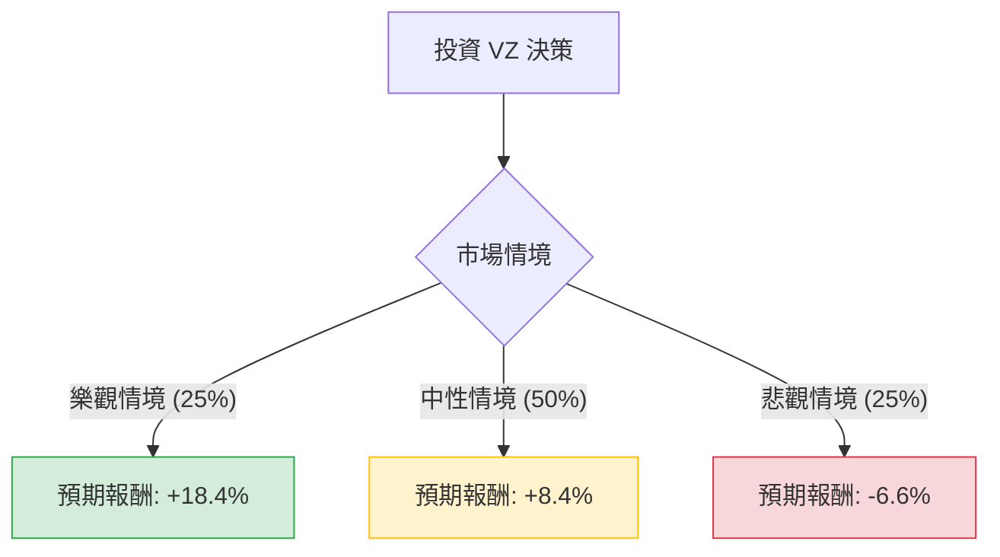

這份分析報告將結合您提供的基本面數據，以及最新的市場動態（包含 2024 年第三季財報表現、Frontier 收購案、以及降息環境的影響），利用**決策樹（Decision Tree）**與**期望值分析（Expected Value Analysis）**評估 Verizon (VZ) 的投資價值。

---

### 一、 核心假設與市場背景分析

在建立模型前，我們先整合最新的即時資訊：

1.  **最新財報 (2024 Q3)**：Verizon 營收略低於預期（333 億美元），但調整後 EPS 符合預期。無線服務收入增長 2.7%，顯示核心業務穩健。
2.  **收購案 (Frontier Communications)**：Verizon 宣布以 200 億美元收購 Frontier，旨在擴大光纖網路版圖。這在長期有利於競爭，但短期內會增加債務壓力（目前 Debt/Eq 已達 1.74）。
3.  **宏觀環境**：聯準會進入降息週期。VZ 作為高股息（5.44%）且高債務的公司，通常會受益於降息（融資成本下降、股息吸引力上升）。
4.  **估值**：目前股價（$50.31）接近 52 週高點（$51.68），且非常接近分析師平均目標價（$51.56），顯示短期上漲空間受限。

---

### 二、 決策樹分析 (Decision Tree)

我們將未來一年的投資情境分為三種：**樂觀（Bull）**、**中性（Base）**、**悲觀（Bear）**。

#### 1. 樂觀情境 (Bull Case) - 機率：25%
*   **假設**：降息速度快於預期，Frontier 整合進度超前，5G 用戶增長強勁。
*   **預期股價**：$57.00 (本益比回升至 11x Forward P/E)。
*   **資本利得**：13%
*   **股息收益**：5.4%
*   **總報酬**：**18.4%**

#### 2. 中性情境 (Base Case) - 機率：50%
*   **假設**：業務維持現狀，股息持續發放，股價隨大盤小幅波動，受限於高債務壓力。
*   **預期股價**：$51.80 (接近目前分析師目標價)。
*   **資本利得**：3%
*   **股息收益**：5.4%
*   **總報酬**：**8.4%**

#### 3. 悲觀情境 (Bear Case) - 機率：25%
*   **假設**：經濟衰退導致用戶流失，收購 Frontier 導致負債比過高，競爭對手（T-Mobile）搶佔更多市佔。
*   **預期股價**：$44.00 (回測 SMA200 支撐位)。
*   **資本利得**：-12%
*   **股息收益**：5.4%
*   **總報酬**：**-6.6%**

---

### 三、 期望值計算 (Expected Value Calculation)

期望值 (EV) = Σ (各情境機率 × 各情境總報酬)

*   **樂觀節點**：$0.25 \times 18.4\% = 4.6\%$
*   **中性節點**：$0.50 \times 8.4\% = 4.2\%$
*   **悲觀節點**：$0.25 \times (-6.6\%) = -1.65\%$

**總期望報酬率 (Total Expected Return) = 4.6% + 4.2% - 1.65% = 7.15%**

---

### 四、 綜合評估與最終結論

#### 1. 數據亮點與隱憂
*   **優勢**：
    *   **高股息 (5.44%)**：在降息環境中極具吸引力，且 P/FCF (10.54) 顯示現金流足以支撐配息。
    *   **估值合理**：Forward P/E 僅 9.61，低於歷史平均。
    *   **技術面**：股價站穩 SMA50 與 SMA200 之上，呈現多頭排列。
*   **劣勢**：
    *   **債務沉重**：Debt/Eq 1.74，收購 Frontier 將進一步推升負債。
    *   **增長緩慢**：EPS Q/Q 下降 53.3%，顯示獲利動能受壓。
    *   **空間有限**：目前股價已反映大部分利多，距離目標價僅剩不到 3% 的資本利得空間。

#### 2. 最終結論：**適合投資 (但僅限於「收益型」投資者)**

**判斷理由：**
根據期望值分析，VZ 的預期年化報酬率為 **7.15%**。雖然這個數字略低於標普 500 指數的歷史平均（約 10%），但其 **5.44% 的股息收益率** 提供了一個強大的下行保護墊（Safety Margin）。

*   **如果您是追求資本增長的投資者**：**不適合**。目前股價接近 52 週高點，且 PEG 為 1.41，顯示增長性不足以支撐股價大幅噴出。
*   **如果您是追求穩定現金流的防禦型投資者**：**適合**。在降息週期中，VZ 是一個優質的債券替代品，且基本面（ROE 16.86%）依然穩健。

**建議操作：**
由於目前股價位於高位（$50.31），建議採取**分批買進**策略，或等待股價回落至 **$47 - $48** 區間（靠近 SMA50）時再行布局，以提高安全邊際並鎖定更高的期望報酬。