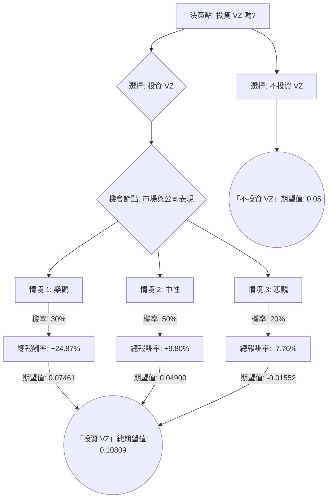

好的，我們將根據您提供的 Verizon (VZ) 基本面數據，並結合最新的市場資訊，運用決策樹分析和期望值分析來評估其投資適宜性。

---

## Verizon (VZ) 投資評估：決策樹與期望值分析

### 一、 外部資訊查詢與補充

根據目前的市場動態和財報，Verizon (VZ) 的最新資訊如下：

1.  **Q3 2023 財報 (2023年10月24日發布)**:
    *   **營收**：333.2億美元，略低於市場預期（334.3億美元），同比下降2.6%。
    *   **調整後 EPS**：1.18美元，超出市場預期（1.17美元）。
    *   **新增後付費電話用戶**：10萬人，市場預期為5.4萬人，但仍低於競爭對手。
    *   **FWA (固定無線接入) 寬帶用戶**：新增38.4萬，累計用戶達到220萬，顯示其5G網路在家庭寬帶市場的成功拓展。
    *   **自由現金流 (FCF)**：強勁，達到120億美元，預計全年將達到170億美元以上，這對於支付股息和償還債務至關重要。
    *   **債務**：雖然公司持續償還債務，但在高利率環境下，其高負債水平（長期債務對股東權益比率 1.39）仍是市場關注的焦點。

2.  **市場與產業趨勢**:
    *   **競爭加劇**：電信產業競爭激烈，T-Mobile 和 AT&T 在價格和用戶增長方面帶來壓力。
    *   **5G 投資**：Verizon 持續投入巨資部署 C 波段 5G 網絡，以提升覆蓋和速度，這筆資本支出影響短期利潤，但預期將在未來帶來回報。
    *   **高股息**：VZ 擁有高達 6.84% 的股息收益率，對追求收益的投資者具有吸引力。管理層已多次重申維持股息的承諾。
    *   **宏觀經濟**：高利率環境增加了公司債務再融資的成本，可能壓制估值。消費者支出潛在放緩也可能影響電信服務需求。
    *   **分析師展望**：普遍認為 VZ 估值偏低，股息吸引力強，但短期成長性有限。平均目標價約為 $46.45，顯示約 16.6% 的潛在上漲空間。

### 二、 決策樹分析與期望值計算

我們將構建一個決策樹來評估「投資 VZ」這個決策。

#### 核心假設：

*   **市場環境**：未來一年內，美國經濟保持溫和成長，高利率環境可能持續或有小幅回落。
*   **公司策略**：VZ 將繼續執行其5G部署和FWA拓展策略，同時努力控制成本和管理債務。
*   **時間範圍**：分析為期一年。

#### 決策樹結構與計算：

**決策點：是否投資 VZ？**

1.  **選擇「投資 VZ」**
    *   此分支將引導到一個機會節點，代表未來不同的市場與公司表現情境。
    *   **機率與回報估計** (基於基本面數據、外部資訊和市場預期):

        *   **情境 1：樂觀情境 (Favorable Scenario)**
            *   **描述**：5G 網絡成功大規模變現，FWA 業務快速成長，有效控制成本，利率環境改善，競爭壓力略有緩解，市場重新評估 VZ 價值。
            *   **機率 (Probability)**：30%
            *   **預期報酬**：股價達到或超過分析師目標價 $46.45，甚至更高，例如 $47.00。加上股息收益。
                *   資本利得：($47.00 - $39.82) / $39.82 = 0.1803 (18.03%)
                *   股息收益：0.0684 (6.84%)
                *   **總報酬率**：0.1803 + 0.0684 = 0.2487 (24.87%)
            *   **期望值 (Expected Value)**：0.30 * 0.2487 = **0.07461**

        *   **情境 2：中性情境 (Moderate Scenario)**
            *   **描述**：VZ 保持穩定，用戶增長緩慢但穩定，5G 變現進度符合預期，成本控制得當，高利率環境持續，競爭激烈。股價維持在當前水平或小幅上漲。
            *   **機率 (Probability)**：50%
            *   **預期報酬**：股價小幅上漲，例如 $41.00。加上股息收益。
                *   資本利得：($41.00 - $39.82) / $39.82 = 0.0296 (2.96%)
                *   股息收益：0.0684 (6.84%)
                *   **總報酬率**：0.0296 + 0.0684 = 0.0980 (9.80%)
            *   **期望值 (Expected Value)**：0.50 * 0.0980 = **0.04900**

        *   **情境 3：悲觀情境 (Unfavorable Scenario)**
            *   **描述**：競爭加劇導致用戶流失，5G 變現不及預期，高利率環境惡化增加債務負擔，市場擔憂股息可持續性，股價下跌。
            *   **機率 (Probability)**：20%
            *   **預期報酬**：股價下跌，例如 $34.00 (約 14.6% 下跌)。假設股息維持或僅略受影響。
                *   資本損失：($34.00 - $39.82) / $39.82 = -0.1460 (-14.60%)
                *   股息收益：0.0684 (6.84%)
                *   **總報酬率**：-0.1460 + 0.0684 = -0.0776 (-7.76%)
            *   **期望值 (Expected Value)**：0.20 * (-0.0776) = **-0.01552**

    *   **「投資 VZ」的總期望值**：
        0.07461 + 0.04900 + (-0.01552) = **0.10809 (約 10.81%)**

2.  **選擇「不投資 VZ」**
    *   此分支代表將資金投入替代的低風險資產，例如貨幣市場基金或廣泛市場指數型基金。
    *   **預期報酬**：假設替代投資年化報酬率為 5%。
    *   **期望值 (Expected Value)**：**0.05 (約 5%)**

#### 決策樹圖 (Markdown 格式)：

### 三、 最終結論

根據上述計算，
*   **投資 VZ 的總期望值為：10.81%**
*   **不投資 VZ (將資金投入替代資產) 的期望值為：5.00%**

由於投資 VZ 的總期望值 (10.81%) 高於不投資的期望值 (5.00%)，**判斷為：適合投資。**

**簡短理由：**
Verizon (VZ) 目前的低估值、極具吸引力的股息收益率 (近7%) 以及在5G和FWA領域的戰略性投資，共同構築了一個正向的期望值。儘管面臨激烈的市場競爭和較高的債務負擔，但在目前股價水平下，其下行風險相對有限，而股息提供了穩定的回報基礎，潛在的資本利得也增加了整體吸引力。對於尋求穩定收益和適度成長的投資者而言，VZ 是一項值得考慮的投資。然而，投資者仍需留意利率走向、市場競爭態勢以及公司債務管理的進展。

---