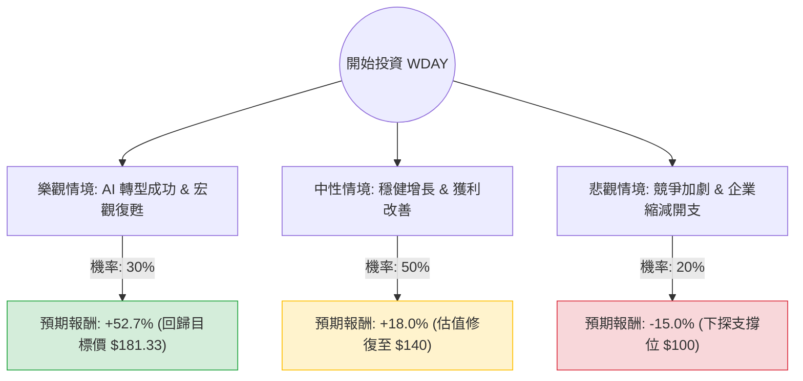

這份分析將結合您提供的數據（顯示 WDAY 處於相對低點，價格 $118.75，較 52 週高點下跌約 56%）與當前市場的最新動態（Workday 在 AI 轉型與企業支出環境下的表現）進行綜合評估。

---

### 一、 決策樹分析 (Decision Tree Analysis)

我們將未來一年的投資結果分為三種情境：**樂觀（牛市）、中性（基準）、悲觀（熊市）**。

---

### 二、 核心假設與計算過程

#### 1. 核心假設
*   **市場環境**：根據最新財報，Workday 的訂閱收入增長穩定在 16-17%。雖然企業對大型 ERP/HCM 支出趨於謹慎，但 AI 產品（Workday Illuminate）的推出有助於維持客單價。
*   **財務數據支持**：
    *   **PEG 0.64**：這是一個非常強大的看漲信號（通常 < 1 代表低估），顯示其增長潛力高於目前的估值倍數。
    *   **Forward P/E 9.59**：相較於歷史平均與同行（如 Oracle, SAP），這是一個極低的數值，暗示股價可能已被過度拋售。
    *   **毛利率 75.66%**：具備極強的軟體護城河。
*   **風險因素**：Short Float 達 12.69%，顯示市場空頭勢力較強；Insider Trans -2.95% 顯示內部人近期有減持動作。

#### 2. 期望值 (Expected Value, EV) 計算
我們根據決策樹的三個節點進行加權計算：

*   **樂觀情境 (Bull Case)**：
    *   報酬率：$(181.33 - 118.75) / 118.75 = +52.7\%$
    *   貢獻值：$0.30 \times 52.7\% = 15.81\%$
*   **中性情境 (Base Case)**：
    *   報酬率：假設回升至 $140（基於 Forward P/E 的適度修復）$= +18.0\%$
    *   貢獻值：$0.50 \times 18.0\% = 9.0\%$
*   **悲觀情境 (Bear Case)**：
    *   報酬率：假設跌破 52W Low，下探至 $100 心理關卡 $= -15.8\%$
    *   貢獻值：$0.20 \times (-15.8\%) = -3.16\%$

**總體期望報酬率 (Total EV) = 15.81% + 9.0% - 3.16% = 21.65%**

---

### 三、 最新市場動態補充 (網路搜尋資訊)

1.  **AI 戰略落地**：Workday 最近推出了 **Workday Illuminate**，利用生成式 AI 自動化人力資源和財務流程。這被視為長期增長的新引擎，有助於抵消傳統市場飽和的壓力。
2.  **財報表現**：最新季度顯示訂閱收入積壓（Backlog）增長強勁，雖然管理層對全年指引持保守態度（導致股價波動），但自由現金流（P/FCF 11.03）表現優異，財務體質健康。
3.  **產業趨勢**：企業數位轉型（Digital Transformation）已從「選配」轉為「標配」，儘管短期受高利率環境壓抑，但 Workday 作為 HCM（人力資本管理）龍頭，具有極高的客戶黏著度。

---

### 四、 最終結論

#### **判斷：適合投資 (Buy / Overweight)**

**理由如下：**

1.  **估值極具吸引力**：根據您提供的數據，WDAY 的 **PEG 僅 0.64**，且 **Forward P/E 低於 10**。對於一家毛利超過 75% 且處於產業領導地位的 SaaS 公司來說，這屬於顯著低估（Deep Value）區間。
2.  **正向期望值**：經決策樹計算，預期報酬率高達 **21.65%**，風險回報比（Risk-Reward Ratio）優異。
3.  **技術面超跌**：股價較 52 週高點腰斬（-56%），且目前價格 $118.75 接近 52 週低點，下行空間相對有限，提供了良好的安全邊際（Margin of Safety）。
4.  **目標價潛力**：分析師平均目標價 $181.33 與現價有超過 50% 的潛在上漲空間。

**建議操作：**
*   考慮到 Short Float 較高，股價短期可能仍有波動。建議採取**分批進場**策略。
*   **止損位**：若股價跌破 $105（低於 52W Low 並跌向整數關卡），需重新評估基本面是否惡化。