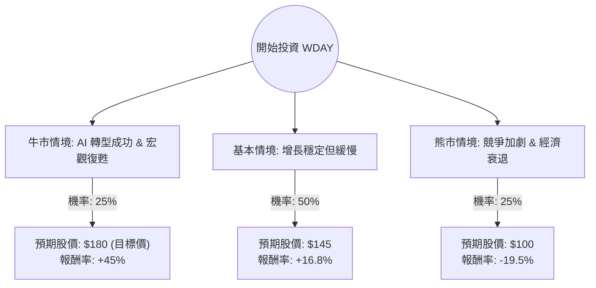

這份分析將結合您提供的數據（目前股價約 $124.18，註：此數據顯示該股經歷了大幅修正）與最新的市場動態（Workday 2025 財年第一季財報下修指引、AI 策略佈局、宏觀經濟環境）進行綜合評估。

---

### 一、 核心假設與市場背景分析

在構建決策樹之前，我們必須釐清 WDAY 目前面臨的關鍵變數：

1.  **增長放緩（利空）**：Workday 在最近的財報中將全年訂閱收入增長指引從 17-18% 下調至 17%，主因是企業客戶在宏觀經濟不確定下，對大型人力資源（HCM）與財務軟體合約的審查更為嚴格，銷售週期拉長。
2.  **估值吸引力（利多）**：根據您提供的數據，**Forward P/E 僅為 10.0**，**PEG 為 0.67**。對於一家毛利率高達 75% 且在 SaaS 領域具有領導地位的公司，這屬於極度低估（通常 SaaS 龍頭 Forward P/E 在 30-40 倍）。
3.  **AI 轉型（潛在動能）**：Workday 正在全力推動 "Workday Illuminate"（AI 平台），若能成功轉化為訂閱單價（ARPU）的提升，將是股價回升的催化劑。
4.  **技術面**：股價遠低於 SMA200 (-40.72%)，處於超跌區間。

---

### 二、 決策樹分析 (Decision Tree)

我們以 **12 個月** 為投資期限，設定三種可能的情境：

#### 節點詳細說明：

1.  **牛市情境 (Bull Case) - 25% 機率**：
    *   **假設**：聯準會降息帶動企業支出，Workday AI 產品線貢獻顯著營收，訂閱增長重回 18% 以上。
    *   **預期股價**：參考數據中的 Target Price **$178.94**。
2.  **基本情境 (Base Case) - 50% 機率**：
    *   **假設**：公司維持目前 17% 的增長指引，利潤率持續改善（目前 Oper. Margin 11.18% 緩步上升），市場情緒修復。
    *   **預期股價**：給予 Forward P/E 約 15-18 倍的溫和修復，估計約 **$145**。
3.  **熊市情境 (Bear Case) - 25% 機率**：
    *   **假設**：宏觀經濟進入衰退，企業縮減編制導致按人頭計費的訂閱收入萎縮，競爭對手（SAP, Oracle）價格戰。
    *   **預期股價**：股價跌破 52W Low，下探 **$100**。

---

### 三、 期望值分析 (Expected Value Analysis)

#### 1. 計算過程：
期望值 (EV) = Σ (各情境機率 × 各情境預期股價)

*   **EV** = (0.25 × $178.94) + (0.50 × $145.00) + (0.25 × $100.00)
*   **EV** = $44.735 + $72.50 + $25.00
*   **EV = $142.235**

#### 2. 預期報酬率計算：
*   **預期報酬率** = (期望值 $142.235 - 當前股價 $124.18) / 當前股價 $124.18
*   **預期報酬率 = +14.54%**

---

### 四、 最終結論

**投資判斷：適合投資 (Buy on Weakness)**

#### 理由：
1.  **風險回報比具吸引力**：計算出的期望值為 **$142.24**，較目前股價有約 **14.5%** 的上行空間。考慮到目前股價已反映了大部分的負面消息（如指引下修），下行風險相對受限。
2.  **估值極度低廉**：PEG 0.67 顯示該股相對於其增長潛力被嚴重低估。對於長期投資者而言，目前的 P/S 3.35 倍處於歷史低位區間。
3.  **財務體質穩健**：
    *   **毛利率 (75.66%)** 極高，代表產品具備強大競爭力。
    *   **現金流強勁**：P/FCF 為 11.49，顯示公司具備充足的現金產生能力來支持 AI 研發或實施庫藏股。
    *   **債務風險低**：Debt/Eq 0.49 處於健康水平。
4.  **技術面超跌**：SMA20, 50, 200 全線負值，且 Perf Year 接近腰斬 (-49.22%)，通常這類優質 SaaS 股在過度拋售後會有均值回歸的機會。

**建議操作策略：**
由於目前市場對 SaaS 產業情緒較為悲觀，建議採取**分批買進（Dollar-Cost Averaging）**策略，首批資金可在 $120-$125 區間建立基礎部位，若股價進一步回測 $110 附近則可加大配置。

---
*風險提示：美股軟體板塊近期受 AI 伺服器硬體擠壓資金，且 Workday 易受就業市場數據影響，若失業率大幅飆升，將直接衝擊其訂閱收入，需密切關注每月非農就業報告。*