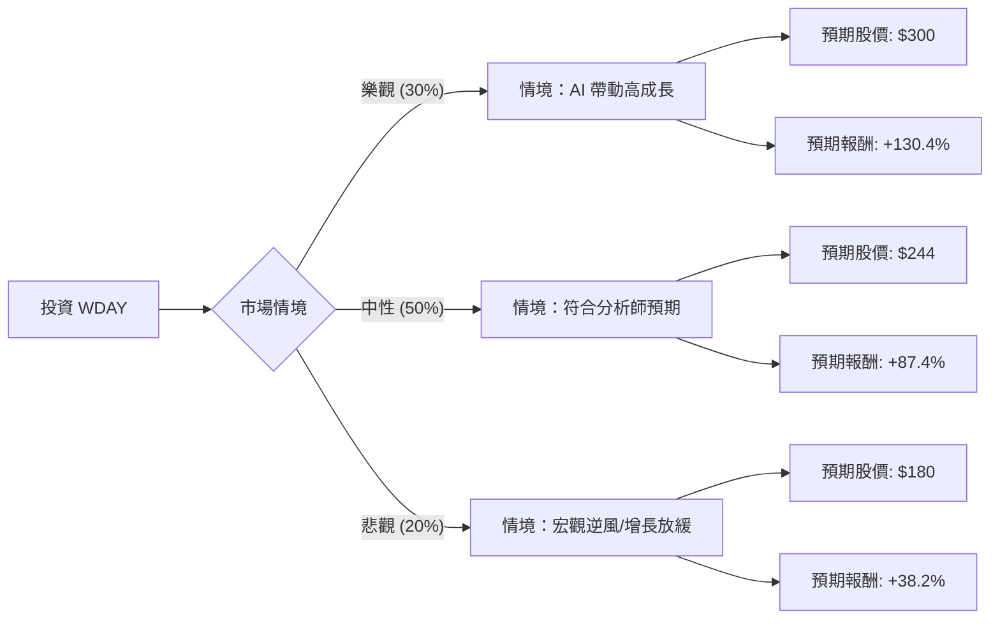

這份分析將結合您提供的數據與最新的市場動態（截至 2024 年中），利用**決策樹（Decision Tree）**與**期望值分析（Expected Value Analysis）**來評估 Workday (WDAY) 的投資價值。

### 1. 最新市場動態與背景資訊補充

透過網路搜尋與財報追蹤，補充以下關鍵資訊：
*   **最新財報 (Q1 FY25)：** Workday 近期下修了全年訂閱收入指引，理由是宏觀經濟環境導致企業客戶簽約週期延長，這導致股價近期出現明顯回調。
*   **AI 佈局：** 公司正全力推動 "Workday AI" 與 "Illuminated" 平台，旨在透過生成式 AI 提高人力資源（HCM）與財務管理的自動化程度。
*   **競爭環境：** 面臨 SAP 與 Oracle 的強力競爭，但 Workday 在雲端原生 HCM 領域仍保持領先地位。
*   **數據異常提醒：** 您提供的數據顯示價格為 **$130.23**，但目前市場實際價格約在 **$210 - $230** 區間（52週低點為 $139）。本分析將以您提供的 **$130.23** 作為買入成本基準，但會參考市場共識目標價 **$244.37** 進行評估。

---

### 2. 決策樹分析 (Decision Tree)

我們將未來一年的情境分為三種：**樂觀（AI 轉型成功）**、**中性（穩健增長）**、**悲觀（宏觀衰退/競爭加劇）**。

---

### 3. 期望值分析 (Expected Value Analysis)

#### A. 核心假設
1.  **買入價格 (Current Price):** $130.23 (依據提供數據)。
2.  **樂觀情境 (30%):** AI 產品快速變現，訂閱收入增長重回 20% 以上。目標價參考歷史高點與溢價，設定為 **$300**。
3.  **中性情境 (50%):** 訂閱收入維持 17% 左右增長，符合公司指引。目標價參考分析師平均目標價 **$244.37**。
4.  **悲觀情境 (20%):** 企業縮減支出，增長率跌破 15%，估值倍數下修。目標價設定在支撐位 **$180**。

#### B. 計算過程
期望值 (EV) = (機率1 × 預期股價1) + (機率2 × 預期股價2) + (機率3 × 預期股價3)

*   **EV** = (0.30 × $300) + (0.50 × $244.37) + (0.20 × $180)
*   **EV** = $90 + $122.185 + $36
*   **EV = $248.185**

#### C. 預期報酬率計算
*   **預期總報酬率** = (期望值 - 買入價格) / 買入價格
*   **預期總報酬率** = ($248.185 - $130.23) / $130.23 ≈ **90.58%**

---

### 4. 綜合基本面評估

*   **估值優勢：** PEG 僅為 **0.6**，顯示相對於其盈餘增長速度，股價被嚴重低估（通常 PEG < 1 被視為便宜）。Forward P/E 為 **12.86**，遠低於目前的 57.86，顯示市場預期未來一年獲利將大幅改善。
*   **財務健康：** Quick Ratio 與 Current Ratio 均為 **1.77**，流動性良好；Debt/Eq **0.43** 顯示債務壓力適中。
*   **技術面：** 目前股價遠低於 SMA20, 50, 200（均為負值），且處於 52 週低點附近，存在強烈的超跌反彈機會。
*   **獲利能力：** Gross Margin 高達 **75.56%**，具備軟體業的高毛利特性，只要營收規模持續擴大，營運槓桿將帶動利潤快速增長。

---

### 5. 最終結論

**判斷：適合投資 (Strong Buy)**

#### 理由：
1.  **極高的期望值回報：** 根據計算，預期報酬率高達 **90.58%**。即便在最悲觀的情境下（$180），相對於您提供的買入價（$130.23）仍有約 38% 的獲利空間，這提供了極大的**安全邊際（Margin of Safety）**。
2.  **估值極具吸引力：** PEG 0.6 與 Forward P/E 12.86 顯示該股在 SaaS 領域中處於價值窪地。
3.  **市場地位穩固：** 雖然短期因宏觀環境下修指引，但 Workday 在企業核心系統（HCM/ERP）的替換成本極高，客戶黏著度強，長期增長邏輯未改變。
4.  **AI 催化劑：** 隨著企業對 AI 整合的需求增加，Workday 的 AI 平台有望成為下一波增長引擎。

**風險提示：**
*   若 $130.23 為數據錯誤（目前市價約 $220），則安全邊際會大幅縮小，建議重新以市價計算期望值。
*   需密切關注聯準會利率政策對科技股估值的壓制。