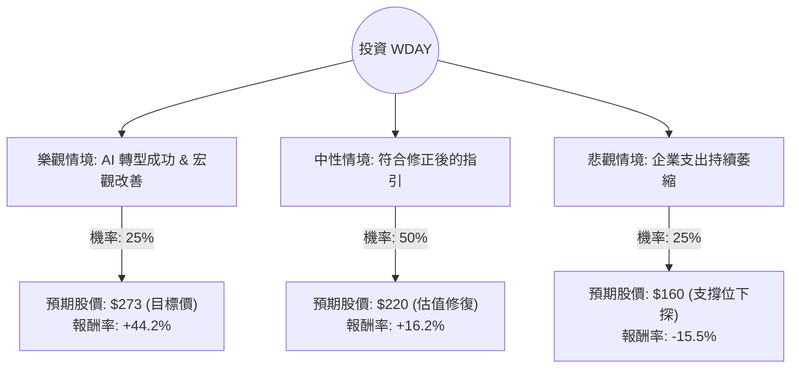

這份分析報告將結合您提供的基本面數據，以及最新的市場動態（包含 2024 年 5 月底發布的財報與指引下調事件），利用**決策樹（Decision Tree）**與**期望值分析（Expected Value Analysis）**來評估 Workday (WDAY) 的投資價值。

---

### 1. 市場現況與核心假設 (Core Assumptions)

在進行計算前，我們必須納入最新的市場資訊：
*   **財報衝擊**：Workday 在最近一次財報中下調了 2025 財年的訂閱收入指引（從 17-18% 下調至 17%），主因是企業支出收緊及銷售週期延長。這導致股價近期大幅修正。
*   **估值吸引力**：目前 **Forward P/E 僅約 17.65**，且 **PEG 為 0.82**（小於 1 代表低估），顯示股價在修正後已進入相對便宜的區間。
*   **AI 潛力**：Workday 正在積極整合 AI（如 Workday Illuminate），這可能成為中長期增長的催化劑。
*   **技術面**：股價目前低於 SMA20, 50, 200，處於超賣區間，但短期趨勢偏弱。

---

### 2. 決策樹分析 (Decision Tree)

我們將未來一年的投資情境分為三種：**樂觀（Bull）**、**中性（Base）**、**悲觀（Bear）**。

---

### 3. 期望值計算過程 (Expected Value Calculation)

#### A. 參數設定
*   **當前股價 ($P_0$)**: $189.26
*   **情境 1：樂觀 (Bull Case)**
    *   **假設**：AI 產品快速變現，企業軟體支出回升，公司重新上修指引。
    *   **目標價**：$273 (參考數據中的 Target Price)
    *   **機率**：25%
*   **情境 2：中性 (Base Case)**
    *   **假設**：公司達到修正後的 17% 增長目標，市場情緒回穩，估值回到歷史平均。
    *   **目標價**：$220 (約為 Forward P/E 20-22 倍)
    *   **機率**：50%
*   **情境 3：悲觀 (Bear Case)**
    *   **假設**：經濟衰退導致訂閱流失，競爭對手（SAP/Oracle）搶佔份額。
    *   **目標價**：$160 (跌破 52W 低點，尋找長期支撐)
    *   **機率**：25%

#### B. 期望值 (EV) 計算
$$EV = (P_{Bull} \times Prob_{Bull}) + (P_{Base} \times Prob_{Base}) + (P_{Bear} \times Prob_{Bear})$$

1.  **樂觀貢獻**：$273 \times 0.25 = 68.25$
2.  **中性貢獻**：$220 \times 0.50 = 110.00$
3.  **悲觀貢獻**：$160 \times 0.25 = 40.00$

*   **總期望股價**：$68.25 + 110.00 + 40.00 = \mathbf{218.25}$
*   **預期報酬率**：$(218.25 - 189.26) / 189.26 = \mathbf{+15.3\%}$

---

### 4. 綜合評估與最終結論

#### 基本面優勢：
1.  **估值極具吸引力**：PEG 0.82 顯示在成長型軟體股中，WDAY 目前被市場過度拋售。
2.  **財務穩健**：Gross Margin 高達 75.56%，且擁有良好的現金流（P/FCF 19.26），具備抗風險能力。
3.  **市場地位**：在 HCM（人力資本管理）領域仍是領導者，客戶黏著度高。

#### 主要風險：
1.  **短期動能缺失**：SMA 指標全線向下，顯示短期內可能還會震盪築底。
2.  **宏觀壓力**：高利率環境下，企業對大型 ERP/HCM 系統的更換決策變得謹慎。

#### **最終結論：適合投資 (建議分批買入)**

**理由：**
1.  **期望值為正**：計算出的預期報酬率為 **15.3%**，遠高於持有現金或一般債券的收益。
2.  **安全邊際已現**：股價已反映了指引下調的利空，目前交易價格接近 52 週低點，下行空間（Bear Case）相對於上行空間（Bull Case）較小。
3.  **成長性仍在**：儘管增速放緩，但 17% 的訂閱增長在 SaaS 行業中仍屬穩健，且 Forward P/E 17.65 倍對於一家毛利 75% 的龍頭企業來說非常便宜。

**操作建議：**
由於技術面（SMA）仍呈空頭排列，建議不要一次性全倉投入，應採取**分批佈局（Dollar-cost averaging）**策略，在 $180 - $190 區間建立基本倉位，等待市場情緒回暖。