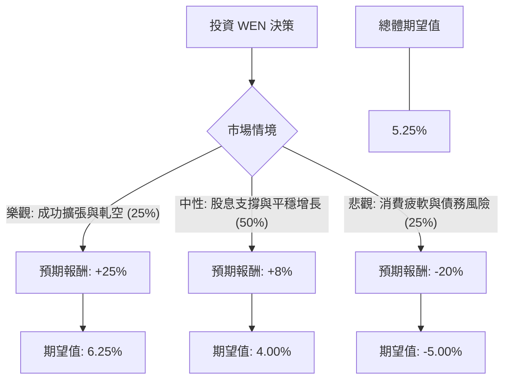

這份分析報告將結合您提供的數據與最新的市場動態（如速食業價格戰、數位轉型進度及高股息政策），利用**決策樹（Decision Tree）**與**期望值分析（Expected Value Analysis）**評估 Wendy's (WEN) 的投資價值。

---

### 一、 外部市場動態與最新資訊補充

在分析數據前，整合目前美股市場對 WEN 的最新觀察：
1.  **速食價格戰（Value Wars）**：為了應對通膨導致的消費降級，麥當勞、漢堡王與 Wendy's 展開激烈的「$5 組合餐」競爭。這雖然能維持客流量，但會壓縮**毛利率（Gross Margin 目前為 26.1%）**。
2.  **數位與早餐增長**：Wendy's 近期大力投資數位點餐與早餐時段，這被視為未來 EPS 增長（預期明年增長 11.79%）的核心動能。
3.  **高空單比例（Short Float 26.71%）**：這是一個極端訊號，顯示市場有大量資金看空，但也存在「軋空（Short Squeeze）」的潛在機會。
4.  **債務壓力**：Debt/Eq 高達 35.63，顯示公司財務槓桿極高，在當前高利率環境下，利息支出是沉重負擔。

---

### 二、 決策樹分析 (Decision Tree)

我們將未來一年的投資情境分為三種：**樂觀（成長與軋空）**、**中性（維持現狀）**、**悲觀（衰退與債務危機）**。

#### 節點詳細說明：

1.  **樂觀情境 (Probability: 25%)**
    *   **描述**：早餐時段市佔率大幅提升，數位轉型成功降低人力成本，且 26% 的空單被迫回補引發軋空。
    *   **預期報酬**：股價回升至 52 週高點附近（約 $10.00），加上 7% 股息，總報酬約 **+25%**。

2.  **中性情境 (Probability: 50%)**
    *   **描述**：價格戰維持住客群，營收微幅增長。公司維持高額配息，股價隨大盤波動。
    *   **預期報酬**：股價持平（$8.00 左右），主要收益來自 **7% 股息 + 1% 資本利得 = +8%**。

3.  **悲觀情境 (Probability: 25%)**
    *   **描述**：高通膨導致低收入客戶流失，高槓桿債務（Debt/Eq 35.63）引發財務疑慮，甚至被迫削減股息。
    *   **預期報酬**：股價下探 52 週低點（約 $6.40），跌幅約 20%，扣除股息後總報酬約 **-20%**。

---

### 三、 期望值計算過程 (Expected Value Calculation)

**核心假設：**
*   **股息安全性**：假設公司在一年內不會輕易削減 7% 的股息（目前 P/FCF 為 6.87，顯示現金流尚能支撐配息）。
*   **估值修正**：目前 P/E 10.34 低於行業平均，但 Target Price $7.67 顯示分析師偏向保守。

**計算公式：**
$$EV = \sum (Probability_i \times Return_i)$$

1.  **樂觀節點**：$0.25 \times 25\% = 6.25\%$
2.  **中性節點**：$0.50 \times 8\% = 4.00\%$
3.  **悲觀節點**：$0.25 \times (-20\%) = -5.00\%$

**總體期望值 (Total EV)：**
$$6.25\% + 4.00\% - 5.00\% = 5.25\%$$

---

### 四、 最終結論與建議

#### **結論：不適合積極型投資，僅適合極度保守的收息族（且需嚴格控管風險）**

**判斷理由：**
1.  **期望值偏低**：5.25% 的預期報酬率僅略高於無風險利率（如美債 4-5%），但 WEN 承擔了極高的財務槓桿風險（Debt/Eq 35.63）與市場看空壓力。
2.  **目標價警訊**：目前股價 $8.02 已高於分析師平均目標價 $7.67，顯示短期內上漲空間受限。
3.  **基本面隱憂**：EPS Q/Q 下跌 38.85%，顯示獲利能力正在衰退。雖然明年預期 EPS 會增長，但在價格戰激烈的環境下，不確定性極高。
4.  **高空單風險**：26.7% 的空單比例是一把雙面刃。雖然有軋空可能，但更多時候反映了專業機構對其資產負債表的不信任。

**操作建議：**
*   **若您已持有**：建議續抱領息，但一旦股價跌破 $7.50（接近目標價與支撐位），應考慮減碼以防債務風險爆發。
*   **若您尚未持有**：目前不建議買入。建議等待股價回落至 $7.00 以下，或看到債務結構改善、EPS Q/Q 轉正後再行介入。

**總結一句話：** 「WEN 目前是一支高風險、中回報的收息股，其財務槓桿過高，抵銷了 7% 股息的吸引力。」