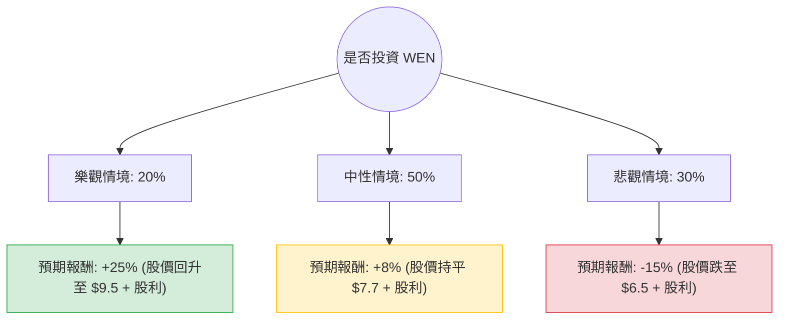

這份分析報告將結合您提供的財務數據與最新的市場動態（包含 2024 年第一季財報表現、數位化轉型進度及產業趨勢），利用**決策樹（Decision Tree）**與**期望值分析（Expected Value Analysis）**評估 Wendy's (WEN) 的投資價值。

---

### 1. 市場現況與核心假設 (Core Assumptions)

在繪製決策樹前，我們先整合最新資訊以設定情境：

*   **財務壓力與債務**：WEN 的 Debt/Eq 高達 35.31，且總負債較高。在當前高利率環境下，利息支出是沉重負擔。
*   **股利誘因**：目前殖利率高達 8.75%，這對價值投資者有吸引力，但也暗示市場擔心其股利發放的永續性（Payout Ratio 偏高）。
*   **營運動態**：
    *   **利好**：早餐時段銷售持續增長，數位訂單佔比提升，且公司正積極擴張全球門店。
    *   **利空**：2024 Q1 同店銷售增長僅 0.9%（低於預期），且先前「動態定價」風波對品牌形象有負面影響。
*   **技術面**：股價處於 52 週低點附近，SMA20/50/200 全線向下，屬於典型的空頭排列。

---

### 2. 決策樹分析 (Decision Tree)

我們將未來一年的表現分為三種情境：**樂觀（牛市）**、**中性（基準）**、**悲觀（熊市）**。

#### 節點詳細說明：

| 情境 | 機率 (P) | 預期報酬 (R) | 說明 |
| :--- | :--- | :--- | :--- |
| **樂觀 (Bull)** | 20% | **+25%** | 早餐業務爆發、數位轉型成功、通膨降溫帶動利潤率回升。股價重回 $9.5 以上。 |
| **中性 (Base)** | 50% | **+8%** | 營收緩步增長，股價在 $7.5 - $8.2 震盪。主要收益來自 8.75% 的高額股利。 |
| **悲觀 (Bear)** | 30% | **-15%** | 消費疲軟導致同店銷售下滑，高債務引發信用評級下調，甚至被迫削減股利。股價下探 $6.5。 |

---

### 3. 期望值計算過程 (Expected Value Calculation)

期望值 (EV) 的計算公式為：
$$EV = \sum (機率 \times 預期報酬)$$

#### 計算步驟：
1.  **樂觀貢獻**：$0.20 \times 25\% = 5.0\%$
2.  **中性貢獻**：$0.50 \times 8\% = 4.0\%$
3.  **悲觀貢獻**：$0.30 \times (-15\%) = -4.5\%$

#### 總期望報酬率：
$$EV = 5.0\% + 4.0\% - 4.5\% = 4.5\%$$

---

### 4. 核心假設與風險評估

1.  **估值陷阱風險**：雖然 P/E 僅 9.0 倍看似便宜，但考慮到 EPS 今年衰退 (-32.33%) 且負債比極高，這可能是一個「價值陷阱」。
2.  **股利安全性**：8.75% 的殖利率極高，但若 EPS 持續低迷，公司可能為了償債或維持現金流而砍掉股利。一旦砍股利，股價將面臨崩潰式下跌。
3.  **空頭壓力**：Short Float 高達 18.62%，顯示市場上有大量專業機構看空該股，短期內上漲阻力極大。
4.  **分析師目標價**：Target Price 為 $8.07，距離現價 $7.66 僅有約 5% 的上漲空間，安全邊際不足。

---

### 5. 最終結論

#### **判斷：不適合投資 (Avoid / Underweight)**

#### **理由：**
1.  **期望值過低**：計算出的總期望報酬率僅為 **4.5%**。在目前無風險利率（美債收益率）仍有 4%~5% 的情況下，承擔 WEN 如此高的財務風險（高債務、EPS 衰退）僅換取 4.5% 的預期回報，風險報酬比（Risk-Reward Ratio）極不划算。
2.  **財務結構脆弱**：Debt/Eq 35.31 顯示公司財務槓桿極高，在經濟放緩時期，這類公司最容易受到衝擊。
3.  **技術面與動能極差**：所有移動平均線（SMA）均呈負值，且股價一年內跌幅達 50%，目前尚未看到明確的止跌築底跡象。
4.  **高股利陷阱**：雖然 8.75% 的股利很誘人，但資本利損（股價下跌）極可能吞噬掉所有股息收益。

**建議：**
若您是追求高股息的投資者，建議尋找資產負債表更穩健（如低債務、現金流穩定）的標的。對於 WEN，建議等到 **EPS 轉正** 且 **債務結構改善** 後再行考慮。