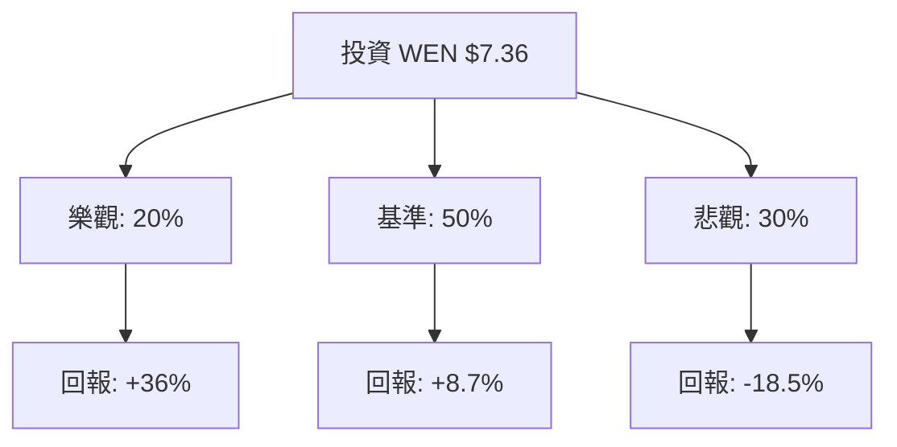

# WEN (Wendy's Co) 量化投資分析報告

作為量化投資分析師，針對 Wendy's (WEN) 的當前數據與市場環境，我將透過機率模型與期望值（Expected Value, EV）框架進行深度拆解。目前 WEN 展現出極高的股息率（7.6%）與極高的空頭部位（Short Float 33.2%），這是一個典型的高風險、高不對稱性的價值陷阱或反轉標的。

---

### 1. 核心驅動因素與風險 (Drivers & Risks)

#### **關鍵催化劑 (Catalysts)**
1.  **空頭擠壓 (Short Squeeze Potential)**：高達 33.22% 的空頭佔比是市場上極其罕見的數值。一旦財報優於預期或有任何利多消息（如大宗收購傳聞或超預期的數位轉型進度），空頭回補將引發股價劇烈噴發。
2.  **數位化與忠誠度計畫轉型**：Wendy's 正在加大對 AI 點餐與數位 App 的投入。若數位銷售佔比（目前約 15%）能顯著提升，將有效改善營運利潤率（Oper. Margin 14.37%）並降低人工成本壓力。
3.  **早餐市場份額擴張**：早餐時段是快餐業利潤最高的區塊。若 Wendy's 能透過促銷成功從 McDonald's 手中奪取份額，將直接帶動 Sales Q/Q 轉強。

#### **主要風險點 (Risks)**
1.  **高槓桿債務壓力**：Debt/Eq 高達 35.63，在當前高利率環境下，再融資成本將嚴重侵蝕淨利。雖然 P/FCF 僅 6.3 顯示現金流尚可，但債務結構是長期隱憂。
2.  **低收入消費者支出放緩**：通膨壓力導致低收入族群減少外食，或轉向更便宜的「超值餐（Value Menu）」競爭，這將壓縮毛利率（Gross Margin 26.1%）。
3.  **股息削減風險**：雖然 7.6% 的股息極具吸引力，但若 EPS 持續疲軟（EPS Q/Q -38.8%），公司可能被迫削減股息以償還債務，這將導致機構投資者（Inst Trans -1.51%）大規模撤出。

---

### 2. 情境設定與機率賦予 (Scenario Modeling)

基於未來 12 個月的展望，設定以下三種互斥情境：

#### **樂觀情境 (Bull Case)：空頭擠壓與增長復甦**
*   **發生條件**：數位銷售突破 20%，早餐業務增長強勁，且聯準會降息緩解債務壓力，引發 33% 空頭部位的大規模回補。
*   **預估機率**：20%
*   **目標價格與預期回報**：**$10.00 (+36%)**。基於 Forward P/E 回升至歷史均值 15x。

#### **基準情境 (Base Case)：維持現狀與高息收割**
*   **發生條件**：同店銷售額（SSS）持平或微增，股息維持發放，市場情緒中性。股價隨大盤波動，主要收益來自股息。
*   **預估機率**：50%
*   **目標價格與預期回報**：**$8.00 (+8.7%)**。接近分析師平均目標價 $7.75，反映小幅估值修復。

#### **悲觀情境 (Bear Case)：債務危機與股息削減**
*   **發生條件**：經濟衰退導致營收下滑，債務違約風險上升，公司宣佈削減股息以保全現金流。
*   **預估機率**：30%
*   **目標價格與預期回報**：**$6.00 (-18.5%)**。跌破 52 週低點，尋找長期支撐位。

---

### 3. 期望值計算與決策樹 (EV Calculation & Decision Tree)

#### **決策樹結構**

```mermaid
graph TD
    Start[投資 WEN $7.36] --> Bull[樂觀: 20%]
    Start --> Base[基準: 50%]
    Start --> Bear[悲觀: 30%]
    Bull --> BullRet[回報: +36%]
    Base --> BaseRet[回報: +8.7%]
    Bear --> BearRet[回報: -18.5%]
```

#### **總期望值計算 (EV)**
*   `EV = (0.20 * 0.36) + (0.50 * 0.087) + (0.30 * -0.185)`
*   `EV = 0.072 + 0.0435 - 0.0555 = 0.060`
*   **預期價格回報率：6.0%**
*   **總預期回報 (含 7.6% 股息)：13.6%**

#### **風險回報比分析**
*   **上行空間**：$2.64 ($10.00 - $7.36)
*   **下行空間**：$1.36 ($7.36 - $6.00)
*   **風險回報比 (Risk/Reward Ratio)**：1 : 1.94。這顯示每承擔 1 元風險，預期可獲得 1.94 元回報，具備統計學上的博弈價值。

---

### 4. 決策總結 (Decision Summary)

| 情境 | 發生機率 (%) | 預期報酬率 (%) | 關鍵驅動/觸發因素 |
| :--- | :--- | :--- | :--- |
| **樂觀 (Bull)** | 20% | +36.0% | 空頭擠壓、數位轉型超預期、降息利多 |
| **基準 (Base)** | 50% | +8.7% | 股息維持、同店銷售穩定、估值修復 |
| **悲觀 (Bear)** | 30% | -18.5% | 股息削減、債務壓力爆發、消費嚴重衰退 |
| **整體期望值** | **100%** | **+13.6%** | **含股息之加權平均預期總回報** |

**最終結論：**
1. **投資建議**：**買入 (Buy) - 僅限收益型與逆向投資者**
2. **核心逻辑**：WEN 目前處於極度低估區間（P/E 9.49），且 33% 的空頭佔比提供了極佳的「不對稱性」。即便在基準情境下，7.6% 的股息也提供了強大的下行保護。6% 的價格期望值加上高額股息，使得總期望回報優於多數成熟期快餐標的。
3. **風控建議**：若股價跌破 **$6.50**（接近 52W Low 且反映市場對股息安全性的質疑），或公司正式宣佈削減股息，應立即執行止損出場，因為這意味著悲觀情境的機率已上升至 80% 以上。