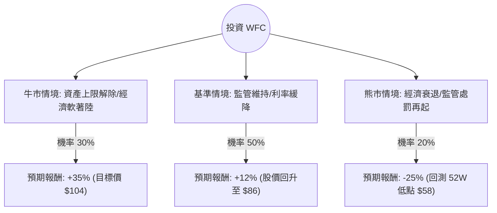

這份分析報告將結合您提供的財務數據與最新的市場動態（包含聯準會利率政策、資產上限監管進度及銀行業趨勢），利用**決策樹（Decision Tree）**與**期望值分析（Expected Value Analysis）**評估富國銀行（Wells Fargo & Co., WFC）的投資價值。

---

### 一、 核心背景與市場動態分析

在進行建模前，我們先整合最新資訊：
1.  **資產上限（Asset Cap）進度**：富國銀行自 2018 年起受限於 1.95 兆美元的資產上限。最新消息顯示，執行長 Charlie Scharf 正積極推動風險管理改革，市場預期 2025 年底前有機會解除，這是股價爆發的最大催化劑。
2.  **利率環境**：聯準會（Fed）進入降息週期。這對銀行是雙面刃：雖然會壓縮淨利差（NIM），但能減少壞帳壓力並刺激貸款需求。
3.  **估值數據**：
    *   **PEG 0.69**：顯示相對於其盈餘成長，股價被低估（通常 < 1 被視為便宜）。
    *   **P/B 1.45**：略高於歷史平均，但低於摩根大通（JPM）。
    *   **目標價 $101.67**：較目前 $77.19 有約 **31.7%** 的潛在漲幅。
4.  **近期表現**：近一季跌幅達 19%，顯示市場已部分消化了對降息導致利潤縮減的擔憂，目前處於技術面回檔後的相對低位。

---

### 二、 決策樹分析（Decision Tree）

我們以 **1 年持有期** 為基準，設定三種主要情境：

#### 節點詳細說明：

| 情境 | 機率 (P) | 預期報酬 (R) | 說明 |
| :--- | :--- | :--- | :--- |
| **牛市 (Bull)** | 30% | +35% | 聯準會成功軟著陸，資產上限正式解除，WFC 恢復放貸規模，估值修復至 $100 以上。 |
| **基準 (Base)** | 50% | +12% | 監管維持現狀，但 EPS 持續成長（EPS next Y 13.66%），股息與回購支撐股價穩步回升。 |
| **熊市 (Bear)** | 20% | -25% | 美國陷入經濟衰退，失業率上升導致信貸損失撥備增加，或出現新的合規問題。 |

---

### 三、 期望值計算（Expected Value Calculation）

**1. 計算公式：**
$EV = (P_{Bull} \times R_{Bull}) + (P_{Base} \times R_{Base}) + (P_{Bear} \times R_{Bear})$

**2. 帶入數值：**
*   $EV = (0.30 \times 0.35) + (0.50 \times 0.12) + (0.20 \times -0.25)$
*   $EV = 0.105 + 0.06 - 0.05$
*   $EV = 0.115$ 或 **11.5%**

**3. 核心假設：**
*   **股息收益**：已包含在報酬率中（目前殖利率約 2.27%）。
*   **估值修復**：假設 Forward P/E 從目前的 9.65 倍回升至歷史均值 11-12 倍。
*   **下行風險**：以 52 週低點（約 $58）作為熊市支撐參考。

---

### 四、 綜合評估與最終結論

#### 1. 優勢分析 (Pros)
*   **極具吸引力的 PEG (0.69)**：在大型銀行股中，WFC 的成長性與價格比非常出色。
*   **營運效率提升**：Oper. Margin 達 20.66%，顯示成本削減計畫見效。
*   **技術面回檔**：近三個月跌幅 19%，SMA20/50/200 均為負值，顯示目前處於超賣區或築底期，提供了較好的安全邊際。

#### 2. 風險分析 (Cons)
*   **資產上限的不確定性**：這是長期壓制股價的「緊箍咒」，若解除時間晚於預期，股價將缺乏爆發力。
*   **高負債比 (Debt/Eq 2.37)**：雖然銀行業負債比普遍較高，但在利率波動期仍需關注其利息支出壓力。

#### 3. 最終判斷：**適合投資 (Buy / Overweight)**

**理由：**
1.  **期望值為正 (11.5%)**：高於標普 500 指數的長期平均年化報酬率（約 8-10%）。
2.  **風險報酬比優異**：目前股價 ($77.19) 距離分析師平均目標價 ($101.67) 有極大的上行空間，而下行風險在 52 週低點已有強力支撐。
3.  **轉型契機**：WFC 正在從「醜聞纏身的銀行」轉型為「高效率的商業銀行」，隨著 EPS 預計明年成長 13.66%，基本面支撐強勁。

**建議操作策略：**
*   **進場點**：目前股價已低於 SMA200 (-8.22%)，是分批佈局的良機。
*   **觀察指標**：密切關注聯準會對其「風險管理框架」的審核評論，以及每季淨利差（NIM）的變化。