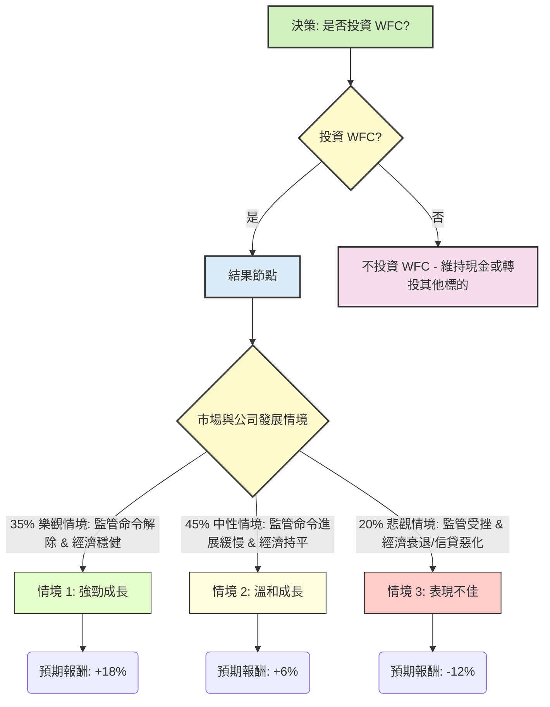

為評估美股公司 **WFC** 目前是否適合投資，我們將綜合運用決策樹分析與期望值分析，並結合其基本面數據及最新的市場與公司資訊進行判斷。

## 決策樹分析 (Decision Tree Analysis)

我們將考慮 WFC 未來一年的主要情境，這些情境的發展將受公司特定因素（如監管命令解除進度）及宏觀經濟因素（如利率環境、經濟成長）的影響。

### 核心假設

在進行決策樹分析前，我們首先建立以下核心假設：

1.  **市場環境 (Market Environment):**
    *   **經濟軟著陸/穩定:** 美國經濟在未來 12-18 個月內能避免嚴重衰退，通膨持續溫和，聯準會利率維持在高位一段時間後可能溫和下降。這將有利於銀行業的營運穩定性。
    *   **利率環境:** 聯準會可能維持現有高利率一段時間，或有小幅降息。這對銀行淨利息收益率 (NII) 影響複雜：初期高利率有助 NII，但若伴隨存款競爭加劇或貸款需求放緩，NII 可能承壓。
    *   **商業房地產 (CRE) 風險:** 部分地區及類型（如辦公室）的 CRE 貸款風險仍需密切關注，可能導致潛在的貸款損失撥備增加，但預期不會造成系統性危機。

2.  **財務表現 (Financial Performance):**
    *   **信貸品質:** 雖然經濟存在不確定性，但預計 WFC 的整體信貸品質將維持穩定，非不良貸款 (NPL) 率將保持在可控範圍內。
    *   **營運效率:** WFC 將繼續推動成本控制和營運效率提升，以應對營收壓力並改善獲利能力。
    *   **資本適足率:** WFC 擁有充足的資本緩衝，能夠應對潛在的經濟下行風險和監管要求。

3.  **產業趨勢 (Industry Trends):**
    *   **存款競爭:** 銀行業將持續面臨來自貨幣市場基金及其他銀行的存款競爭，可能導致資金成本上升。
    *   **數位轉型:** 銀行業持續投資於數位化轉型，提升客戶體驗和營運效率，WFC 亦在此方面有所投入。
    *   **監管壓力:** 銀行業普遍面臨嚴格的監管，尤其 WFC 仍受美國聯準會的資產上限限制。

4.  **WFC 特定假設:**
    *   **監管命令解除:** WFC 解除聯準會資產上限命令的進度是其未來成長的關鍵催化劑。公司已投入大量資源解決歷史問題，市場預期在未來一年半內有機會逐步解除部分限制。
    *   **執行長領導:** 現任執行長對公司轉型和合規的努力持續進行，預計將帶來正面影響。
    *   **股東回報:** WFC 將在維持監管要求和資本充足的前提下，持續透過股息和庫藏股回報股東。

---

### 決策樹繪製

**決策點 (Decision Node): 投資 WFC**
*   **成本:** 目前股價 $93.01

### 情境分析與期望值計算

以下為各情境的詳細說明、機率與預期報酬計算：

**當前股價 (Close):** $93.01

**1. 樂觀情境 (Favorable Scenario)**
*   **情境名稱:** 監管命令解除，經濟穩健增長
*   **情境描述:** WFC 在解決合規問題上取得重大突破，聯準會資產上限命令有望解除或大幅放寬，使其可以擴大資產規模和業務。同時，美國經濟保持穩健增長，失業率低，企業和消費者貸款需求旺盛，信貸質量良好，銀行淨利息收益和非利息收入均表現強勁。
*   **機率 (Probability):** 35%
*   **預期報酬 (Expected Return):** 在此情境下，WFC 股價可能達到分析師高目標價甚至更高，加上股息回報，預期總報酬率約為 **+18%**。
    *   預期股價 ($): $93.01 * (1 + 0.18) = $109.75
    *   期望值貢獻 ($): ($109.75 - $93.01) * 0.35 = $16.74 * 0.35 = **$5.86**

**2. 中性情境 (Moderate Scenario)**
*   **情境名稱:** 監管命令進展緩慢，經濟持平或溫和放緩
*   **情境描述:** WFC 在解除監管命令上持續努力，但進度較為緩慢，短期內資產上限仍存在。經濟保持穩定，但成長動能不足，或出現溫和放緩跡象。淨利息收益受存款競爭和貸款需求平穩影響，非利息收入亦無顯著增長。WFC 表現符合分析師普遍預期。
*   **機率 (Probability):** 45%
*   **預期報酬 (Expected Return):** 股價可能接近分析師目標價 $97.0，加上股息回報，預期總報酬率約為 **+6%**。
    *   預期股價 ($): $93.01 * (1 + 0.06) = $98.59
    *   期望值貢獻 ($): ($98.59 - $93.01) * 0.45 = $5.58 * 0.45 = **$2.51**

**3. 悲觀情境 (Unfavorable Scenario)**
*   **情境名稱:** 監管受挫，經濟衰退或信貸惡化
*   **情境描述:** WFC 在監管問題上遭遇新的挑戰或進展停滯，導致市場信心受損。宏觀經濟陷入衰退，失業率大幅上升，商業房地產或其他貸款領域出現大規模違約，導致銀行需要大幅增加貸款損失準備金。淨利息收益因利率下調和貸款需求萎縮而大幅下降，公司盈利能力嚴重受損。
*   **機率 (Probability):** 20%
*   **預期報酬 (Expected Return):** 股價可能大幅下跌，預期總報酬率約為 **-12%** (股價下跌抵消股息)。
    *   預期股價 ($): $93.01 * (1 - 0.12) = $81.85
    *   期望值貢獻 ($): ($81.85 - $93.01) * 0.20 = -$11.16 * 0.20 = **-$2.23**

---

### 整體期望值計算

將各情境的期望值貢獻加總，得到整體投資 WFC 的期望值：

**總期望值 (Total Expected Value) = (樂觀情境期望值貢獻) + (中性情境期望值貢獻) + (悲觀情境期望值貢獻)**
總期望值 = $5.86 + $2.51 - $2.23 = **$6.14**

---

## 最終結論

根據上述決策樹分析和期望值計算：

*   **整體期望值為 $6.14**。這表示投資 WFC 每股預期將獲得約 $6.14 的收益。由於期望值為正數，從純粹的期望值角度來看，**WFC 目前適合投資**。

**簡短理由:**
儘管 WFC 目前股價已接近 52 週高點，且過去一年表現強勁，可能已部分反映市場對其監管問題解決的預期。然而，其正的期望值表明，潛在的監管解除（樂觀情境）帶來的上行空間足以抵消經濟逆風或監管延遲（悲觀情境）帶來的下行風險。公司穩健的基本面（如良好的 P/FCF、ROE、ROA 和分析師「買入」評級）也為這種投資提供了支持。但投資者需注意，此判斷高度依賴於對監管進展和宏觀經濟走向的假設，尤其是 WFC 能否在未來一年內解除部分資產上限限制將是關鍵催化劑。