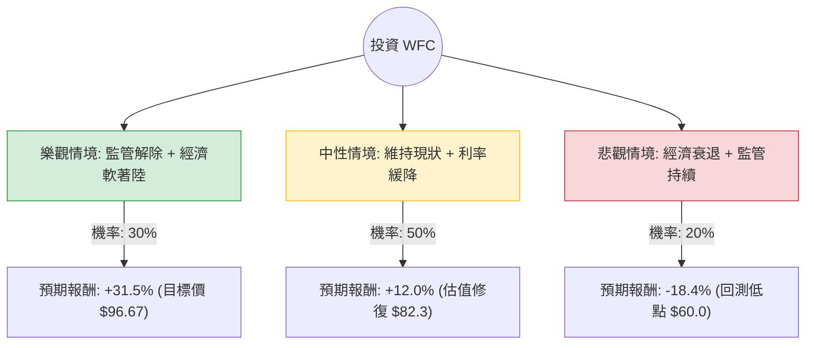

這份分析報告將結合您提供的 **Wells Fargo (WFC)** 基本面數據，以及當前美股銀行業的市場動態（如聯準會利率政策、資產上限監管進度等），利用**決策樹（Decision Tree）**與**期望值分析（Expected Value Analysis）**評估其投資價值。

---

### 一、 核心假設與市場背景分析

在建立決策樹之前，我們必須基於數據與現況設定核心假設：

1.  **估值面（Valuation）：** WFC 目前 P/E 為 11.35，Forward P/E 僅 9.33，PEG 為 0.71。這顯示相對於其盈餘成長，股價處於**低估**狀態。
2.  **監管壓力（Regulatory Factor）：** 富國銀行長期受限於 1.95 兆美元的「資產上限（Asset Cap）」。最新進展顯示公司正積極改善風險控管，市場預期 2025 年有機會解除，這是股價爆發的核心催化劑。
3.  **宏觀環境（Macro）：** 聯準會進入降息週期。降息雖會壓縮淨利差（NIM），但能減少壞帳壓力並刺激貸款需求。
4.  **技術面（Technical）：** 目前股價低於 SMA20, 50, 200，且 YTD 下跌 21%，顯示短期動能極弱，處於超賣或修正區間。

---

### 二、 決策樹分析圖 (Decision Tree)

我們將未來一年的表現分為三種情境：**樂觀（Bull）**、**中性（Base）**、**悲觀（Bear）**。

---

### 三、 期望值計算過程 (Expected Value Calculation)

#### 1. 情境參數設定
*   **現價 (Current Price):** $73.53
*   **樂觀情境 (Bull Case):** 聯準會成功軟著陸，且 Fed 正式解除資產上限。股價回歸分析師平均目標價 **$96.67**。
    *   報酬率 = ($96.67 - $73.53) / $73.53 = **+31.47%**
*   **中性情境 (Base Case):** 監管未完全解除但有正面進展，獲利隨 EPS next Y (12.72%) 成長，股價回升至 P/E 11 倍左右水平（約 **$82.35**）。
    *   報酬率 = ($82.35 - $73.53) / $73.53 = **+12.00%**
*   **悲觀情境 (Bear Case):** 美國陷入衰退，壞帳撥備增加，且資產上限持續。股價回測 52 週低點附近（約 **$60.00**）。
    *   報酬率 = ($60.00 - $73.53) / $73.53 = **-18.40%**

#### 2. 期望值 (EV) 計算
$$EV = (P_{Bull} \times R_{Bull}) + (P_{Base} \times R_{Base}) + (P_{Bear} \times R_{Bear})$$

*   $EV = (0.30 \times 31.47\%) + (0.50 \times 12.00\%) + (0.20 \times -18.40\%)$
*   $EV = 9.441\% + 6.00\% - 3.68\%$
*   **$EV = 11.761\%$**

---

### 四、 綜合評估與數據解讀

1.  **估值安全邊際：** WFC 的 PEG 0.71 遠低於 1，且 Forward P/E (9.33) 低於行業平均。這意味著即便在悲觀情境下，下行空間也受到低估值的保護。
2.  **財務體質：** ROE 12.07% 表現穩健，EPS Q/Q 成長 15.41% 顯示獲利能力仍在提升。雖然 Debt/Eq 2.55 偏高（銀行業特性），但其利潤率 (Profit Margin 16.41%) 足以支撐利息支出。
3.  **技術面警訊：** 股價目前處於所有均線（SMA 20/50/200）之下，且 YTD 表現 (-21.15%) 遠遜於大盤。這通常代表市場短期內對其缺乏信心，或是資金正在流出金融板塊。
4.  **股利收益：** 2.45% 的殖利率提供了持有的現金流緩衝。

---

### 五、 最終結論

**投資建議：適合投資 (Buy on Weakness)**

#### 理由：
1.  **期望值為正 (11.76%)**：計算結果顯示，在考慮了各種風險後，預期報酬率依然優於定存與多數債券工具。
2.  **風險報酬比優異**：目前股價 ($73.53) 距離分析師目標價 ($96.67) 有極大的上行空間，而下行至 $60 的機率相對較低（除非發生系統性金融危機）。
3.  **轉機股特性**：WFC 是一檔典型的「轉機股」。一旦資產上限解除的利多兌現，其估值將會與摩根大通 (JPM) 或美國銀行 (BAC) 看齊，產生估值修復（Re-rating）行情。
4.  **進場策略**：由於目前技術面呈現空頭排列（SMA 全數跌破），建議採取**分批進場（Dollar Cost Averaging）**策略，以應對短期內可能因市場情緒導致的進一步回檔。

**風險提示：** 需密切關注聯準會對富國銀行風險控管評估的最新聲明，若監管機構再次延長資產上限期限，股價可能會在 $70 附近長期盤整。