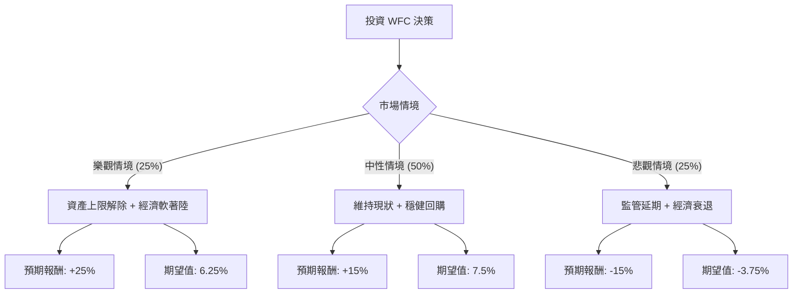

這份分析報告將結合您提供的財務數據與最新的市場動態（包含資產上限監管進度、利率環境及財報表現），利用**決策樹（Decision Tree）**與**期望值分析（Expected Value Analysis）**評估富國銀行（Wells Fargo, WFC）的投資價值。

---

### 一、 核心背景與市場動態分析

在進入模型前，我們先整合最新資訊：
1.  **資產上限（Asset Cap）進展**：富國銀行自 2018 年起受限於 1.95 兆美元的資產上限。最新消息顯示，公司在改善風險管理與合規方面取得進展，市場預期 2025 年有機會解除限制，這將是股價爆發的核心催化劑。
2.  **利率環境**：聯準會（Fed）進入降息週期。雖然降息會壓縮淨利差（NIM），但富國銀行的非利息收入（如投行業務、財富管理）增長強勁，且降息有助於減少潛在的信貸損失。
3.  **財務指標亮點**：
    *   **PEG 0.83**：低於 1，顯示相對於其盈餘成長性，目前股價被低估。
    *   **Forward P/E 10.94**：低於行業平均與自身歷史高位，具備估值吸引力。
    *   **回購與股息**：公司擁有強大的資本充足率，持續進行大規模股票回購。

---

### 二、 決策樹分析 (Decision Tree)

我們將未來一年的表現分為三種情境：**樂觀（Bull）**、**中性（Base）**、**悲觀（Bear）**。

#### 節點詳細說明：

| 情境 | 機率 (P) | 預期報酬 (R) | 期望值 (P * R) | 關鍵假設 |
| :--- | :--- | :--- | :--- | :--- |
| **樂觀 (Bull)** | 25% | +25% | **6.25%** | Fed 正式解除資產上限，貸款規模恢復增長，投行業務爆發。股價挑戰 $110。 |
| **中性 (Base)** | 50% | +15% | **7.50%** | 達到分析師目標價 ($102)，回購支撐股價，NIM 雖降但非利息收入補足。 |
| **悲觀 (Bear)** | 25% | -15% | **-3.75%** | 監管機構要求進一步整改，資產上限無限期延長，商業地產貸款違約率上升。股價回測 $74。 |

---

### 三、 期望值計算過程

**1. 總期望報酬率 (Total Expected Return):**
$$E(R) = (P_{Bull} \times R_{Bull}) + (P_{Base} \times R_{Base}) + (P_{Bear} \times R_{Bear})$$
$$E(R) = (0.25 \times 0.25) + (0.50 \times 0.15) + (0.25 \times -0.15)$$
$$E(R) = 0.0625 + 0.075 - 0.0375 = 0.10 = \mathbf{10\%}$$

**2. 核心假設說明：**
*   **估值修復**：目前 Forward P/E 僅 10.94，若回歸歷史均值 12-13 倍，股價有天然上漲空間。
*   **目標價參考**：數據顯示 Target Price 為 $102.13，較目前股價 ($86.96) 有約 17.4% 的上漲空間，這支撐了中性情境的假設。
*   **風險溢價**：考慮到 Debt/Eq 較高 (2.35) 以及 SMA20/SMA50 的短期技術面走弱，悲觀情境設定了 15% 的跌幅以反映市場波動。

---

### 四、 最終結論

#### **評估結果：適合投資 (Suitable for Investment)**

**理由如下：**

1.  **正向期望值**：經過加權計算，WFC 的年度預期報酬率為 **10%**（不含 1.95% 的股息），在大型銀行股中屬於優異表現。
2.  **估值極具吸引力**：**PEG 0.83** 是最強大的買入理由，顯示市場尚未完全反映其未來的盈利增長潛力。
3.  **催化劑明確**：資產上限的解除不是「會不會」的問題，而是「何時」的問題。目前股價處於 52 週高點回落約 11% 的位置（SMA20/50 負值），提供了較好的分批進場點。
4.  **防禦性與進攻性兼備**：1.95% 的股息提供基礎收益，而一旦監管鬆綁，其資產負債表的擴張空間將使其表現優於摩根大通 (JPM) 或美國銀行 (BAC)。

**投資建議：**
由於短期技術指標（SMA20, SMA50）顯示股價正在修正，建議採取**分批買入（Dollar Cost Averaging）**策略，首批資金可在當前價位進場，若股價回測 SMA200（約 $81 附近）可加大配置。