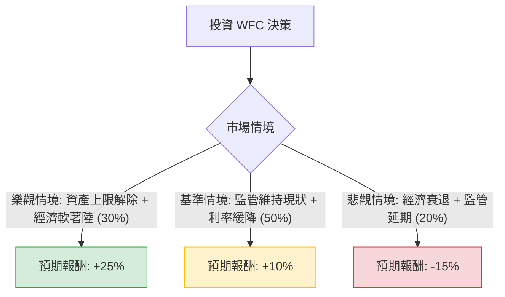

這份分析報告將結合您提供的 **Wells Fargo (WFC)** 基本面數據，以及當前美股市場的最新動態（如聯準會利率政策、資產上限進展、銀行業監管環境）進行綜合評估。

---

### 一、 核心假設與市場動態分析

在建立決策樹之前，我們必須確立影響 WFC 股價的三大核心變數：

1.  **資產上限 (Asset Cap) 的解除進度**：自 2018 年以來，聯準會因虛假帳戶醜聞對 WFC 實施 1.95 兆美元的資產上限。最新進展顯示 WFC 已完成多項監管要求，市場預期 2025 年有極高機率解除，這將釋放其放貸能力。
2.  **淨利息收入 (NII) 與利率環境**：聯準會進入降息週期。雖然降息會壓縮利差，但 WFC 的 **Forward P/E (10.61)** 與 **PEG (0.77)** 顯示其估值仍具吸引力，且降息可能刺激貸款需求。
3.  **營運效率與成本控制**：WFC 持續進行裁員與流程自動化，其 **Profit Margin (16.38%)** 與 **Oper. Margin (20.7%)** 在同業中表現穩健。

---

### 二、 決策樹分析 (Decision Tree)

以下使用 Markdown 繪製 WFC 投資決策樹，評估未來 12 個月的潛在報酬：

#### 節點詳細說明：

1.  **樂觀情境 (Bull Case) - 30% 機率**：
    *   **條件**：聯準會正式解除資產上限；美國經濟維持增長；WFC 擴大股票回購。
    *   **預期報酬**：股價向目標價 **$103.16** 靠攏，加上 2.07% 股息，總報酬約 **25%**。
2.  **基準情境 (Base Case) - 50% 機率**：
    *   **條件**：資產上限未解除但監管壓力減輕；NII 受降息影響輕微；營運效率持續提升。
    *   **預期報酬**：股價隨大盤溫和上漲，反映其低估值（PEG 0.77），總報酬約 **10%**。
3.  **悲觀情境 (Bear Case) - 20% 機率**：
    *   **條件**：美國陷入經濟衰退導致信貸損失增加；監管機構發現新違規。
    *   **預期報酬**：股價回測 200 日均線或更低，預估跌幅約 **-15%**。

---

### 三、 期望值分析 (Expected Value Analysis)

根據上述決策樹的機率與報酬分配，我們計算投資 WFC 的期望報酬率：

#### 1. 計算過程：
$$EV = (P_{Bull} \times R_{Bull}) + (P_{Base} \times R_{Base}) + (P_{Bear} \times R_{Bear})$$

*   **樂觀 (Bull)**: $0.30 \times 25\% = 7.5\%$
*   **基準 (Base)**: $0.50 \times 10\% = 5.0\%$
*   **悲觀 (Bear)**: $0.20 \times (-15\%) = -3.0\%$

#### 2. 總期望值：
$$EV = 7.5\% + 5.0\% - 3.0\% = 9.5\%$$

**額外考量因素：**
*   **估值安全邊際**：Forward P/E 10.61 低於行業平均，且 P/FCF 僅 7.31，顯示現金流極其強勁。
*   **技術面**：目前股價低於 SMA20 (-5.52%) 與 SMA50 (-7.28%)，顯示短期處於超賣或回檔區，是較好的分批進場點。

---

### 四、 最終結論

#### **判斷：適合投資 (Buy / Overweight)**

#### **理由：**
1.  **期望值為正 (9.5%)**：即便在考慮 20% 悲觀風險的情況下，整體期望報酬仍優於無風險利率（美債收益率）。
2.  **估值極具吸引力**：**PEG 0.77** 顯示市場嚴重低估了 WFC 的增長潛力。相較於 JPM 或 BAC，WFC 的估值修復空間更大。
3.  **催化劑明確**：資產上限的解除是「時間問題」而非「是否問題」。一旦解除，WFC 的 ROE (目前 11.85%) 有望進一步提升。
4.  **財務穩健**：雖然 Debt/Eq 較高 (2.35)，但這是銀行業常態；其 **Profit Margin (16.38%)** 確保了在降息週期中仍有足夠的獲利緩衝。

**建議操作策略：**
由於短期技術指標 (SMA20/50) 偏弱，建議採取**分批買入 (Dollar-Cost Averaging)** 策略，首批資金可在當前價位 ($86 附近) 建立基礎倉位，若股價回測 $80-$82 區間則可加碼。目標價設定在分析師預期的 **$103** 附近。