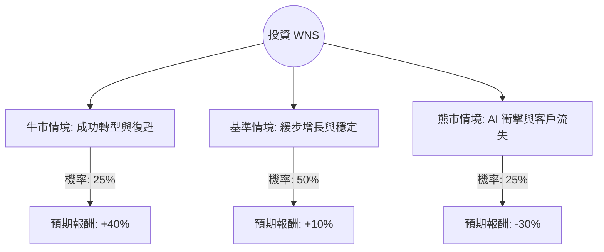

這份分析報告將針對 **WNS (Holdings) Limited (WNS)** 進行深入評估。WNS 是一間全球領先的業務流程管理（BPM）公司。近期該公司股價經歷了劇烈波動，主要受到大客戶流失與生成式 AI（GenAI）衝擊產業前景的疑慮影響。

以下結合最新市場數據、財報資訊與產業趨勢，利用**決策樹**與**期望值分析**進行投資評估。

---

### 一、 WNS 基本面與市場動態摘要

在進入分析前，我們先整理關鍵背景資訊：
1.  **近期利空**：WNS 在 2024 年初揭露失去了一家大型保健服務客戶（預計影響 2025 財年營收約 4%），導致股價重挫。
2.  **AI 威脅論**：市場擔心生成式 AI 會取代傳統的 BPO（外包）服務，降低客戶對人工服務的需求。
3.  **估值水平**：目前 WNS 的本益比（P/E Ratio）處於歷史低位（約 10-12 倍），遠低於過去 5 年平均的 20-25 倍。
4.  **財務狀況**：儘管營收成長放緩，但 WNS 仍保持健康的現金流與利潤率，並積極進行股票回購。

---

### 二、 決策樹分析（Decision Tree）

我們以 **1 年為投資期限**，設定三種可能的情境：

#### 決策樹節點詳細說明：

| 節點名稱 | 發生機率 (P) | 預期報酬 (R) | 說明 |
| :--- | :--- | :--- | :--- |
| **牛市情境 (Bull Case)** | 25% | +40% | 成功利用 AI 提升效率，簽下新大客戶彌補缺口，估值修復至歷史平均。 |
| **基準情境 (Base Case)** | 50% | +10% | 營收持平或微增，AI 影響中性，透過股票回購支撐每股盈餘 (EPS)。 |
| **熊市情境 (Bear Case)** | 25% | -30% | 更多客戶因 AI 縮減外包規模，利潤率因價格競爭受壓，股價進一步下探。 |

---

### 三、 核心假設與計算過程

#### 1. 核心假設
*   **市場假設**：美股整體環境穩定，無系統性金融危機。
*   **財務假設**：WNS 2025 財年營收指引（Guidance）能達標，且營業利益率維持在 20% 以上。
*   **產業趨勢**：AI 對 BPM 產業是「工具」而非「終結者」，短期內客戶仍需專業人力管理 AI 流程。

#### 2. 期望值 (Expected Value, EV) 計算
期望值的計算公式為：
$$EV = \sum (機率 \times 預期報酬)$$

*   **牛市貢獻**：$25\% \times 40\% = 10\%$
*   **基準貢獻**：$50\% \times 10\% = 5\%$
*   **熊市貢獻**：$25\% \times (-30\%) = -7.5\%$

**總計期望報酬率**：
$$10\% + 5\% - 7.5\% = 7.5\%$$

---

### 四、 綜合分析與評估

#### 1. 優勢 (Pros)
*   **估值極具吸引力**：目前的 P/E 顯示市場已過度反應（Oversold）利空消息。
*   **高客戶黏著度**：BPM 服務通常涉及深層業務整合，客戶更換供應商的成本高。
*   **資本回報**：公司持續回購股票，顯示管理層認為股價被低估。

#### 2. 風險 (Cons)
*   **AI 的不確定性**：如果 AI 演進速度超過 WNS 轉型速度，長期護城河將消失。
*   **客戶集中度**：失去一個大客戶的衝擊巨大，顯示其營收結構仍有脆弱性。

---

### 五、 最終結論

**判斷：適合投資 (但建議採取「分批佈局」策略)**

#### 理由：
1.  **期望值為正 (7.5%)**：雖然面臨 AI 挑戰，但計算後的期望報酬仍為正值，顯示目前的股價已提供了足夠的安全邊際（Margin of Safety）。
2.  **風險已部分反映**：失去大客戶的消息已完全反映在股價中，目前的低估值降低了進一步大幅下跌的機率。
3.  **轉型契機**：WNS 正在積極投入 AI 驅動的解決方案，若能證明 AI 能提高其利潤率而非取代其業務，股價將有巨大的估值修復空間。

**投資建議：**
由於 AI 衝擊屬於長期結構性議題，短期內股價可能持續震盪。建議投資者不要一次性重倉，而是分批買入，並密切觀察接下來兩季的財報中，關於「新簽約客戶數量」與「AI 專案營收佔比」的數據。

---
*免責聲明：本分析僅供參考，不構成任何投資建議。投資股票具有風險，請務必自行審慎評估。*