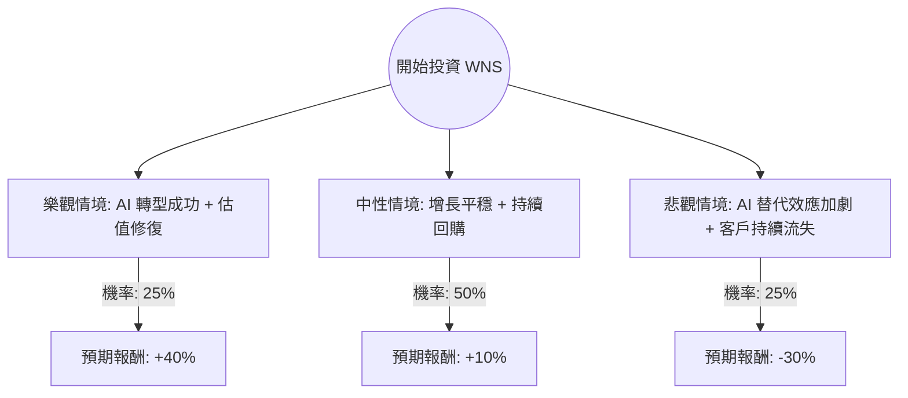

這份分析報告將針對 **WNS (Holdings) Limited (WNS)** 進行深入評估。WNS 是一間領先的業務流程管理（BPM）公司。近期該公司面臨市場對 AI 衝擊的擔憂以及主要客戶流失的壓力，股價處於歷史相對低位。

以下結合最新市場數據、財報資訊與產業趨勢，利用**決策樹**與**期望值分析**進行投資評估。

---

### 一、 WNS 基本面與市場現況摘要

在進入分析前，我們先整理關鍵背景資訊：
1.  **財務表現**：根據 2024 財年第四季與全年財報，營收增長放緩。FY2025 指引（Guidance）顯示營收增長預計在 1% 至 5% 之間，顯示短期增長乏力。
2.  **核心風險**：
    *   **客戶流失**：近期失去了一家大型醫療保健客戶（預計影響營收約 4%）。
    *   **AI 威脅論**：市場擔心生成式 AI（GenAI）會取代傳統 BPM 服務，導致估值倍數（P/E）遭到壓縮。
3.  **估值**：目前本益比（P/E）約在 10-12 倍左右，遠低於其 5 年平均值（約 18-22 倍），顯示市場已反映大量利空。
4.  **資本配置**：公司持續進行股票回購，顯示管理層認為股價被低估。

---

### 二、 決策樹分析（Decision Tree）

我們將未來一年的投資回報分為三種情境：**樂觀（牛市）**、**中性（基準）**、**悲觀（熊市）**。

#### 決策樹圖表 (Markdown 格式)

| 節點名稱 | 情境描述 | 機率 (P) | 預期報酬 (R) | 期望值 (P * R) |
| :--- | :--- | :--- | :--- | :--- |
| **樂觀情境** | AI 提升效率並創造新需求，成功獲取新客戶填補缺口，P/E 回升至 18x | 25% | +40% | +10.0% |
| **中性情境** | 營收維持低速增長，AI 影響中性，回購支撐股價，P/E 維持在 12x | 50% | +10% | +5.0% |
| **悲觀情境** | AI 導致合約價格大幅下降，更多客戶流失，P/E 降至 8x | 25% | -30% | -7.5% |
| **總計** | **整體期望值 (Total Expected Value)** | **100%** | -- | **+7.5%** |

---

### 三、 計算過程與核心假設

#### 1. 期望值計算方式
$$EV = (P_{Bull} \times R_{Bull}) + (P_{Base} \times R_{Base}) + (P_{Bear} \times R_{Bear})$$
$$EV = (0.25 \times 0.40) + (0.50 \times 0.10) + (0.25 \times -0.30)$$
$$EV = 0.10 + 0.05 - 0.075 = 0.075 \text{ (即 7.5%)} $$

#### 2. 核心假設說明
*   **市場假設**：假設美股整體環境不發生系統性金融危機，利率環境趨於穩定或緩步下降。
*   **財務假設**：
    *   **樂觀**：WNS 證明其 AI 解決方案能增加客戶黏著度，利潤率因自動化而提升。
    *   **中性**：公司能維持現有客戶群，雖然增長緩慢，但強大的現金流足以支撐每年約 2-3% 的股數回購。
    *   **悲觀**：BPM 產業發生結構性改變，傳統的人力外包模式被 AI 軟體直接取代，導致營收萎縮。
*   **產業趨勢**：目前處於「AI 恐懼期」。歷史上，當新技術出現時，服務商通常會先經歷估值下修，隨後透過整合新技術實現反彈。

---

### 四、 最終結論

#### **判斷：適合投資（但屬於「價值陷阱」風險較高的投機性配置）**

**期望值分析結果：+7.5%**
雖然期望值為正，但 7.5% 的預期回報在當前高利率環境下（無風險利率約 4-5%）並不算非常有吸引力，且面臨較大的下行風險（-30%）。

#### **理由：**
1.  **估值極低**：WNS 目前的 P/E 處於歷史底部，這為投資者提供了較大的安全邊際（Margin of Safety）。即便增長緩慢，只要不陷入衰退，股價下行空間有限。
2.  **現金流強勁**：BPM 業務具有高現金轉換率，公司有能力透過回購來回饋股東，這在低增長時期是重要的股價支撐。
3.  **AI 的雙面刃**：市場目前過度定價了 AI 的威脅，而忽略了 WNS 利用 AI 降低自身營運成本的可能性。

#### **投資建議：**
*   **適合對象**：偏好價值投資、能忍受短期波動、且相信 BPM 產業能成功轉型的投資者。
*   **操作策略**：建議**分批建倉**。由於短期內缺乏強大的利多催化劑（Catalyst），股價可能會在底部盤整較長時間。需密切關注下一季財報中關於「新客戶簽約金（ACV）」以及「AI 專案貢獻度」的數據。

---
**風險提示：** 本分析僅供參考，不構成任何投資建議。美股投資涉及風險，請務必根據自身風險承受能力做出決策。