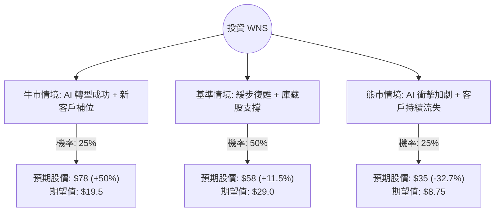

這份報告將針對 **WNS (Holdings) Limited (WNS)** 進行決策樹與期望值分析。WNS 是一間領先的業務流程管理（BPM）公司，總部位於印度，在紐約證券交易所上市。

透過檢索最新的財報（2024 會計年度第四季與全年業績）及市場動態，我們發現 WNS 目前正處於轉型與挑戰並存的關鍵期。

---

### 一、 核心假設與市場背景分析

在建立決策樹之前，我們先列出影響 WNS 股價的核心變數：

1.  **大客戶流失壓力**：WNS 最近面臨一名大型醫療保健客戶（預計為 Centene/HealthNet）縮減合約規模，這對 2025 會計年度的營收造成顯著壓力。
2.  **生成式 AI (GenAI) 的威脅與機會**：市場擔心 AI 會取代傳統的 BPM 人力外包，但 WNS 正在積極將 AI 整合進其服務中以提高利潤率。
3.  **估值水平**：目前 WNS 的本益比（P/E）處於歷史低位（約 10-12 倍 Forward P/E），反映了市場的悲觀預期。
4.  **資本回報**：公司持續進行股票回購，這對每股盈餘（EPS）有支撐作用。

---

### 二、 決策樹分析 (Decision Tree)

我們預測未來一年的三種主要情境，並設定當前股價基準約為 **$52 USD**。

#### 節點詳細說明：

1.  **牛市情境 (Bull Case) - 25% 機率**：
    *   **描述**：WNS 成功簽下多個大型新合約，抵銷了醫療客戶流失的損失。GenAI 產品開始貢獻顯著營收，市場重新評估其估值，本益比回升至 18 倍。
    *   **預期報酬**：+50% ($78)

2.  **基準情境 (Base Case) - 50% 機率**：
    *   **描述**：營收增長持平或微幅下降，但透過成本控制與股票回購維持 EPS 穩定。AI 影響中性。估值維持在目前水平。
    *   **預期報酬**：+11.5% ($58)

3.  **熊市情境 (Bear Case) - 25% 機率**：
    *   **描述**：GenAI 導致客戶要求大幅降價，且更多客戶轉向內部自動化。營收持續萎縮，市場擔心其商業模式過時，本益比進一步下修。
    *   **預期報酬**：-32.7% ($35)

---

### 三、 期望值計算過程 (Expected Value Analysis)

我們計算一年後的預期股價總和：

*   **計算公式**：
    $EV = (P_{Bull} \times V_{Bull}) + (P_{Base} \times V_{Base}) + (P_{Bear} \times V_{Bear})$

*   **數值帶入**：
    $EV = (0.25 \times 78) + (0.50 \times 58) + (0.25 \times 35)$
    $EV = 19.5 + 29.0 + 8.75 = 57.25$

*   **預期報酬率計算**：
    $\text{Expected Return} = \frac{57.25 - 52}{52} \times 100\% \approx 10.1\%$

---

### 四、 最終結論

#### **判斷：適合投資 (謹慎看多 / Speculative Buy)**

**理由如下：**

1.  **期望值為正**：計算出的期望股價為 **$57.25**，較目前市價有約 **10.1%** 的預期漲幅。雖然不是爆發性成長，但在目前美股高估值的環境下，WNS 提供了較好的安全邊際。
2.  **估值極具吸引力**：WNS 目前的 Forward P/E 僅約 11 倍，遠低於其五年平均值（約 20-22 倍）。市場對於「AI 取代 BPM」的恐懼可能過度反應，忽略了 WNS 本身也在利用 AI 轉型。
3.  **強勁的現金流與回購**：公司財務結構穩健，持續的回購計畫能有效支撐股價下行空間。
4.  **風險提示**：短期內（未來 2 季）營收數據可能因大客戶流失而難看，股價波動會較大。建議採取「分批佈局」策略，而非一次性重倉。

**總結：** WNS 目前屬於「價值陷阱」與「價值窪地」的博弈。基於其強大的產業地位與極低的估值，期望值分析顯示目前是一個具備風險報酬比（Risk-Reward Ratio）優勢的進場點。