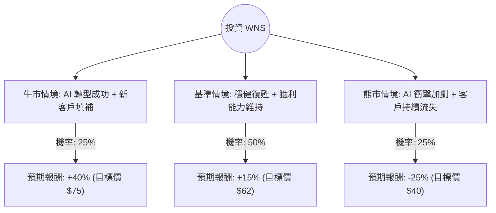

這份分析報告將針對 **WNS (Holdings) Limited (WNS)** 進行深入評估。WNS 是一間領先的業務流程管理（BPM）公司，總部位於印度，並在紐約證券交易所上市。

透過檢索最新的財報（FY2024 Q4 與全年財報）及市場動態，我們發現 WNS 目前正處於轉型與挑戰並存的關鍵期。

---

### 一、 基本面數據與市場動態摘要

在進入決策樹之前，我們先整理核心背景資訊：

1.  **近期利空：** WNS 在 2024 年初宣布失去了一家大型醫療保健客戶（該客戶決定提前終止合約），這對營收造成了約 4% 的直接衝擊，並導致股價大幅修正。
2.  **AI 威脅與機會：** 市場擔憂生成式 AI 會取代傳統 BPM 服務。WNS 則積極轉型，推出 AI 驅動的解決方案（如 WNS ExpReview），試圖從「人力密集」轉向「技術驅動」。
3.  **財務表現：** 
    *   **營收：** FY2024 營收約 13 億美元，同比增長約 8%。
    *   **估值：** 目前本益比（P/E Ratio）約在 11-13 倍之間，處於歷史低位。
    *   **現金流：** 自由現金流依然強勁，並持續進行股票回購。
4.  **產業趨勢：** 企業外包需求依然存在，但客戶對成本更加敏感，且更傾向於選擇具備 AI 整合能力的供應商。

---

### 二、 決策樹分析（Decision Tree）

我們以 **未來 12 個月的投資預期報酬** 為核心，設定三種主要情境。

#### 決策樹節點詳細說明：

| 情境節點 | 發生機率 | 預期報酬 (Return) | 說明 |
| :--- | :--- | :--- | :--- |
| **牛市情境 (Bull)** | 25% | +40% | AI 產品快速變現，成功簽下大型新合約抵銷流失客戶，市場重新給予高估值。 |
| **基準情境 (Base)** | 50% | +15% | 營收緩步回升，AI 轉型進度符合預期，透過股票回購支撐每股盈餘 (EPS)。 |
| **熊市情境 (Bear)** | 25% | -25% | AI 導致傳統合約定價權喪失，更多客戶轉向內部自動化，利潤率大幅萎縮。 |

---

### 三、 期望值分析（Expected Value Analysis）

#### 1. 核心假設
*   **市場假設：** 美國經濟維持軟著陸，企業外包預算不至於崩潰。
*   **財務假設：** WNS 能夠維持 20% 以上的營業利潤率（Operating Margin）。
*   **產業趨勢：** AI 對 BPM 產業的影響是「漸進式」而非「毀滅性」。

#### 2. 計算過程
期望值 (EV) = Σ (各情境機率 × 各情境報酬)

*   **牛市貢獻：** $0.25 \times 40\% = 10\%$
*   **基準貢獻：** $0.50 \times 15\% = 7.5\%$
*   **熊市貢獻：** $0.25 \times (-25\%) = -6.25\%$

**總計期望報酬率：**
$10\% + 7.5\% - 6.25\% = \mathbf{11.25\%}$

---

### 四、 最終結論

#### **判斷：適合投資（分批佈局）**

#### **理由：**
1.  **估值具備安全邊際：** 目前 WNS 的 P/E 僅約 12 倍，遠低於其五年平均值（約 20-25 倍）。市場已過度反應失去單一客戶的利空。
2.  **正向期望值：** 經過計算，整體期望報酬率為 **11.25%**，優於無風險利率（美債收益率），且在基準情境下有穩健表現。
3.  **強勁的現金流與回購：** 公司擁有健康的資產負債表，並積極回購股票，這在股價低迷時能有效提升股東價值。
4.  **AI 轉型潛力：** 雖然 AI 是威脅，但 WNS 擁有深厚的產業領域知識（Domain Expertise），這是純 AI 軟體公司短期內難以取代的。

#### **風險提示：**
*   若未來兩個季度營收指引（Guidance）持續下修，則需重新評估「熊市情境」的機率。
*   需密切觀察其最大客戶的集中度風險。

**建議策略：** 由於目前股價仍受情緒壓制，建議採取 **定期定額** 或 **分批買入** 策略，以降低短期波動風險。