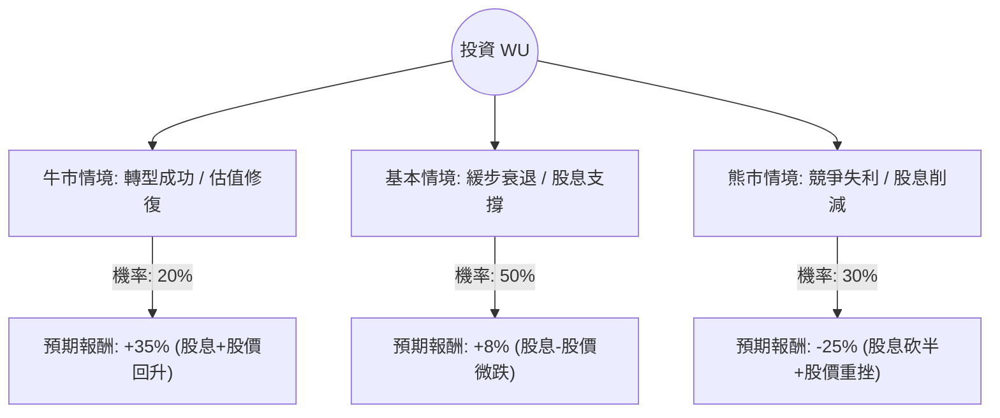

這份分析報告將結合您提供的 Western Union (WU) 基本面數據，以及最新的市場動態（如 Evolve 2025 策略、數位轉型進度與宏觀經濟環境），利用**決策樹（Decision Tree）**與**期望值分析（Expected Value Analysis）**來評估其投資價值。

---

### 一、 核心假設與市場背景分析

在建立決策樹之前，我們基於數據與最新資訊設定以下核心假設：

1.  **數位轉型壓力（核心挑戰）：** WU 正面臨 Wise、Remitly 等數位原生對手的激烈競爭。雖然 WU 的數位營收在增長，但傳統零售代理業務（利潤較高）正緩慢萎縮。
2.  **財務槓桿與股利（核心支撐）：** 
    *   **高債務：** Debt/Eq 高達 3.24，財務壓力大。
    *   **高股息：** 10.77% 的殖利率極具吸引力，但若現金流惡化，有砍股息的風險。
    *   **低估值：** P/E 5.72 處於歷史低位，反映市場極度悲觀。
3.  **Evolve 2025 策略：** 公司試圖轉型為全方位金融服務平台（包含數位錢包、借記卡等），此轉型的成敗決定了長期估值修復的可能性。

---

### 二、 決策樹分析 (Decision Tree)

我們預測未來一年的三種主要情境：

#### 節點詳細說明：

1.  **牛市情境 (Bull Case) - 20% 機率：**
    *   **條件：** 數位業務增長超過 15%，成功抵銷零售下滑；利潤率改善；市場給予 P/E 回升至 8x。
    *   **預期報酬：** 股價回升至 $11 + 10% 股息 ≈ **+35%**。

2.  **基本情境 (Base Case) - 50% 機率：**
    *   **條件：** 營收持平或微跌，數位轉型進度緩慢但穩定。公司維持現有股息政策。
    *   **預期報酬：** 股價維持在 $8.5-$9 之間，靠 10.7% 股息支撐，扣除股價小幅波動，總報酬約 **+8%**。

3.  **熊市情境 (Bear Case) - 30% 機率：**
    *   **條件：** 競爭對手大幅奪取市佔，營收 Q/Q 持續惡化（目前為 -4.8%）。因債務壓力被迫削減股息。
    *   **預期報酬：** 股價跌破 $7，股息減半，總報酬約 **-25%**。

---

### 三、 期望值計算 (Expected Value Calculation)

我們將各情境的機率與預期報酬相乘，得出投資 WU 一年的期望報酬率：

$$EV = (P_{Bull} \times R_{Bull}) + (P_{Base} \times R_{Base}) + (P_{Bear} \times R_{Bear})$$

*   **計算過程：**
    *   牛市：$0.20 \times 35\% = 7.0\%$
    *   基本：$0.50 \times 8\% = 4.0\%$
    *   熊市：$0.30 \times (-25\%) = -7.5\%$

*   **總期望值 (Total EV)：**
    $$7.0\% + 4.0\% - 7.5\% = \mathbf{3.5\%}$$

---

### 四、 綜合數據分析與最新動態補充

1.  **估值陷阱警訊：** 雖然 P/E 5.72 極低，但 **Short Float (放空比例) 高達 14.23%**，顯示專業機構投資者對其前景高度存疑。
2.  **獲利能力：** ROE 51.86% 看似驚人，但這是由高槓桿（Debt/Eq 3.24）堆疊出來的，並非純粹的經營效率。
3.  **現金流：** P/FCF 5.42 顯示目前現金流尚能支撐股息，但 **Current Ratio 僅 0.26**，短期流動性非常緊繃，這在升息環境下是巨大風險。
4.  **技術面：** 股價低於 SMA20, SMA50, SMA200，處於標準的空頭排列，短期內缺乏向上動能。

---

### 五、 最終結論

#### **判斷：不適合投資 (或僅適合極小規模的收息投機)**

**理由：**

1.  **期望值過低：** 3.5% 的期望報酬率遠低於標普 500 的歷史平均，且未能補償其承擔的高債務與產業競爭風險。
2.  **高股息陷阱風險：** 10.77% 的殖利率在流動性比率（0.26）如此低的情況下，極具不穩定性。一旦營收持續萎縮，股息削減將引發股價崩潰。
3.  **缺乏成長動能：** Sales Q/Q 為 -4.8%，EPS Q/Q 為 -68.4%，顯示核心業務仍在失血，數位轉型尚未轉化為底線利潤的增長。
4.  **市場情緒惡劣：** 高放空比與技術面破位，顯示市場正在對賭其轉型失敗。

**建議：**
如果您是追求高股息的投資者，WU 的風險回報比並不理想。建議觀察其 **Digital Revenue** 是否能連續兩季實現雙位數增長，以及 **Debt/Eq** 是否有所下降，再考慮進場。目前資金留在高利存款或指數基金的效益與安全性皆優於 WU。