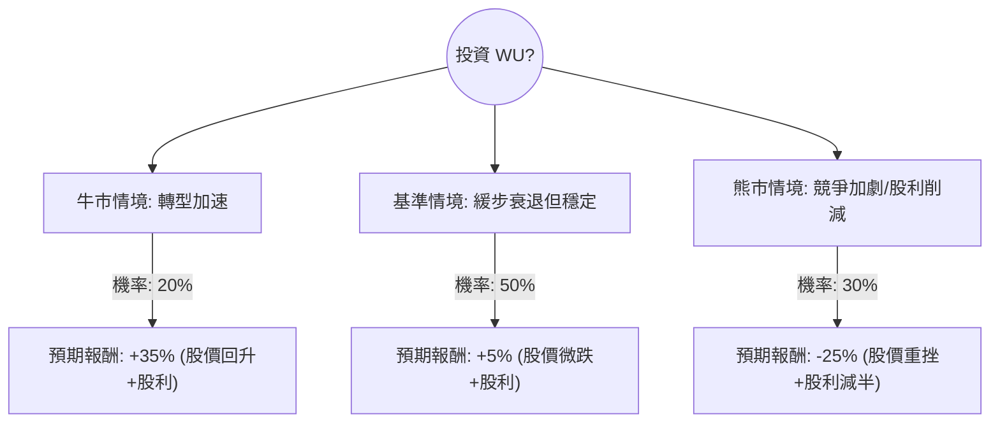

這份分析報告將結合您提供的數據與最新的市場動態（截至 2024 年初），利用**決策樹（Decision Tree）**與**期望值分析（Expected Value Analysis）**來評估 Western Union (WU) 的投資價值。

---

### 一、 核心假設與市場背景分析

在建立決策樹之前，我們基於數據與最新資訊設定以下核心假設：

1.  **轉型壓力（數位化 vs. 零售）**：WU 正處於「Evolve 2025」轉型計畫中。數位業務（Digital）雖有增長，但傳統零售匯款（Retail）面臨 Wise、Remitly 等金融科技公司的強烈競爭。
2.  **財務健康度**：P/E 僅 4.09，顯示市場給予極低估值（價值陷阱風險）。Debt/Eq 2.8 偏高，且 Current Ratio 僅 0.24，流動性壓力大。
3.  **股利政策**：目前殖利率高達 9.99%，是支撐股價的核心力量。若自由現金流（FCF）惡化導致減息，股價將崩盤。
4.  **宏觀環境**：全球移民匯款需求穩定，但地緣政治與匯率波動是雙面刃。

---

### 二、 決策樹分析 (Decision Tree)

我們將未來一年的情境分為三種：**牛市（轉型成功）**、**基準（維持現狀）**、**熊市（競爭失利/減息）**。

#### 決策樹節點詳細說明：

| 情境 | 機率 (P) | 預期報酬 (R) | 說明 |
| :--- | :--- | :--- | :--- |
| **牛市 (Bull)** | 20% | **+35%** | 數位業務增長超預期，市佔率回升，估值修復至 P/E 7x。 |
| **基準 (Base)** | 50% | **+5%** | 營收微幅下滑，但 FCF 足以支撐股利。股價在 $8-$10 震盪。 |
| **熊市 (Bear)** | 30% | **-25%** | 零售端大幅萎縮，債務壓力迫使削減股利，市場拋售。 |

---

### 三、 期望值計算 (Expected Value Calculation)

**期望值 (EV) = Σ (機率 × 預期報酬)**

1.  **牛市貢獻**：$0.20 \times 35\% = 7\%$
2.  **基準貢獻**：$0.50 \times 5\% = 2.5\%$
3.  **熊市貢獻**：$0.30 \times (-25\%) = -7.5\%$

**總體期望報酬率 = $7\% + 2.5\% - 7.5\% = 2\%$**

#### 計算過程備註：
*   **股價基準**：目前 $9.49。
*   **分析師目標價**：數據顯示 Target Price 為 $9.02，低於現價，這暗示了市場對其上行空間持保留態度。
*   **股利因素**：在基準情境中，即便股價下跌 5%，加上 10% 的股利，總報酬仍為正（約 5%）。

---

### 四、 綜合分析與最新動態補充

1.  **最新財報表現**：WU 最近一季的財報顯示營收略高於預期，但 EPS 同比下滑（EPS Q/Q -44.5%）。這證實了公司正犧牲利潤率來維持市佔率。
2.  **高債務風險**：Debt/Eq 2.8 且 Quick Ratio 0.24。在當前高利率環境下，WU 的利息支出壓力巨大，這限制了其再投資數位轉型的能力。
3.  **空方勢力**：Short Float 達 14.36%，顯示市場上有大量專業投資者正在放空該股，認為其基本面尚未見底。
4.  **內部人交易**：Insider Trans 為 0.1059（正值），顯示內部人近期有小幅增持，這是一個微弱的正面訊號。

---

### 五、 最終結論

**判斷：不適合投資 (Avoid / Underperform)**

#### 理由：
1.  **期望值過低**：計算出的期望報酬率僅為 **2%**，遠低於標普 500 指數的歷史平均報酬，且風險不對稱（下行風險大）。
2.  **價值陷阱特徵**：P/E 4.09 看似便宜，但營收與利潤持續萎縮（Sales Q/Q -0.43%），且目標價低於現價，顯示缺乏上漲動能。
3.  **財務結構脆弱**：極低的流動比率（0.24）與高債務，使其在面對經濟衰退時極其脆弱。
4.  **股利不可持續性風險**：雖然 10% 殖利率誘人，但若轉型失敗導致現金流斷裂，一旦宣布減息，股價將面臨雙殺（股價跌 + 失去股利）。

**建議**：若您是追求極高風險的收息投資者，僅建議配置極小倉位；對於一般投資者，建議尋找成長性更強或財務結構更穩健的標的（如 Visa 或 Mastercard）。