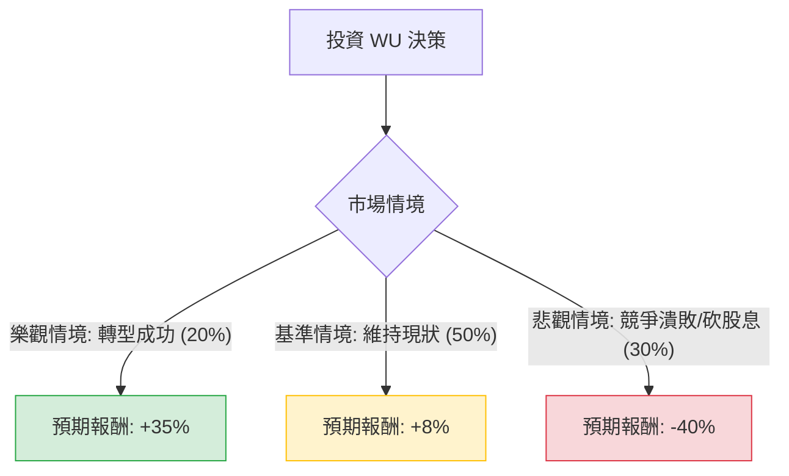

這份分析報告將結合您提供的基本面數據與最新的市場動態（如數位轉型進度、競爭壓力及宏觀經濟環境），利用**決策樹（Decision Tree）**與**期望值分析（Expected Value Analysis）**評估 Western Union (WU) 的投資價值。

---

### 一、 市場動態與核心假設分析

在進入計算前，根據最新資訊（2024 Q3/Q4 趨勢）總結以下關鍵點：

1.  **數位轉型壓力**：WU 正面臨 Wise、Remitly 等數位原生公司的強烈競爭。雖然 WU 的數位營收在增長，但傳統零售網點（Retail）的萎縮抵銷了部分漲幅。
2.  **財務風險**：**Current Ratio 僅 0.21** 且 **Debt/Eq 高達 2.88**，顯示短期流動性極度緊張，且槓桿率高。在當前高利率環境下，債務展期成本增加。
3.  **高股息陷阱風險**：11.14% 的股息率極高，但 **EPS Q/Q 下降 43.9%**。若現金流持續受壓，未來有砍股息的風險。
4.  **估值極低**：P/E 6.18 與 Forward P/E 4.41 顯示市場對其長期成長持悲觀態度，但也意味著任何利多都可能引發空頭回補（Short Float 16.2%）。

---

### 二、 決策樹分析 (Decision Tree)

以下為未來一年（12個月）的投資情境預測：

#### 決策樹節點詳細說明：

| 節點 | 情境名稱 | 發生機率 | 預期報酬 (含股息) | 說明 |
| :--- | :--- | :--- | :--- | :--- |
| **C** | **樂觀 (Bull)** | 20% | **+35%** | 數位業務增長超預期，市佔率回穩，估值修復至 P/E 8x。 |
| **D** | **基準 (Base)** | 50% | **+8%** | 營收微幅下滑但股息照發，股價在 $7.5 - $9 區間震盪。 |
| **E** | **悲觀 (Bear)** | 30% | **-40%** | 營收大幅萎縮，流動性危機爆發導致砍股息，股價跌破 $5。 |

---

### 三、 期望值計算過程 (Expected Value Calculation)

我們將各情境的「機率」乘以「預期報酬」來計算總期望值（EV）：

1.  **樂觀情境期望值**：$20\% \times 35\% = 7.0\%$
2.  **基準情境期望值**：$50\% \times 8\% = 4.0\%$
3.  **悲觀情境期望值**：$30\% \times (-40\%) = -12.0\%$

**總期望報酬率 (Total EV)**：
$$EV = 7.0\% + 4.0\% - 12.0\% = -1.0\%$$

#### 核心假設說明：
*   **報酬率設定**：樂觀情境包含 11% 股息 + 24% 股價回升；基準情境假設股價微跌但被股息抵銷；悲觀情境假設股價腰斬且股息減半。
*   **機率分配**：鑑於其 **Current Ratio (0.21)** 的極端風險與 **EPS Q/Q (-43.9%)** 的衰退，悲觀機率設定為較高的 30%。

---

### 四、 綜合評估與最終結論

#### 1. 基本面亮點 (Pros)
*   **極低估值**：P/E 6.18，遠低於標普500平均。
*   **高 ROE**：47.66% 顯示其品牌資產仍具備強大的獲利能力。
*   **空頭回補潛力**：16.2% 的券商借券賣出比例，若財報稍有利多，易引發軋空。

#### 2. 核心風險 (Cons)
*   **流動性危機**：Current Ratio 0.21 是極其危險的訊號，代表短期資產遠不足以支付短期負債。
*   **結構性衰退**：傳統匯款市場被加密貨幣與低手續費 FinTech 公司蠶食。
*   **技術面弱勢**：股價低於所有均線 (SMA20, 50, 200)，呈現標準空頭排列。

#### 最終判斷：**不適合投資 (Not Recommended)**

**理由：**
雖然 WU 看起來像是一個誘人的「價值陷阱（Value Trap）」，但經過期望值分析，其**最終期望報酬率為 -1.0%**，這意味著在考慮風險後，這並非一項具備正向預期的投資。

最致命的因素在於其**財務結構的脆弱性（低流動性、高債務）**與**核心業務的衰退**。11% 的股息在基本面惡化的情況下極不可持續。對於尋求穩健收益的投資者，該股風險過高；對於尋求成長的投資者，其數位轉型速度尚不足以支撐股價反轉。

**建議操作：**
若已持有，建議逢高減碼，關注其是否能改善流動性比率；若未持有，建議觀望，直到其數位業務營收佔比能完全覆蓋零售業務的流失，且債務結構得到改善。