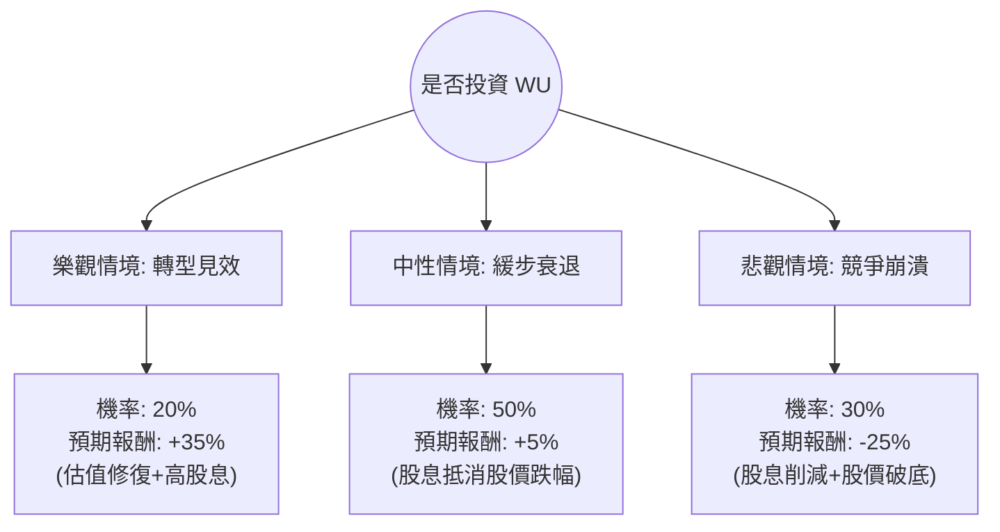

這份分析報告將結合您提供的財務數據與最新的市場動態（包含 2024 年最新的財報趨勢與產業競爭現況），利用**決策樹（Decision Tree）**與**期望值分析（Expected Value Analysis）**評估 Western Union (WU) 的投資價值。

---

### 一、 核心假設與市場背景分析

在建立模型前，我們先整合基本面與外部資訊：

1.  **財務亮點**：P/E 僅 6.13，Forward P/E 4.84，且股息率高達 10.04%。ROE (51.86%) 極高，顯示其在輕資產模式下的獲利能力。
2.  **財務隱憂**：負債權益比 (Debt/Eq) 高達 3.24，流動比率僅 0.26，顯示短期償債壓力大。營收成長 (Sales Q/Q -4.8%) 與 EPS 成長 (-68.4%) 均在衰退。
3.  **產業趨勢**：
    *   **競爭壓力**：面臨 Wise, Remitly 等數位原生金融科技公司的強烈競爭，以及穩定幣（Stablecoins）跨境支付的潛在威脅。
    *   **轉型計畫**：公司正推動「Evolve 2025」計畫，試圖從單一匯款轉向全方位金融服務，但數位化進度仍難以完全抵消傳統零售網點的萎縮。
4.  **市場情緒**：空單餘額 (Short Float) 高達 14.4%，顯示市場有大量資金看空。分析師平均評級為 3.67（偏向持有/賣出）。

---

### 二、 決策樹分析 (Decision Tree)

我們將未來一年的情境分為三種：**樂觀（轉型成功）**、**中性（維持現狀）**、**悲觀（競爭失控/股息削減）**。

#### 節點詳細說明：

1.  **樂觀情境 (Bull Case) - 20% 機率**：
    *   **描述**：數位匯款成長超過 15%，成功留住零售客戶，且聯準會降息帶動新興市場匯款需求。
    *   **預期報酬計算**：股價回升至 52 週高點約 $11.5 + 10% 股息 ≈ +35% 總報酬。
2.  **中性情境 (Base Case) - 50% 機率**：
    *   **描述**：營收持續微幅萎縮，但公司透過庫藏股與高股息維持股價。股價在 $8.5 - $9.5 震盪。
    *   **預期報酬計算**：股價微跌至目標價 $9.17 (-2%) + 10% 股息 - 稅務成本 ≈ +5% 總報酬。
3.  **悲觀情境 (Bear Case) - 30% 機率**：
    *   **描述**：數位競爭對手市佔率大幅提升，WU 為了保住現金流被迫削減股息，引發機構拋售。
    *   **預期報酬計算**：股價跌破 52 週低點至 $7.0 (-25%) + 削減後的股息 (5%) ≈ -20% 至 -25% 總報酬。

---

### 三、 期望值計算 (Expected Value Analysis)

根據上述機率與報酬率，計算投資 WU 一年的預期總報酬率（Expected Return, ER）：

$$ER = (P_{Bull} \times R_{Bull}) + (P_{Base} \times R_{Base}) + (P_{Bear} \times R_{Bear})$$

**計算過程：**
1.  **樂觀貢獻**：$0.20 \times 35\% = 7.0\%$
2.  **中性貢獻**：$0.50 \times 5\% = 2.5\%$
3.  **悲觀貢獻**：$0.30 \times (-25\%) = -7.5\%$

**總期望值 (EV)：**
$$7.0\% + 2.5\% - 7.5\% = 2.0\%$$

---

### 四、 核心假設與風險評估

1.  **估值陷阱 (Value Trap)**：雖然 P/E 極低，但這是因為市場預期其未來盈餘將持續下降。PEG 0.77 看似便宜，但若 EPS 成長率轉為負值，該指標將失去意義。
2.  **股息安全性**：10% 的股息率在當前高債務（Debt/Eq 3.24）與低流動性（Quick Ratio 0.26）背景下極具風險。一旦自由現金流（P/FCF 5.81）受損，股息首當其衝。
3.  **技術面壓力**：股價目前低於 SMA20 與 SMA50，顯示短期趨勢向下，且 14.4% 的空單比例意味著市場對其反彈缺乏信心。

---

### 五、 最終結論

**判斷：不適合投資 (Avoid / Underweight)**

#### 理由：
1.  **期望值過低**：經過加權計算，預期報酬率僅為 **2.0%**。在當前美債殖利率仍有 4%~5% 的環境下，承擔如此高的個股風險（特別是高負債與產業競爭）僅換取 2% 的期望報酬，極不具備風險回報比（Risk-Reward Ratio）。
2.  **基本面惡化**：Q/Q 營收與 EPS 的大幅下滑顯示轉型尚未見效。高達 10% 的股息更像是「價值陷阱」的誘餌，而非健康的現金回饋。
3.  **財務結構脆弱**：極低的流動比率 (0.26) 意味著公司在面臨突發金融波動時，缺乏緩衝空間。

**建議**：
如果您是為了領取股息，需高度警惕其股價跌幅超過股息收益（Total Return 為負）。建議觀察其數位業務營收佔比是否能連續兩季提升，或債務比例明顯下降後，再行考慮。目前資金留在標普 500 指數或高成長科技股的勝率更高。