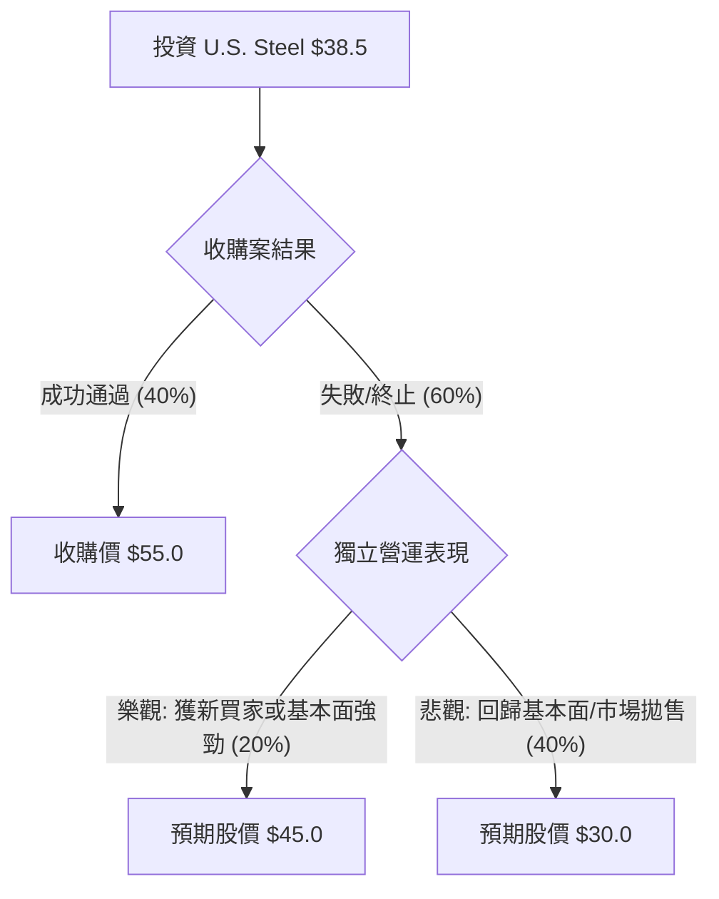

針對美股公司 **United States Steel Corporation (股票代碼：X)**，目前的投資價值高度取決於 **日本製鐵（Nippon Steel）收購案** 的進展。這是一個典型的「併購套利（Merger Arbitrage）」情境，而非單純的基礎面驅動。

以下是基於最新市場資訊（截至 2024 年 5 月底/ 6 月初）的決策樹與期望值分析。

---

### 一、 核心假設與背景資訊

1.  **收購價格**：日本製鐵提議以每股 **$55.00 美元** 現金收購。
2.  **當前股價**：約為 **$38.50 美元**（以此作為基準計算）。
3.  **主要變數**：
    *   **政治阻力**：美國總統拜登、前總統川普以及美國鋼鐵工人聯合會（USW）均表示反對。
    *   **監管審查**：美國外國投資委員會（CFIUS）的國家安全審查。
    *   **基本面**：若收購失敗，公司將回歸獨立營運，受全球鋼鐵需求與價格波動影響。

---

### 二、 決策樹分析 (Decision Tree)

使用 Markdown 繪製決策樹結構：

#### 節點詳細數據：

| 節點名稱 | 情境描述 | 機率 (P) | 預期價值 (V) | 預期報酬率 |
| :--- | :--- | :--- | :--- | :--- |
| **情境 1** | 收購成功 (日本製鐵以 $55 收購) | 40% | $55.0 | +42.8% |
| **情境 2** | 收購失敗 - 樂觀 (其他買家介入或鋼價上漲) | 20% | $45.0 | +16.9% |
| **情境 3** | 收購失敗 - 悲觀 (股價跌回併購前水準) | 40% | $30.0 | -22.1% |

---

### 三、 期望值分析 (Expected Value Analysis)

#### 1. 計算過程
期望值 (EV) = $\sum (機率 \times 預期價值)$

*   **EV** = $(0.40 \times 55.0) + (0.20 \times 45.0) + (0.40 \times 30.0)$
*   **EV** = $22.0 + 9.0 + 12.0$
*   **EV** = **$43.0 美元**

#### 2. 期望報酬率計算
*   **預期獲利額** = $43.0 (EV) - 38.5 (現價) = $4.5
*   **期望報酬率** = $4.5 / 38.5 \approx$ **11.7%**

#### 3. 核心假設說明
*   **收購成功率 (40%)**：考慮到 2024 是美國大選年，兩黨候選人為爭取賓州（鋼鐵重鎮）選票皆持反對立場，成功率設定為低於一半。
*   **悲觀價值 ($30)**：若交易破裂，股價通常會跌回消息公布前的起漲點（約 $25-$30 區間）。
*   **樂觀價值 ($45)**：若日本製鐵失敗，Cleveland-Cliffs 等其他美國本土買家可能再次提出收購，但價格預計低於 $55。

---

### 四、 最終結論

**判斷：適合投資 (但屬於高風險套利性質)**

#### 理由：
1.  **期望值高於現價**：計算出的期望值為 **$43.0**，較目前市價 **$38.5** 有約 **11.7%** 的溢價空間。這顯示市場目前的恐慌情緒可能過度反應了政治風險。
2.  **風險回報比 (Risk/Reward)**：
    *   最大潛在獲利：+$16.5 (42.8%)
    *   最大潛在虧損：-$8.5 (-22.1%)
    *   這是一個非對稱的賭注，潛在獲利幾乎是潛在虧損的兩倍。
3.  **基本面支撐**：即便收購失敗，U.S. Steel 近年來的資產負債表已有所改善，且其 Big River Steel 電弧爐工廠具有長期競爭力，股價跌破 $30 的空間有限。

**風險提示：**
此投資極度依賴政治決策。若 CFIUS 明確以國家安全為由否決且無申訴空間，股價短期內可能出現劇烈回檔。建議僅以**少量倉位**參與，或利用**期權 (Options)** 進行避險。