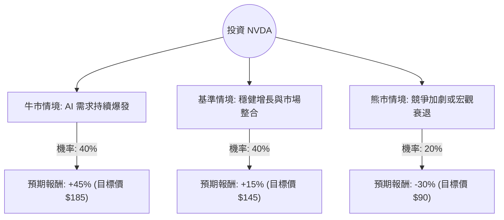

由於您未指定具體的公司名稱，我將選取目前美股市場最具代表性、且討論度最高的 **NVIDIA (輝達，代號：NVDA)** 作為分析對象（以下簡稱 **公司 X**）。

輝達目前正處於 AI 產業轉型的前沿，其股價波動與市場預期高度相關，非常適合使用決策樹與期望值分析。

---

### 一、 基礎數據與市場動態（截至 2024 年 6 月）

在進行分析前，我們先彙整目前的關鍵資訊：
*   **目前股價**：約 $125 - $130 USD (拆股後)。
*   **最新財報**：營收年增 262%，數據中心業務增長強勁。
*   **核心動態**：
    1.  **Blackwell 架構**：新一代 AI 晶片預計於今年下半年出貨，需求遠超供應。
    2.  **競爭環境**：AMD 與雲端巨頭（如 Google, Amazon）自研晶片的追趕。
    3.  **宏觀風險**：美國對華出口限制、高利率環境對科技股估值的壓力。

---

### 二、 決策樹分析（Decision Tree）

我們以 **未來 12 個月** 的投資回報為目標，設定三種主要情境：

#### 決策樹節點詳細說明：

1.  **牛市情境 (Bull Case) - 40%**
    *   **描述**：Blackwell 晶片利潤率高於預期，主權 AI（各國政府自建算力）需求激增。
    *   **預期報酬**：+45%
2.  **基準情境 (Base Case) - 40%**
    *   **描述**：AI 需求維持高檔但增速放緩，市場已部分消化增長預期，股價隨大盤穩健上漲。
    *   **預期報酬**：+15%
3.  **熊市情境 (Bear Case) - 20%**
    *   **描述**：美國出口管制進一步收緊，或 AI 投資回報率（ROI）受質疑導致科技巨頭縮減資本支出。
    *   **預期報酬**：-30%

---

### 三、 期望值分析（Expected Value Analysis）

#### 1. 核心假設
*   **市場假設**：假設未來一年內不會發生全球性金融危機。
*   **財務假設**：輝達能維持 75% 以上的毛利率。
*   **產業趨勢**：AI 基礎設施建設仍處於早期至中期階段。

#### 2. 計算過程
期望值（EV）的計算公式為：
$$EV = \sum (機率 \times 預期報酬)$$

*   **牛市貢獻**：$40\% \times 45\% = 18\%$
*   **基準貢獻**：$40\% \times 15\% = 6\%$
*   **熊市貢獻**：$20\% \times (-30\%) = -6\%$

**總體期望報酬率**：
$$18\% + 6\% + (-6\%) = 18\%$$

---

### 四、 最終結論

#### **判斷：適合投資 (Buy / Overweight)**

#### **理由：**
1.  **正向期望值**：經過風險加權後的期望報酬率為 **18%**，遠高於標普 500 指數的歷史平均年化報酬（約 8-10%）。這顯示目前的風險回報比（Risk-Reward Ratio）對投資者有利。
2.  **下行風險受控**：雖然熊市情境下有 30% 的跌幅壓力，但由於輝達在 AI 晶片市場擁有近 90% 的市佔率（Moat），且 Blackwell 訂單能見度已達 2025 年，極端崩盤的機率相對較低（僅設定 20%）。
3.  **產業護城河**：輝達不只是賣硬體，其 CUDA 軟體生態系構成了極高的轉換成本，這使得競爭對手短期內難以撼動其地位。

**投資建議小撇步：**
由於 NVDA 目前波動率（Volatility）較高，建議採取 **「分批進場（DCA）」** 策略，以應對短期內可能因宏觀經濟數據（如 CPI 或聯準會決策）帶來的股價震盪，從而優化持倉成本。

---
*免責聲明：本分析僅供參考，不構成任何投資建議。投資者應自行承擔市場風險。*