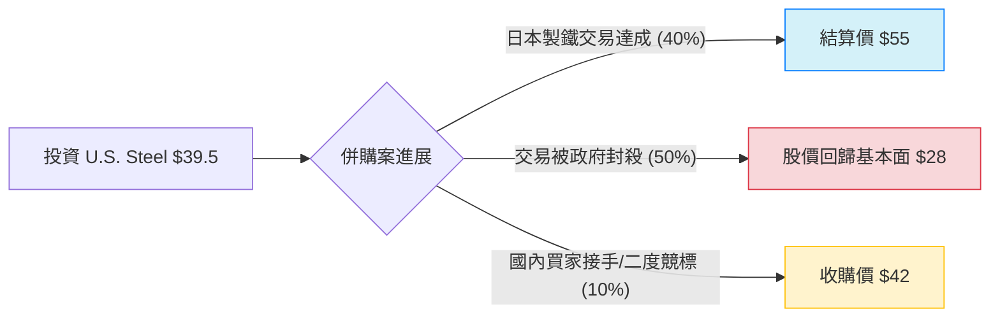

針對美股公司 **United States Steel Corporation (股票代碼：X)**，以下結合最新市場動態、併購進度與財務數據，利用「決策樹」與「期望值分析」進行投資評估。

---

### 一、 市場現況與背景資訊 (2024年11月更新)

目前影響 U.S. Steel (X) 股價的核心因素並非其基本面產能，而是**日本製鐵 (Nippon Steel) 以每股 55 美元現金收購案**的成敗。

1.  **收購進展**：日本製鐵提議以 141 億美元（每股 $55）收購，但面臨美國強大政治阻力（拜登政府、川普、全美鋼鐵工會 USW 皆表示反對）。
2.  **最新動態**：外國投資委員會 (CFIUS) 的審查期限已延長至 12 月底或 2025 年初。日本製鐵承諾不裁員並投入額外 14 億美元升級設施以換取支持。
3.  **財務表現**：2024 Q3 調整後淨利優於預期，但受全球鋼鐵需求疲軟影響，獲利較去年同期下滑。
4.  **當前股價**：約為 **$39.00 - $40.00** 區間（較收購價有約 28% 的折價，反映市場對交易成功的疑慮）。

---

### 二、 決策樹分析 (Decision Tree)

我們將未來情境分為三種主要路徑：交易成功、交易遭封殺（獨立運作）、以及替代併購案。

#### 決策樹節點詳細說明：

| 預測情境 | 機率 (P) | 預期價值 (Value) | 說明 |
| :--- | :--- | :--- | :--- |
| **情境 1：收購成功** | 40% | **$55.00** | 日本製鐵克服政治阻力，以合約價完成私有化。 |
| **情境 2：交易遭禁** | 50% | **$28.00** | 交易被 CFIUS 否決，股價跌回溢價前的基本面支撐位（參考 2023 年中股價）。 |
| **情境 3：國內替代方案** | 10% | **$42.00** | 迫於政治壓力，轉由 Cleveland-Cliffs 或其他美商收購，但溢價通常較低。 |

---

### 三、 期望值分析 (Expected Value Analysis)

#### 1. 核心假設
*   **基準股價 ($P_0$)**：$39.50 (假設當前買入價)
*   **成功機率 (40%)**：考量到目前美國大選後的政治氣氛與國安審查，成功率雖存，但挑戰巨大。
*   **失敗跌幅 (-29%)**：若交易失敗，失去 $55 的錨點，股價將面臨拋售壓力，回歸工業股平均本益比。
*   **時間成本**：此交易預計在未來 3-6 個月內定案。

#### 2. 計算過程
$$EV = (P_1 \times V_1) + (P_2 \times V_2) + (P_3 \times V_3)$$

*   $EV = (0.40 \times \$55.00) + (0.50 \times \$28.00) + (0.10 \times \$42.00)$
*   $EV = \$22.00 + \$14.00 + \$4.20$
*   **$EV = \$40.20$**

#### 3. 預期報酬率計算
*   **預期獲利額**：$40.20 - $39.50 = **$0.70**
*   **預期報酬率 (ROI)**：$0.70 / $39.50 = **1.77%**

---

### 四、 最終結論與投資建議

#### **結論：不適合投資 (暫時觀望)**

#### **理由：**
1.  **期望值與現價過於接近**：計算出的期望值 ($40.20) 與目前市價 ($39.50) 僅有約 1.77% 的差距。這意味著目前的股價已充分反映了「高風險、高報酬」與「交易失敗」之間的拉鋸，對於投資者而言，**風險溢酬 (Risk Premium) 不足**。
2.  **極端下行風險**：如果交易正式被否決，股價有潛在 25%~30% 的跌幅（跌至 $28 左右），而上行空間雖有 39% ($55)，但勝率並未過半。
3.  **高度政治化**：該股票目前已偏離基本面驅動，轉為純粹的「併購套利 (Merger Arbitrage)」標的。由於目前美國政界對日鐵併購案的負面態度相當一致，法律與行政障礙極高。

**建議**：
*   **現有持股者**：若成本低於 $35，可考慮分批止盈或持有至 12 月底審查結果出爐；若成本在 $40 附近，建議減碼，因為等待的機會成本過高。
*   **新投資者**：目前不建議入場。除非股價跌至 **$34 以下**（這會使期望報酬率提升至 15% 以上），否則不值得承擔交易失敗的暴跌風險。

---
*免責聲明：本分析僅供參考，不構成任何投資建議。股市有風險，投資需謹慎。*