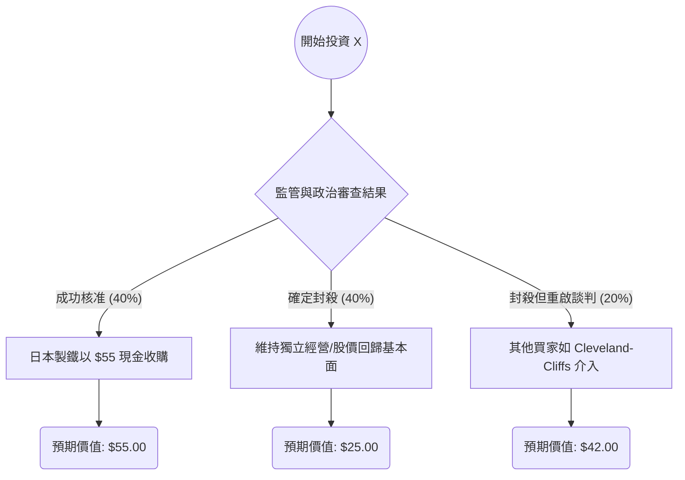

由於您提到的公司代號為 **"X"**，在美股市場中，這通常指代 **美國鋼鐵公司（United States Steel Corporation）**。

目前美國鋼鐵正處於一個極其複雜的併購審查階段（日本製鐵 Nippon Steel 的收購案），這使得其股價波動主要受政治與監管消息驅動，而非單純的財務基本面。以下是基於最新市場資訊的決策樹與期望值分析。

---

### 1. 決策樹分析 (Decision Tree)

我們將未來 6-12 個月的情境分為三種主要路徑：收購成功、收購遭阻斷（獨立經營）、以及收購遭阻斷但有替代買家。

#### 決策樹節點詳細說明：

| 預測情境 | 機率 (P) | 預期股價 (V) | 說明 |
| :--- | :--- | :--- | :--- |
| **情境 1：收購成功** | 40% | $55.00 | 日本製鐵維持原價收購，法律與商業邏輯戰勝政治阻力。 |
| **情境 2：收購遭阻斷** | 40% | $25.00 | 美國政府以國家安全為由封殺，股價跌回併購消息前的基本面水準。 |
| **情境 3：替代收購案** | 20% | $42.00 | 日本製鐵案失敗，但 Cleveland-Cliffs 以較低溢價再次提出收購。 |

---

### 2. 期望值分析與計算過程

#### A. 核心假設
1.  **當前股價 ($P_{current}$)**：約 **$37.00 - $38.00** (以 2024 年 9 月初市場價格估算)。
2.  **收購價**：日本製鐵合約價為每股 $55。
3.  **下行風險**：若交易失敗，考慮到鋼鐵產業循環與失去溢價，股價可能回落至 $25 左右（2023 年起漲點）。
4.  **政治因素**：由於 2024 是美國大選年，拜登政府與川普均表示反對此交易，CFIUS（美國外資投資委員會）的審查極具不確定性，因此將失敗機率設為較高的 40%。

#### B. 期望值 (Expected Value, EV) 計算
$$EV = (P_1 \times V_1) + (P_2 \times V_2) + (P_3 \times V_3)$$

*   **情境 1 (成功)**：$0.40 \times 55 = 22.0$
*   **情境 2 (失敗)**：$0.40 \times 25 = 10.0$
*   **情境 3 (替代)**：$0.20 \times 42 = 8.4$

**總期望值 (EV) = $22.0 + $10.0 + $8.4 = $40.4**

#### C. 預期報酬率計算
*   **潛在獲利空間**：$40.4 (EV) - $37.5 (假設現價) = **$2.9**
*   **預期報酬率**：$2.9 / $37.5 \approx **7.73%**

---

### 3. 最終結論

#### **判斷：不適合投資 (或僅適合極高風險承受者進行套利)**

#### **理由：**
1.  **風險報酬比不具吸引力**：雖然期望值 ($40.4) 高於當前股價 ($37.5)，但預期報酬率僅約 7.7%。考慮到此案面臨強大的政治阻力（白宮可能在短期內正式封殺），下行風險（跌至 $25，跌幅約 33%）遠大於上行空間的確定性。
2.  **政治高度介入**：目前 X 的股價已非由基本面（如鋼鐵產量、營收）決定，而是由 CFIUS 的行政命令決定。在選舉年，政治人物傾向於保護工會利益而反對外資收購，這使得「情境 2」發生的機率正在上升。
3.  **基本面疲軟**：若收購失敗，美國鋼鐵面臨高爐設備老化與競爭力下降的問題，單純靠公司自身營運很難支撐目前接近 $40 的股價。

**總結：** 除非您相信法律程序最終能推翻行政干預，否則在目前政治風暴中心投資 U.S. Steel，其**風險調整後的收益**並不理想。建議觀望監管機構的最終裁決，或尋找其他基本面更穩健的標的。

***

**免責聲明：** 本分析僅供參考，不構成任何投資建議。投資者應自行承擔市場風險。