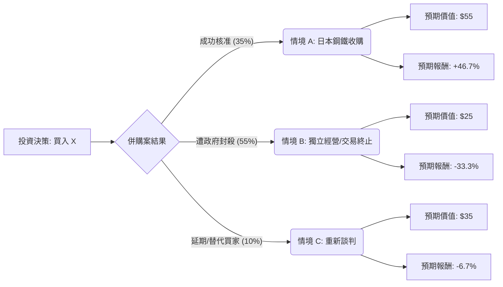

針對美股上市公司 **United States Steel Corporation (股票代碼：X)**，以下結合當前市場動態、併購進度及產業趨勢，進行決策樹與期望值分析。

---

### 1. 背景資訊與核心假設

在進行分析前，我們先釐清目前影響 **X** 股價的核心因素：

*   **併購案現況**：日本鋼鐵（Nippon Steel）擬以每股 **$55 美元** 現金收購 U.S. Steel。
*   **政治阻力**：此案面臨美國政府（拜登、川普、賀錦麗均表示反對）及美國鋼鐵工人聯合會（USW）的強烈抵制，理由涉及國家安全與勞工權益。
*   **市場價格**：目前股價約在 **$37 - $38** 之間波動（相較於 $55 的收購價有極大的折價，反映市場對交易成功的疑慮）。
*   **基本面**：若併購失敗，公司需獨自面對鋼鐵需求疲軟及高額的資本支出（轉型電弧爐）。

#### 核心假設：
1.  **當前股價 ($P_0$)**：假設為 **$37.50**。
2.  **情境 A (併購成功)**：收購價為 $55。
3.  **情境 B (併購失敗/被封殺)**：股價將回歸基本面，考慮到產業景氣與失望性賣壓，預估跌至 $25。
4.  **情境 C (延期或替代方案)**：交易陷入長期法律訴訟或由 Cleveland-Cliffs 等美資公司以較低價格收購，預估價值為 $35。

---

### 2. 決策樹分析 (Decision Tree)

使用 Markdown 繪製決策樹結構：

---

### 3. 期望值分析 (Expected Value Analysis)

#### 計算過程：

期望值 (EV) 的計算公式為：
$$EV = \sum (機率 \times 預期價值)$$

1.  **情境 A (成功)**：
    *   機率：$35\%$ (考慮到政治壓力極大，成功率設為中低)
    *   價值：$55$
    *   計算：$0.35 \times 55 = 19.25$

2.  **情境 B (失敗)**：
    *   機率：$55\%$ (目前政治共識偏向反對，且 CFIUS 審查壓力大)
    *   價值：$25$
    *   計算：$0.55 \times 25 = 13.75$

3.  **情境 C (延期/替代)**：
    *   機率：$10\%$
    *   價值：$35$
    *   計算：$0.10 \times 35 = 3.5$

#### 總期望值計算：
$$EV_{Total} = 19.25 + 13.75 + 3.5 = \$36.50$$

---

### 4. 綜合評估與結論

#### 數據對比：
*   **當前市場價格**：約 **$37.50**
*   **計算期望值 (EV)**：**$36.50**
*   **潛在獲利空間**：$-2.67\%$ (相對於當前股價)

#### 核心分析理由：
1.  **政治風險溢價過高**：目前股價 $37.50 雖然遠低於收購價 $55，但仍高於我們計算出的期望值 $36.50。這意味著市場目前對「成功」的預期可能仍過於樂觀，或者低估了「失敗」後股價回落的深度。
2.  **基本面支撐力弱**：若日本鋼鐵的交易失敗，U.S. Steel 將面臨高額的現代化成本，且在鋼鐵價格循環向下的背景下，缺乏短期利多支撐。
3.  **非對稱風險**：雖然成功後的獲利空間有 46%，但失敗後的跌幅可能高達 33% 以上。在美國大選年，兩黨候選人均反對此案，政治阻力幾乎是不可逆的。

#### 最終結論：
**【不適合投資 (Avoid / Underweight)】**

**理由簡述：**
根據期望值分析，U.S. Steel 目前的**期望價值 ($36.50) 低於當前市價 ($37.50)**。這是一場勝率較低且受政治因素高度干擾的博弈。除非投資者有強烈理由相信美國政府會在選後改變立場（目前機率極低），否則當前的風險回報比並不具備吸引力。建議投資者觀望，或尋找其他受政策干擾較小的鋼鐵標的（如 Nucor 或 Steel Dynamics）。