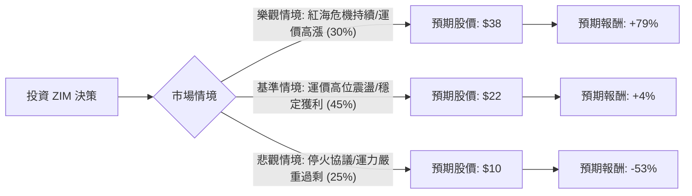

這份分析將結合您提供的財務數據與最新的市場動態（紅海危機、運價走勢、2024 Q1 財報），利用**決策樹（Decision Tree）**與**期望值分析（Expected Value Analysis）**評估 ZIM 的投資價值。

---

### 一、 市場背景與最新動態 (2024年6月更新)

在進入計算前，必須考慮以下影響 ZIM 的核心變數：
1.  **紅海危機持續**：由於地緣政治緊張，多數船隻繞道好望角，導致航程增加、有效運力下降，支撐了貨櫃運價（SCFI/WCI 指數）在 2024 年 Q2 持續飆升。
2.  **2024 Q1 財報轉虧為盈**：ZIM 於 5 月公布 Q1 財報，營收 15.6 億美元，淨利 9,200 萬美元（去年同期為虧損），並上調了全年調整後 EBITDA 預測。
3.  **高空單比例（Short Float 18.28%）**：這代表市場仍有大量看空勢力，但也存在「軋空（Short Squeeze）」的潛力。
4.  **運力過剩風險**：2024-2025 年有大量新船下水，若紅海危機解除，運價可能迅速崩盤。

---

### 二、 決策樹分析 (Decision Tree)

我們以 **1年為投資期限**，設定三種主要情境：

#### 決策樹節點詳細說明：

| 節點 (情境) | 發生機率 (P) | 預期目標價 (1年) | 預期報酬率 (R) | 期望值 (P * R) |
| :--- | :--- | :--- | :--- | :--- |
| **1. 樂觀 (Bull)** | 30% | $38.0 | +79.2% | +23.76% |
| **2. 基準 (Base)** | 45% | $22.0 | +3.7% | +1.67% |
| **3. 悲觀 (Bear)** | 25% | $10.0 | -52.9% | -13.23% |
| **總計期望值** | **100%** | **$23.8** | **-** | **+12.2%** |

---

### 三、 核心假設與計算過程

#### 1. 核心假設
*   **當前股價**：$21.21 (參考數據)。
*   **樂觀情境 (30%)**：紅海封鎖持續至 2024 年底，且旺季需求強勁。ZIM 憑藉高比例的現貨市場（Spot Market）曝險，獲利將大幅超出預期，並恢復高額配息。目標價參考 2022 年部分估值回歸。
*   **基準情境 (45%)**：運價維持在目前水平（高於 2023 年平均），但隨著新船下水抵銷部分漲幅。公司維持小幅獲利，股價在現價附近震盪。
*   **悲觀情境 (25%)**：中東達成停火協議，蘇伊士運河恢復通行。全球運力過剩問題立即浮現，運價崩跌至成本線以下。ZIM 因租船成本較高，可能再次陷入虧損。

#### 2. 期望值 (EV) 計算
*   **預期股價 EV** = $(38 \times 0.3) + (22 \times 0.45) + (10 \times 0.25)$
*   **預期股價 EV** = $11.4 + 9.9 + 2.5 = \mathbf{\$23.8}$
*   **預期報酬率** = $(23.8 - 21.21) / 21.21 = \mathbf{12.2\%}$

*註：此計算尚未包含潛在的季度配息（ZIM 政策為淨利的 30%-50%），若計入配息，期望報酬可能再增加 5-10%。*

---

### 四、 財務數據補充分析

*   **估值極低**：P/B 0.64 顯示股價低於淨值，P/E 2.57 雖是基於過去獲利，但即便未來獲利腰斬，估值依然處於歷史低位。
*   **槓桿風險**：Debt/Eq 1.41 偏高，這在航運業下行週期是致命傷，但在上行週期則能放大 ROE (目前 25.25%)。
*   **技術面**：SMA20/50/200 均呈現多頭排列（股價在均線之上），顯示短期動能強勁。

---

### 五、 最終結論

**評估結果：適合投資 (投機型買入)**

#### 理由：
1.  **正向期望值**：經過加權計算，預期報酬率為 **+12.2%**（不含股息），在當前高利率環境下仍具吸引力。
2.  **不對稱風險報酬比**：雖然悲觀情境下有 -50% 的風險，但 ZIM 作為「現貨運價槓桿」，其向上爆發力（樂觀情境）極強，且目前 P/B 僅 0.64 提供了一定的安全邊際。
3.  **短期催化劑明確**：紅海危機短期內無解，加上 6-8 月進入航運傳統旺季，運價易漲難跌。

#### 投資建議與風險控管：
*   **適合對象**：風險承受度高、追求高波動收益、能隨時關注地緣政治新聞的投資者。
*   **操作策略**：建議分批進場，並將停損位設在 **$17.5 (SMA50 附近)**。若中東局勢突然和解，應立即減碼。
*   **警示**：ZIM 不是長期存股標的，而是極度依賴循環週期與地緣政治的「景氣循環股」。

**結論：在目前運價上漲趨勢未變前，ZIM 具備博弈價值。**