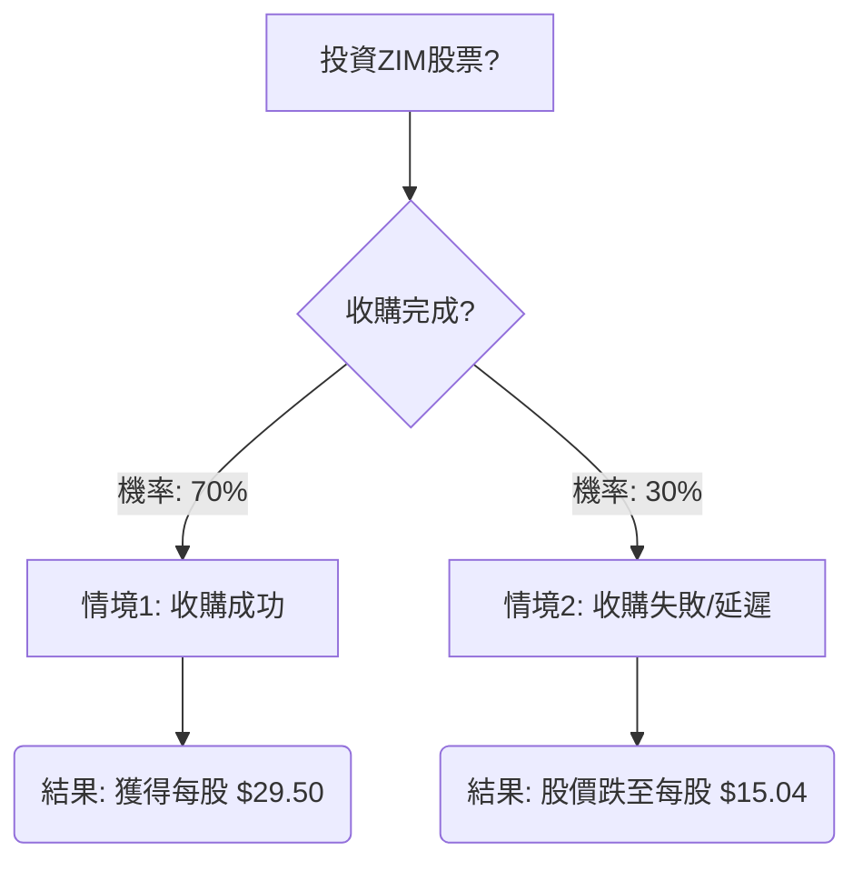

根據您提供的ZIM股票基本面數據，並結合最新的市場資訊，我們將使用決策樹分析和期望值分析來評估ZIM目前是否適合投資。

### 最新市場資訊與核心假設

1.  **ZIM被收購與下市：** 最關鍵的資訊是ZIM綜合航運服務公司已達成協議，將以超過35億美元的價格被德國赫伯羅特（Hapag-Lloyd）和以色列FIMI Opportunity Funds收購，並將從華爾街下市。此交易涉及將ZIM的業務拆分，赫伯羅特將收購不涉及以色列港口的國際航線，而FIMI將收購服務以色列的航線。此協議於2026年2月15日（即當前日期）達成。
2.  **收購價格估計：** ZIM目前的市值約為25億美元至26.7億美元。 交易估值超過35億美元，甚至可能高達37億美元。 假設收購價格為35億美元，以目前約1.2027億股流通股計算（26.7億美元市值 / 22.20美元股價），每股收購價約為 $3,500,000,000 / 120,270,270 ≈ $29.10。若以37億美元計算，則約為 $3,700,000,000 / 120,270,270 ≈ $30.76。我們將採用一個中間值 **$29.50** 作為預期的收購價格。
3.  **分析師目標價（若收購失敗）：** 在收購消息傳出前，分析師對ZIM的共識評級為「賣出」，平均目標價為15.04美元，最低目標價為8.70美元（截至2025年12月19日）。 若收購失敗，股價很可能回歸這些基本面預期。我們將採用 **$15.04** 作為收購失敗時的預期股價。
4.  **產業趨勢：** 紅海危機導致航運路線繞道、運輸時間延長、燃料成本增加，並推高了運費，尤其是在亞洲至歐洲航線。 這在2023年末和2024年初吸收了過剩運力並支撐了運費。 然而，航運業在2024年和2025年面臨運力過剩的擔憂，大量新船將投入營運。 如果紅海危機解決，運費可能迅速下跌。 這些產業趨勢在收購情境下對新投資者的直接影響較小，但在收購失敗情境下則會成為股價下跌的驅動因素。
5.  **股息：** 雖然ZIM過去曾支付高額股息，但最新的資訊顯示，預計本財年的股息將大幅減少99.77%，且股息可靠性較低。 鑑於公司即將被收購並下市，對於新投資者而言，未來的股息已不再是主要考量因素，重點將放在收購價格。

### 決策樹分析

**決策點：** 目前是否投資ZIM股票？ (當前股價: $22.20)

**節點說明與計算：**

*   **A (投資ZIM股票?)**
    *   這是我們的初始決策點。
    *   當前股價：$22.20

*   **B (收購完成?)**
    *   這是主要的不確定性節點。
    *   **核心假設：** 儘管收購協議已達成，但仍存在監管批准（特別是以色列政府的「黃金股」權利）和潛在的員工抗議等風險。
    *   **機率分配：**
        *   **收購成功機率 (P_complete)：70%** (基於協議已達成，但考慮到潛在阻礙)
        *   **收購失敗/延遲機率 (P_fail)：30%** (基於潛在的監管和營運風險)

*   **C (情境1: 收購成功)**
    *   **預測情境名稱：** 收購成功
    *   **對應機率：** 70%
    *   **預期報酬 / 期望值 (Expected Value)：**
        *   若收購成功，預計每股獲得 $29.50。
        *   此情境下的期望值 = $29.50

*   **E (情境2: 收購失敗/延遲)**
    *   **預測情境名稱：** 收購失敗/延遲
    *   **對應機率：** 30%
    *   **預期報酬 / 期望值 (Expected Value)：**
        *   若收購失敗，股價預計回歸分析師的平均目標價 $15.04。
        *   此情境下的期望值 = $15.04

### 期望值計算過程

我們將計算投資ZIM股票的整體期望值，即預期每股的最終價值。

**整體期望值 (EV_overall) = (P_complete \* 情境1期望值) + (P_fail \* 情境2期望值)**

EV_overall = (0.70 \* $29.50) + (0.30 \* $15.04)
EV_overall = $20.65 + $4.512
**EV_overall = $25.162**

### 最終結論

根據我們的期望值分析，投資ZIM股票的整體期望值為每股 **$25.162**。

*   **當前股價：** $22.20
*   **整體期望值：** $25.162
*   **預期每股收益：** $25.162 - $22.20 = **$2.962**

**判斷：適合投資**

**理由：**
儘管ZIM的基本面數據（如P/E、P/B、ROE、ROA、ROI等）在過去一年表現不佳，且航運業面臨運力過剩的長期挑戰，但最新的收購消息徹底改變了投資前景。 由於公司即將被收購並下市，對於新投資者而言，主要的考量是收購價格與當前股價之間的價差。

根據我們的分析，預期的收購價格 ($29.50) 高於當前股價 ($22.20)，即使考慮到收購失敗的風險，整體期望值 ($25.162) 仍然高於當前股價。這意味著，在當前價格買入ZIM股票，存在一個正向的預期收益。

然而，投資者應注意以下風險：
1.  **收購失敗風險：** 儘管協議已達成，但以色列監管機構的批准（特別是涉及「黃金股」和業務拆分）以及潛在的員工抗議，都可能導致交易延遲或失敗。 若收購失敗，股價可能大幅下跌至分析師預期的15.04美元甚至更低。
2.  **收購價格不確定性：** 雖然我們估計了每股收購價，但最終的確切價格可能因交易條款和市場情況而有所不同。
3.  **時間風險：** 收購完成需要時間，期間市場情緒或宏觀經濟變化仍可能影響股價。

總體而言，對於願意承擔收購失敗風險的投資者，ZIM目前提供了一個潛在的套利機會，因此在當前時點被評估為**適合投資**。