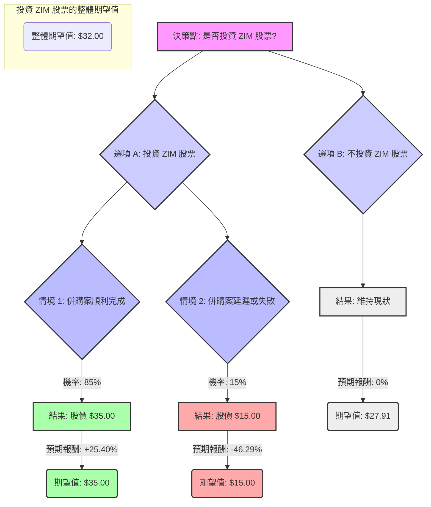

根據對 ZIM Integrated Shipping Services Ltd. (ZIM) 的決策樹分析與期望值分析，並參考最新的市場資訊，評估如下：

### **核心假設**

1.  **併購案為核心驅動因素**：ZIM 已於 2026 年 2 月 17 日宣布與 Hapag-Lloyd 達成最終併購協議，Hapag-Lloyd 將以每股 35.00 美元的現金收購 ZIM。 這是目前評估 ZIM 投資價值最關鍵的因素。
2.  **當前股價**：截至 2026 年 3 月 3 日，ZIM 的收盤價約為 $27.91。
3.  **航運業基本面 (若併購失敗)**：
    *   **運力過剩**：2026 年全球貨櫃航運市場預計將面臨嚴重的運力過剩，新船交付量創歷史新高，運力增長將超過需求增長。
    *   **運費壓力**：市場基本面不利於航運公司，預計運費將在 2025 年剩餘時間和 2026 年持續下跌。全球平均即期運費預計在 2026 年全年下降 25%。
    *   **地緣政治風險**：紅海危機和荷姆茲海峽等地緣政治風險持續存在，增加了市場波動性。 雖然這可能導致航線繞道，吸收部分過剩運力，但整體而言，行業仍面臨挑戰。
    *   **ZIM 財務表現 (若併購失敗)**：ZIM 在 2025 年第三季度的每股盈餘 (EPS) 未達預期，分析師預計 2025 年第四季度將出現負 EPS (-$1.01)，且管理層預計 2026 年運費將持續承壓。

### **決策樹分析**

**1. 決策點：是否投資 ZIM 股票？**

*   **選項 A：投資 ZIM 股票**
    *   **情境 1：併購案順利完成 (高機率)**
        *   **預測情境名稱**：併購成功
        *   **機率 (Probability)**：85% (基於已簽署最終協議)
        *   **預期報酬 / 期望值 (Expected Value)**：
            *   股價達到併購價 $35.00。
            *   預期報酬率 = ($35.00 - $27.91) / $27.91 = 25.40%
            *   期望值 = $35.00
    *   **情境 2：併購案延遲或失敗 (低機率)**
        *   **預測情境名稱**：併購失敗，回歸基本面
        *   **機率 (Probability)**：15% (考慮到潛在的監管障礙或股東異議等風險)
        *   **預期報酬 / 期望值 (Expected Value)**：
            *   若併購失敗，ZIM 股價可能回歸其受行業逆風影響的基本面價值。分析師目標價 (併購前) 範圍較廣，從 $8.70 到 $21.00 不等，共識約為 $17.21。 考慮到行業的嚴峻挑戰和 ZIM 預計的負 EPS，我們保守估計股價可能跌至 $15.00。
            *   預期報酬率 = ($15.00 - $27.91) / $27.91 = -46.29%
            *   期望值 = $15.00

*   **選項 B：不投資 ZIM 股票**
    *   **預測情境名稱**：維持現金或投資其他標的
    *   **機率 (Probability)**：100%
    *   **預期報酬 / 期望值 (Expected Value)**：0% (不投入資金，因此報酬為零，但機會成本為當前股價 $27.91)

### **計算過程**

**投資 ZIM 股票的整體期望值 (EV_Invest)**：
EV_Invest = (情境 1 的機率 × 情境 1 的期望值) + (情境 2 的機率 × 情境 2 的期望值)
EV_Invest = (0.85 × $35.00) + (0.15 × $15.00)
EV_Invest = $29.75 + $2.25
**EV_Invest = $32.00**

**不投資 ZIM 股票的期望值 (EV_No_Invest)**：
EV_No_Invest = $27.91 (代表當前股價，作為不投資的基準點)

### **繪製完整的決策樹 (使用 Markdown)**

### **最終結論**

根據計算，投資 ZIM 股票的整體期望值為 **$32.00**。 由於此期望值高於 ZIM 當前的股價 ($27.91)，因此，**目前適合投資 ZIM 股票**。

**簡短理由：**

ZIM 已宣布與 Hapag-Lloyd 達成每股 $35.00 現金的併購協議。儘管貨櫃航運業面臨運力過剩和運費下跌的嚴峻挑戰，但由於併購案的確定性較高，投資者有機會從當前股價 ($27.91) 到併購價格 ($35.00) 之間獲取套利收益。 即使考慮到併購失敗的低機率風險，整體期望值仍為正向，顯示出潛在的投資價值。