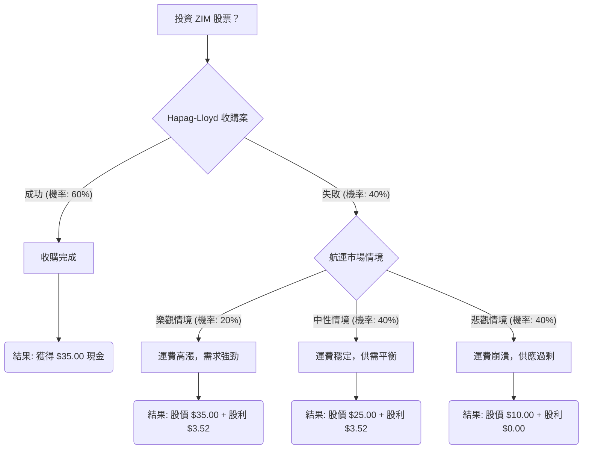

根據您提供的 ZIM 股票基本面數據，並結合最新的市場資訊、財報、產業趨勢及分析師預期，以下將透過決策樹分析與期望值分析，評估 ZIM 目前是否適合投資。

### **核心假設**

在進行決策樹分析前，我們需要建立以下核心假設：

*   **當前股價 (P0)**：$26.39 (來自您提供的數據)。
*   **時間範圍**：考量 Hapag-Lloyd 收購案預計於 2026 年底完成，以及市場情境的評估，我們將分析時間範圍設定為約 6-12 個月。
*   **Hapag-Lloyd 收購案**：ZIM 已同意 Hapag-Lloyd 以每股 $35.00 的現金價格收購。這是目前影響 ZIM 股價最關鍵的因素。
*   **股利政策**：ZIM 採浮動股利政策，目標是將淨利潤的 30% 至 50% 返還給股東。最近一次支付的季度股利為每股 $0.88 (於 2026 年 3 月 26 日支付)。由於航運業的週期性及高派息率 (2025 年 12 月為 1.08)，若收購失敗且市場惡化，股利可能大幅減少或取消。
*   **市場情境機率 (若收購失敗)**：
    *   **樂觀情境**：紅海危機持續，運費保持高位，全球貿易強勁復甦。
    *   **中性情境**：紅海局勢部分緩解，運費穩定在溫和水平，但船舶供應過剩壓力仍在。
    *   **悲觀情境**：紅海危機迅速解決，船舶嚴重供應過剩，運費崩潰，全球經濟放緩。

### **最新資訊補充與分析**

1.  **Hapag-Lloyd 收購案**：ZIM 已於 2026 年 2 月 17 日宣布同意 Hapag-Lloyd 以每股 $35.00 的現金價格收購，總交易金額約 $42 億美元，預計於 2026 年底完成。目前 ZIM 股價 ($26.39) 遠低於收購價，反映市場對交易完成存在不確定性。
2.  **2024 年財報 (於 2025 年 3 月 12 日發布)**：ZIM 在 2024 年實現顯著復甦，淨利潤達 $21.5 億美元 (2023 年虧損 $26.9 億美元)，總收入 $84.3 億美元 (年增 63%)。貨運量增長 14%，平均運費為每 TEU $1,888。這與您提供的基本面數據中負的 EPS 預期形成鮮明對比，表明您提供的 EPS 數據已過時。
3.  **2025 年展望 (於 2025 年 3 月 12 日發布)**：ZIM 預計 2025 年調整後 EBITDA 介於 $16 億至 $22 億美元，調整後 EBIT 介於 $3.5 億至 $9.5 億美元，此預期假設紅海貿易條件至少在 2025 年下半年之前不會正常化。
4.  **紅海危機影響**：紅海地區的衝突導致航運公司繞道好望角，增加了航程時間和運費，對 ZIM 的盈利能力產生了顯著的正面影響。ZIM 作為以色列航運公司，已完全避開蘇伊士運河。預計這種中斷將持續吸收過剩運力至 2025 年。
5.  **產業趨勢**：
    *   **運費**：2024 年運費因紅海中斷和提前出貨而上漲。預計將持續到 2025 年農曆新年，之後可能出現季節性下降。然而，一旦紅海危機解決，運費可能迅速下跌。
    *   **供應過剩**：由於新船交付和低報廢率，2025 年存在嚴重的運力過剩風險。預計 2025 年新交付的運力將增加 210 萬 TEU (佔總船隊的 6-7%)，超過約 2% 的需求增長。
    *   **分析師評級與目標價**：分析師對 ZIM 的評級普遍為「持有」或「賣出」。平均 12 個月目標價介於 $16.17 至 $25.90 之間，普遍低於當前股價，但最高目標價可達 $35.00-$36.75，最低目標價為 $8.70-$15.80。

### **決策樹分析**

**決策點：投資 ZIM 股票？**

*   **當前股價 (P0)**：$26.39

### **計算過程**

**1. 核心假設與情境機率：**

*   **收購成功機率 (P_close)**：60% (基於當前股價與收購價的折價，反映市場對交易完成的信心，此為假設值)
*   **收購失敗機率 (P_fail)**：40% (1 - P_close)

**2. 情境結果與期望值計算：**

*   **情境 1：Hapag-Lloyd 收購成功**
    *   **預測情境名稱**：收購完成
    *   **對應機率 (Probability)**：60%
    *   **預期報酬 (Outcome)**：每股 $35.00 (收購價)
    *   **期望值 (EV_close)**：P_close \* (Outcome - P0)
        *   EV_close = 0.60 \* ($35.00 - $26.39) = 0.60 \* $8.61 = **$5.166**

*   **情境 2：Hapag-Lloyd 收購失敗**
    *   **對應機率 (Probability)**：40%
    *   此情境進一步分為三個子情境：

        *   **子情境 2a：樂觀航運市場**
            *   **預測情境名稱**：運費高漲，需求強勁 (紅海危機持續)
            *   **對應機率 (Probability)**：20% (在收購失敗的 40% 中佔比)
            *   **預期股價 (FP_optimistic)**：$35.00 (參考分析師高目標價)
            *   **預期股利 (Div_optimistic)**：$0.88/股 \* 4 季 = $3.52 (假設當前季度股利可持續一年)
            *   **預期總價值 (FV_optimistic)**：$35.00 + $3.52 = $38.52
            *   **期望值 (EV_optimistic | fail)**：0.20 \* ($38.52 - $26.39) = 0.20 \* $12.13 = **$2.426**

        *   **子情境 2b：中性航運市場**
            *   **預測情境名稱**：運費穩定，供需平衡 (紅海局勢部分緩解，供應過剩壓力)
            *   **對應機率 (Probability)**：40% (在收購失敗的 40% 中佔比)
            *   **預期股價 (FP_neutral)**：$25.00 (參考分析師平均目標價)
            *   **預期股利 (Div_neutral)**：$0.88/股 \* 4 季 = $3.52 (假設當前季度股利可持續一年)
            *   **預期總價值 (FV_neutral)**：$25.00 + $3.52 = $28.52
            *   **期望值 (EV_neutral | fail)**：0.40 \* ($28.52 - $26.39) = 0.40 \* $2.13 = **$0.852**

        *   **子情境 2c：悲觀航運市場**
            *   **預測情境名稱**：運費崩潰，供應過剩 (紅海危機解決，嚴重供應過剩)
            *   **對應機率 (Probability)**：40% (在收購失敗的 40% 中佔比)
            *   **預期股價 (FP_pessimistic)**：$10.00 (參考分析師低目標價)
            *   **預期股利 (Div_pessimistic)**：$0.00 (假設股利取消，因盈利大幅下滑)
            *   **預期總價值 (FV_pessimistic)**：$10.00 + $0.00 = $10.00
            *   **期望值 (EV_pessimistic | fail)**：0.40 \* ($10.00 - $26.39) = 0.40 \* (-$16.39) = **-$6.556**

**3. 整體期望值 (Overall Expected Value)：**

*   **若收購失敗的總期望值 (EV_fail_total)**：
    *   EV_fail_total = (P_optimistic | fail \* FV_optimistic) + (P_neutral | fail \* FV_neutral) + (P_pessimistic | fail \* FV_pessimistic)
    *   EV_fail_total = (0.20 \* $38.52) + (0.40 \* $28.52) + (0.40 \* $10.00)
    *   EV_fail_total = $7.704 + $11.408 + $4.00 = $23.112
    *   **若收購失敗的每股預期損益**：$23.112 - $26.39 = -$3.278

*   **整體投資期望值 (EV_total)**：
    *   EV_total = (P_close \* (收購價 - P0)) + (P_fail \* (EV_fail_total - P0))
    *   EV_total = (0.60 \* ($35.00 - $26.39)) + (0.40 \* ($23.112 - $26.39))
    *   EV_total = (0.60 \* $8.61) + (0.40 \* (-$3.278))
    *   EV_total = $5.166 - $1.3112 = **$3.8548**

### **最終結論**

根據上述決策樹分析和期望值計算，投資 ZIM 股票的整體期望值為每股 **$3.8548**。這表示相對於當前股價 $26.39，預期每股有約 14.61% 的潛在收益 ($3.8548 / $26.39)。

**判斷：適合投資**

**理由：**

儘管航運業本身具有高度週期性和供應過剩的風險，且若收購失敗，市場情境可能導致股價下跌，但 Hapag-Lloyd 的現金收購要約 ($35.00/股) 為 ZIM 股票提供了一個明確的潛在上行空間和安全邊際。當前股價 ($26.39) 與收購價之間的顯著折價，使得這筆投資在收購成功的情況下具有吸引力的套利機會。即使考慮到收購失敗的風險，並且在悲觀市場情境下股價可能大幅下跌，但由於收購成功的較高機率 (假設 60%)，整體期望值仍為正值。因此，對於願意承擔收購失敗風險的投資者而言，ZIM 目前是適合投資的。

**重要提示：**
此分析基於當前可獲取的資訊和假設。實際投資涉及風險，市場情況和地緣政治事件可能迅速變化，影響 ZIM 的營運和股價。特別是收購案的完成仍需監管批准，存在不確定性。投資者應自行進行盡職調查並評估風險承受能力。