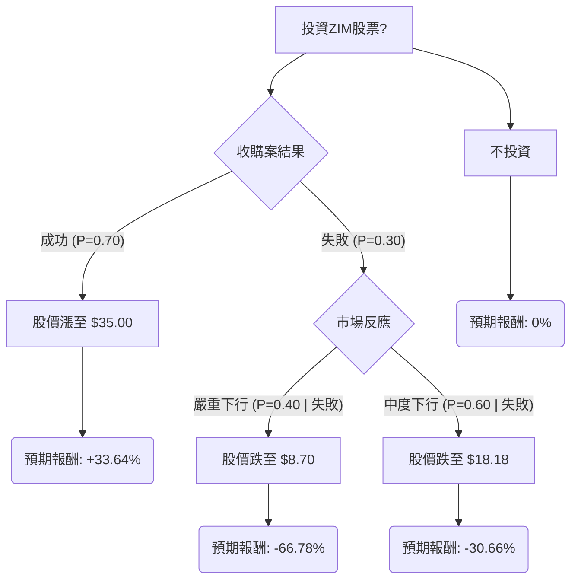

根據您提供的ZIM股票基本面數據，並結合最新的市場資訊、財報、產業趨勢及分析師評級，我們將使用決策樹分析和期望值分析來評估ZIM目前是否適合投資。

### 核心假設

在進行決策樹分析和期望值分析之前，我們需要建立以下核心假設：

1.  **收購案為主要驅動因素**：ZIM於2026年2月16日宣布將被Hapag-Lloyd以每股35.00美元現金收購，預計於2026年底完成。此收購案是目前評估ZIM投資價值最重要的因素。
2.  **收購成功機率**：大型收購案存在監管批准、股東同意等風險，但一旦宣布，通常成功機率較高。我們假設收購成功機率為70%。
3.  **收購失敗情境**：若收購案失敗，ZIM股價將回歸其基本面。根據分析師普遍看淡的評級、負向的EPS預期以及航運業的供過於求趨勢，基本面表現不佳。
4.  **股價預期**：
    *   **收購成功**：股價將達到收購價35.00美元。
    *   **收購失敗 - 嚴重下行**：股價可能跌至分析師最低目標價8.70美元。
    *   **收購失敗 - 中度下行**：股價可能跌至分析師平均目標價（排除收購溢價影響，取較悲觀的平均值）18.18美元。
5.  **投資時間範圍**：考量到收購案預計於2026年底完成，我們的評估時間範圍設定為約一年。
6.  **當前股價**：26.19美元。

### ZIM 最新資訊摘要

*   **收購案**：Hapag-Lloyd將以每股35.00美元現金收購ZIM，較宣布前股價有顯著溢價。
*   **2025年第四季度及全年財報 (2026年3月9日發布)**：
    *   2025年全年營收69.0億美元，較2024年下降18%。
    *   2025年全年淨利潤4.81億美元，較2024年的21.5億美元大幅下降。
    *   2025年第四季度營收14.8億美元，略低於分析師預期15.2億美元。
    *   2025年第四季度稀釋後每股收益0.32美元，優於分析師預期的虧損1.01美元，但非GAAP每股收益虧損0.58美元，略差於預期的虧損0.57美元。
    *   第四季度平均每TEU運費為1,333美元，同比下降29%。
    *   淨負債為29.2億美元，較2024年底略有增加。
    *   2025年全年股息總計每股1.99美元。
*   **分析師評級**：截至2026年3月，分析師對ZIM的共識評級多為「賣出」或「持有」，平均目標價介於16.17美元至25.90美元之間，普遍低於當前股價。最高目標價為31.80美元，最低為8.70美元。
*   **產業趨勢 (2026年)**：航運業面臨需求疲軟、運力過剩的挑戰，運費預計將趨於緩和。然而，港口擁堵、地緣政治風險、貿易政策變化和環境合規成本上升等因素仍將導致市場波動。

### 決策樹分析

**決策點：投資ZIM股票？** (當前股價 $26.19)

**節點說明與計算：**

*   **決策點 A：投資ZIM股票？**
    *   這是我們需要做出的主要決策。
*   **節點 B：收購案結果**
    *   **情境：收購成功**
        *   **預測情境名稱**：Hapag-Lloyd成功收購ZIM。
        *   **機率 (Probability)**：P(成功) = 70% (基於收購案已宣布且有明確價格)。
        *   **預期報酬計算**：
            *   股價上漲至 $35.00。
            *   報酬率 = ($35.00 - $26.19) / $26.19 = 0.3364 = 33.64%。
            *   期望值 = 0.70 * 33.64% = 23.55%。
    *   **情境：收購失敗**
        *   **預測情境名稱**：Hapag-Lloyd收購ZIM失敗。
        *   **機率 (Probability)**：P(失敗) = 1 - P(成功) = 1 - 0.70 = 30%。
        *   此情境進一步分為兩種市場反應。
*   **節點 D：市場反應 (若收購失敗)**
    *   **情境：嚴重下行**
        *   **預測情境名稱**：收購失敗且市場對ZIM基本面極度悲觀。
        *   **機率 (Probability)**：P(嚴重下行 | 失敗) = 40%。
            *   整體機率 = P(失敗) * P(嚴重下行 | 失敗) = 0.30 * 0.40 = 0.12 = 12%。
        *   **預期報酬計算**：
            *   股價跌至分析師最低目標價 $8.70。
            *   報酬率 = ($8.70 - $26.19) / $26.19 = -0.6678 = -66.78%。
            *   期望值 = 0.12 * (-66.78%) = -8.01%。
    *   **情境：中度下行**
        *   **預測情境名稱**：收購失敗但市場對ZIM基本面反應中度悲觀。
        *   **機率 (Probability)**：P(中度下行 | 失敗) = 60%。
            *   整體機率 = P(失敗) * P(中度下行 | 失敗) = 0.30 * 0.60 = 0.18 = 18%。
        *   **預期報酬計算**：
            *   股價跌至分析師平均目標價 $18.18。
            *   報酬率 = ($18.18 - $26.19) / $26.19 = -0.3066 = -30.66%。
            *   期望值 = 0.18 * (-30.66%) = -5.52%。
*   **節點 G：不投資**
    *   **預測情境名稱**：維持現金或投資無風險資產。
    *   **機率 (Probability)**：100%。
    *   **預期報酬**：0% (為簡化比較，不考慮無風險利率)。

### 期望值分析 (Expected Value Analysis)

**投資ZIM股票的總期望值 (Expected Value of Investing in ZIM):**

總期望值 = (收購成功期望值) + (收購失敗 - 嚴重下行期望值) + (收購失敗 - 中度下行期望值)
總期望值 = (0.70 * 33.64%) + (0.12 * -66.78%) + (0.18 * -30.66%)
總期望值 = 23.55% - 8.01% - 5.52%
**總期望值 = 10.02%**

**不投資的總期望值：**

總期望值 = 0%

### 最終結論

根據上述決策樹分析和期望值分析，投資ZIM股票的整體期望報酬率為 **10.02%**。

**判斷：適合投資**

**簡短理由：**
儘管ZIM的基本面數據（如負向的EPS預期、營收和利潤下降、航運業的運力過剩）顯示出挑戰，且分析師普遍給予「賣出」或「持有」的評級，但Hapag-Lloyd以每股35.00美元現金收購ZIM的公告，為投資者提供了一個明確的潛在上行空間。 考慮到當前股價為26.19美元，若收購案成功，存在約33.64%的報酬率。即使考慮到收購失敗的風險及其可能導致的股價下跌，整體期望值仍為正向的10.02%。這表明，在當前股價下，投資ZIM作為一個套利機會（merger arbitrage）或基於收購案成功的預期，是具有吸引力的。然而，投資者應充分意識到收購案失敗的風險，這將導致顯著的虧損。