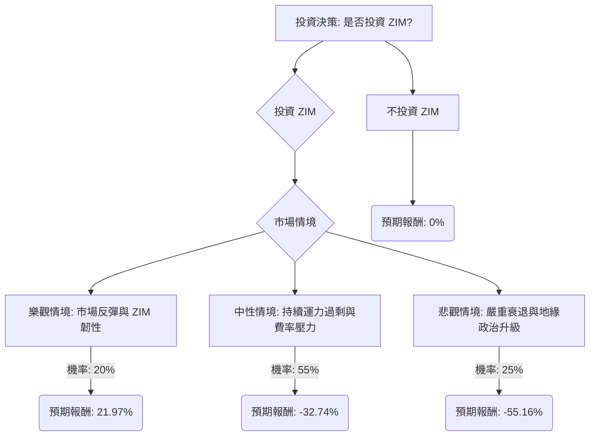

根據對美股公司 ZIM 的基本面數據、最新新聞、財報、市場動態及產業趨勢的綜合分析，並運用決策樹分析與期望值分析，評估 ZIM 目前是否適合投資。

### 核心假設

本次分析基於以下核心假設：

*   **市場趨勢 (2026)**：
    *   **運力過剩**：全球貨櫃航運市場預計在 2026 年將面臨嚴重的運力過剩。新船交付量將持續增加，預計全球船隊運力將增長 3.6% 至 5%，而貨運需求增長僅為 1.7% 至 3%。這種供需失衡將對運費構成持續的下行壓力。
    *   **運費下降**：分析師普遍預計 2026 年現貨運費將大幅下降 25% 至 35%，長期合約運費也將下降約 10%。儘管航運公司可能透過空班、慢速航行等方式管理運力以支撐費率，但整體趨勢仍為下降。
    *   **紅海危機**：紅海地區的地緣政治不穩定和政策風險將持續存在。紅海航線的潛在恢復將減少「噸英里」需求，進一步增加有效運力並壓低運費。ZIM 作為一家以色列公司，可能面臨額外的風險或更高的保險成本，即使其他國際航運公司恢復正常航行。
    *   **營運成本上升**：國際海事組織 (IMO) 的「淨零排放」框架預計將在中期內增加航運公司的營運成本。
    *   **美國補庫存**：存在美國大規模補庫存的可能性，這可能在短期內推動貨櫃需求增長超過 4%，為市場帶來潛在的利好。
*   **公司財務 (ZIM)**：
    *   **近期業績下滑**：ZIM 在 2025 年第三季度報告了營收、淨利潤和每 TEU 平均運費的顯著同比下降。
    *   **2026 年預期虧損**：分析師普遍預計 ZIM 在 2026 年將出現負每股盈餘 (EPS)，平均預測為每股虧損 2.00 美元或總計虧損 4.6 億美元。
    *   **股價目標**：分析師對 ZIM 的平均一年期目標價約為 15.60 美元，較當前股價存在約 28.8% 的下行空間。
    *   **收購不確定性**：ZIM 正在進行出售程序，並吸引了主要航運公司的興趣。然而，以色列公司管理局已警告稱，國家有權反對任何可能影響國家利益的重大股權轉讓（超過 24%），這為收購結果增加了不確定性。
    *   **資產負債表**：截至 2025 年 9 月 30 日，ZIM 擁有 30.1 億美元的現金頭寸，淨債務降至 26.4 億美元。然而，其負債權益比 (Debt/Eq) 為 1.41，相對較高。

### 決策樹分析

我們將評估投資 ZIM 的決策，並考慮三種未來情境：樂觀、中性、悲觀。

**當前股價 (Close):** $22.30

### 計算過程

**1. 樂觀情境 (Optimistic Scenario)**
*   **情境名稱**：市場反彈與 ZIM 韌性
*   **核心假設**：全球經濟增長強於預期，美國庫存顯著回補，紅海局勢穩定且對 ZIM 影響不大，航運公司成功管理運力，ZIM 的輕資產模式展現靈活性，且戰略審查帶來有利結果（例如以溢價被收購）。
*   **預期股價**：假設股價回升至 $27.00。
*   **預期股息**：假設支付少量股息 $0.20。
*   **預期報酬 (Expected Return)**：
    (($27.00 - $22.30) + $0.20) / $22.30 = ($4.70 + $0.20) / $22.30 = $4.90 / $22.30 = **21.97%**
*   **機率 (Probability)**：20%

**2. 中性情境 (Neutral Scenario)**
*   **情境名稱**：持續運力過剩與費率壓力
*   **核心假設**：貨櫃航運業面臨顯著運力過剩，新船交付導致運費持續下降。需求增長溫和 (1.7-3%)。紅海局勢持續不穩定，ZIM 繼續面臨改道和較高成本。ZIM 在 2026 年預計虧損。戰略審查進展緩慢或未達成收購。
*   **預期股價**：假設股價跌至分析師平均目標價附近，約 $15.00。
*   **預期股息**：預計不支付股息（因預期虧損）。
*   **預期報酬 (Expected Return)**：
    (($15.00 - $22.30) + $0.00) / $22.30 = -$7.30 / $22.30 = **-32.74%**
*   **機率 (Probability)**：55%

**3. 悲觀情境 (Pessimistic Scenario)**
*   **情境名稱**：嚴重衰退與地緣政治升級
*   **核心假設**：全球經濟陷入衰退或顯著放緩。運力過剩導致激烈的價格戰，運費跌破盈虧平衡點。紅海危機升級，ZIM 作為以色列公司受到嚴重影響或面臨高昂成本/風險。IMO 法規大幅增加營運成本且無法轉嫁。戰略審查完全失敗，或以色列政府阻止有利的出售。
*   **預期股價**：假設股價跌至或低於 52 週低點，約 $10.00。
*   **預期股息**：預計不支付股息。
*   **預期報酬 (Expected Return)**：
    (($10.00 - $22.30) + $0.00) / $22.30 = -$12.30 / $22.30 = **-55.16%**
*   **機率 (Probability)**：25%

**期望值分析 (Expected Value Analysis)**

計算投資 ZIM 的整體期望值：

期望值 (Invest in ZIM) = (樂觀情境機率 × 樂觀情境報酬) + (中性情境機率 × 中性情境報酬) + (悲觀情境機率 × 悲觀情境報酬)

期望值 (Invest in ZIM) = (0.20 × 0.2197) + (0.55 × -0.3274) + (0.25 × -0.5516)
期望值 (Invest in ZIM) = 0.04394 + (-0.18007) + (-0.1379)
期望值 (Invest in ZIM) = 0.04394 - 0.18007 - 0.1379
期望值 (Invest in ZIM) = **-0.27403**

因此，投資 ZIM 的整體期望值約為 **-27.40%**。

### 最終結論

根據上述決策樹分析和期望值計算，美股公司 ZIM **不適合投資**。

**簡短理由**：
ZIM 的整體期望報酬為負 27.40%，這表明在未來一年內，投資 ZIM 的預期損失遠大於預期收益。儘管存在樂觀情境下的潛在正報酬，但中性和悲觀情境的機率更高，且其預期損失幅度顯著。航運業在 2026 年面臨嚴重的運力過剩、運費下降以及地緣政治風險（特別是紅海危機對 ZIM 的影響），加上分析師普遍預期 ZIM 將在 2026 年出現虧損，這些因素共同導致了負面的投資前景。