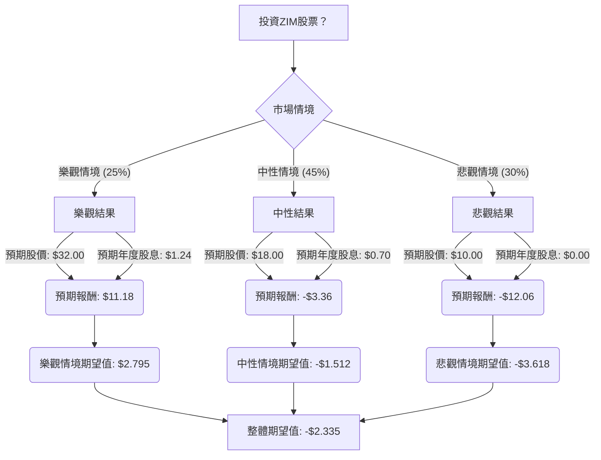

根據您提供的ZIM基本面數據以及透過網路搜尋獲得的最新資訊，我們將使用決策樹分析和期望值分析來評估ZIM目前是否適合投資。

### **核心假設 (Core Assumptions)**

在進行決策樹分析之前，我們基於ZIM的最新財報、市場動態和產業趨勢，建立以下核心假設：

*   **市場趨勢：**
    *   **運費率波動劇烈：** 貨櫃航運業的運費率在2024年因紅海危機而獲得提振，但預計在2025年下半年至2026年將面臨顯著下降壓力。全球平均現貨運價預計在2026年全年下跌25%，長期合約運價下跌10%。
    *   **運力過剩：** 2026年新船訂單量創紀錄，預計船隊增長3.6%，加上現有過剩運力，將對運費率構成下行壓力。
    *   **紅海危機影響：** 紅海危機的持續時間和解決方式是關鍵變數。若危機持續，將支撐運費率；若迅速解決，將導致運力回歸，加劇運力過剩。
    *   **全球貿易需求：** 2026年全球貨櫃航運需求預計增長1.7%至3.5%之間，但美國進口可能因關稅影響而萎縮2%。
*   **財務狀況：**
    *   **盈利能力下降：** ZIM在2025年第三季度的淨收入和平均運費率較2024年同期大幅下降。分析師普遍預期ZIM在2025年第四季度可能出現EBIT虧損和負的每股盈餘。
    *   **高槓桿：** ZIM的總債務為56.6億美元，資產負債率（Debt/Eq）為1.41，對運費率的波動高度敏感。
    *   **股息政策：** ZIM的股息政策具有高度彈性，過去曾有高額派息，但近期季度股息已調整至0.31美元。未來股息將取決於盈利能力和現金流。
    *   **船隊現代化：** ZIM已完成船隊轉型，50%為新造船，40%為LNG動力船，有助於提高燃油效率和成本效益。公司也保有靈活調整運力的選項。
*   **分析師評級：**
    *   截至2026年1月22日，分析師對ZIM的平均評級為「減持」（Reduce），一年期平均目標價為15.13美元，顯著低於當前股價（約22.06美元）。

### **決策樹分析 (Decision Tree Analysis)**

**決策點：投資ZIM股票？**
*   **當前股價 (Current Stock Price):** $22.06

**節點說明與計算過程：**

1.  **決策點：投資ZIM股票？**
    *   這是投資者面臨的初始決策。

2.  **市場情境 (Market Scenarios)**
    *   **樂觀情境 (Optimistic Scenario)**
        *   **預測情境名稱：** 紅海危機持續，運費率維持高位，全球貿易需求強勁。ZIM憑藉其現代化船隊和靈活的運力管理，抓住市場機遇，實現良好盈利。
        *   **對應的機率 (Probability)：** 25%
        *   **預期股價 (Expected Price)：** $32.00 (基於歷史高點和AI預測上限，考慮到運費率維持高位)
        *   **預期年度股息 (Expected Annual Dividend)：** $1.24 (基於近期公告的年度化股息)
        *   **預期報酬 (Expected Return)：** ($32.00 - $22.06) + $1.24 = $9.94 (股價增值) + $1.24 (股息) = **$11.18**
        *   **期望值 (Expected Value)：** $11.18 * 0.25 = **$2.795**

    *   **中性情境 (Neutral Scenario)**
        *   **預測情境名稱：** 紅海危機逐步緩解，運費率溫和下降。全球貿易需求溫和增長，符合預期。市場運力過剩壓力存在，但ZIM的營運效率和航線策略部分抵消負面影響，盈利能力從高峰回落但仍保持正數。
        *   **對應的機率 (Probability)：** 45%
        *   **預期股價 (Expected Price)：** $18.00 (介於當前價格與分析師目標價之間，考慮到運費率下降但仍有一定支撐)
        *   **預期年度股息 (Expected Annual Dividend)：** $0.70 (假設股息因盈利下降而減少)
        *   **預期報酬 (Expected Return)：** ($18.00 - $22.06) + $0.70 = -$4.06 (股價貶值) + $0.70 (股息) = **-$3.36**
        *   **期望值 (Expected Value)：** -$3.36 * 0.45 = **-$1.512**

    *   **悲觀情境 (Pessimistic Scenario)**
        *   **預測情境名稱：** 紅海危機完全解決，導致運力迅速回歸市場，運費率大幅崩跌，甚至低於紅海危機前水平。全球貿易需求疲軟，主要市場（如美國進口）可能萎縮。ZIM因高槓桿和對現貨運價的依賴而面臨嚴重虧損，甚至可能出現負EPS。
        *   **對應的機率 (Probability)：** 30%
        *   **預期股價 (Expected Price)：** $10.00 (接近52週低點，並考慮到分析師的悲觀預期和歷史低位)
        *   **預期年度股息 (Expected Annual Dividend)：** $0.00 (假設公司為保留現金而暫停派息)
        *   **預期報酬 (Expected Return)：** ($10.00 - $22.06) + $0.00 = -$12.06 (股價貶值) + $0.00 (股息) = **-$12.06**
        *   **期望值 (Expected Value)：** -$12.06 * 0.30 = **-$3.618**

3.  **整體期望值 (Overall Expected Value)**
    *   **計算方式：** 將所有情境的期望值加總。
    *   **整體期望值 =** $2.795 (樂觀) + (-$1.512) (中性) + (-$3.618) (悲觀) = **-$2.335**

### **最終結論 (Final Conclusion)**

根據上述決策樹分析和期望值計算，投資ZIM股票的**整體期望值為 -$2.335**。

**判斷：不適合投資**

**簡短理由：**
ZIM股票的整體期望值為負數，這表示根據當前的市場資訊、產業趨勢和對未來情境的假設，投資ZIM預期將帶來負回報。儘管紅海危機在短期內可能支撐運費率，但長期來看，貨櫃航運業面臨嚴重的運力過剩問題和運費率下跌的壓力。分析師普遍給予「減持」評級，且目標價顯著低於當前股價。ZIM的高槓桿特性也使其在運費率下行週期中面臨較高的財務風險。因此，目前ZIM股票不適合投資。