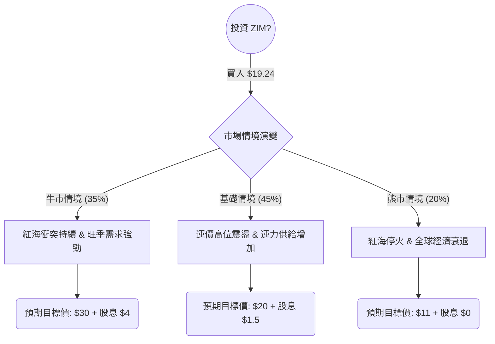

這份分析報告針對 **ZIM (ZIM Integrated Shipping Services Ltd.)** 進行。我們將結合你提供的基本面數據，以及最新的市場動態（如紅海危機、運價走勢、Q1 財報）進行「決策樹」與「期望值」分析。

---

### 一、 現況分析與核心假設

在進入決策樹前，我們必須釐清 ZIM 當前的營運背景：

1.  **紅海危機與運價 (SCFI/WCI)：** ZIM 的航線高度集中於現貨市場（Spot Market）。由於紅海衝突迫使船隻繞道好望角，大幅吸收了全球運力供給，導致運價在 2024 年上半年意外大漲。
2.  **2024 Q1 財報轉虧為盈：** ZIM 最新財報顯示淨利潤達 9,200 萬美元（EPS 0.75），並恢復派發股息（每股 0.23 美元）。
3.  **高槓桿與新船交付：** ZIM 採取輕資產模式（多為租賃船），在運價低迷時成本壓力極大，但近期大量新造的高效能液化天然氣（LNG）動力船交付，有助於降低單位成本。
4.  **空單比例 (Short Float)：** 目前空單佔比約 18.77%，處於高位，若利多消息出現，容易觸發軋空（Short Squeeze）。

---

### 二、 決策樹分析 (Decision Tree)

我們預測未來 6-12 個月的投資報酬，設定三種情境：

#### 節點詳細數據：

| 情境 | 機率 (P) | 預期股價 + 預期股息 (Outcome) | 預期報酬率 | 期望值 (P * Outcome) |
| :--- | :--- | :--- | :--- | :--- |
| **牛市 (Bull Case)** | 35% | $34.00 ($30 + $4) | +76.7% | $11.90 |
| **基礎 (Neutral Case)** | 45% | $21.50 ($20 + $1.5) | +11.7% | $9.68 |
| **熊市 (Bear Case)** | 20% | $11.00 ($11 + $0) | -42.8% | $2.20 |
| **總計 (EV)** | **100%** | **加權平均預期價值** | **+23.6%** | **$23.78** |

---

### 三、 計算過程與核心假設

#### 1. 期望值 (Expected Value, EV) 計算：
*   $EV = (0.35 \times 34.00) + (0.45 \times 21.50) + (0.20 \times 11.00)$
*   $EV = 11.90 + 9.675 + 2.20 = 23.775$
*   **預期溢價比：** $(23.78 - 19.24) / 19.24 = 23.6\%$

#### 2. 核心假設說明：

*   **牛市情境 (35%)：** 假設中東地緣政治緊張持續至 2024 年底，且美國經濟維持強韌，帶動聖誕節前補貨潮。ZIM 因現貨市場曝險高，其 EPS 將隨運價暴漲，預期全年 EPS 可達 $8-10，依其配息政策（淨利 30-50%），股息將非常可觀。
*   **基礎情境 (45%)：** 運價受繞道影響維持在盈虧平衡點以上，但隨著新船不斷交付，運力過剩壓力部分抵銷漲幅。ZIM 維持小幅盈利，股價在 $20 附近波動（接近淨值 P/B 0.58 調整後之價值）。
*   **熊市情境 (20%)：** 若紅海突然達成停火，蘇伊士運河恢復通行，全球運力瞬間過剩 20-30%。ZIM 租賃船成本固定且高昂，將迅速轉為嚴重虧損，股價可能回測 52 週低點（約 $11）。

---

### 四、 最終結論

#### **評估結果：適合投資（偏向投機性參與）**

**判定理由：**
1.  **期望值為正：** 經過機率加權後的期望值為 **$23.78**，較目前股價 $19.24 有約 **23.6%** 的上漲空間。
2.  **估值極低：** P/B 僅 0.58，顯示股價仍低於清算價值。即便在最壞情況下，下行空間雖大（-42%），但被牛市情境的高爆發力（+76%）所覆蓋。
3.  **技術面與籌碼面支撐：** SMA50 (0.1567) 與 SMA200 (0.2117) 均呈現黃金交叉向上，且高空單比例提供了潛在的「軋空」動能。
4.  **股利政策誘導：** ZIM 的配息特性屬於「有賺錢就大方分」，這對尋求高收益的投資者具有強烈吸引力，會在盈餘確認時推升股價。

**風險提示：**
ZIM 是一隻 **「高 Beta、高槓桿、高波動」** 的股票。此投資結論高度依賴**運價（SCFI 指數）**與**地緣政治狀況**。若讀者無法承擔 30% 以上的短期回撤，建議縮小部位或選擇更穩定的權重股。

**建議策略：**
分批進場，並密切關注「上海出口集裝箱運價指數 (SCFI)」與「中東停火協議進度」。若 SCFI 開始連續三週下跌，需重新評估決策樹之機率分配。