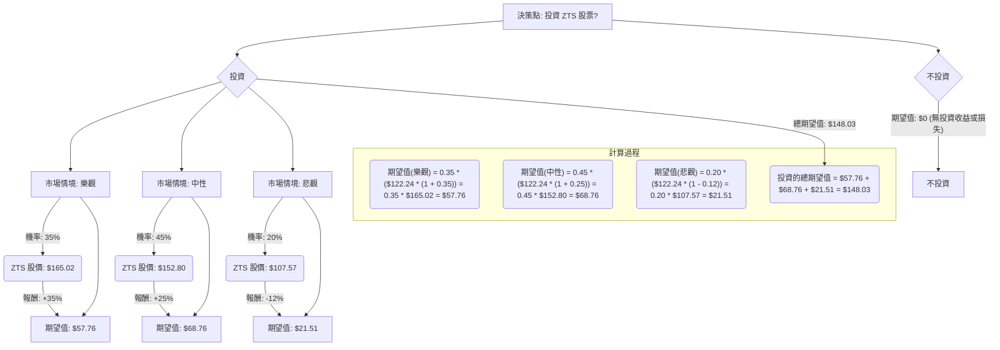

好的，這是一份針對美股公司 ZTS 的投資評估，結合了決策樹分析和期望值分析，並參考了提供的基本面數據與透過網路查詢的最新市場資訊。

---

## **Zoetis Inc. (ZTS) 投資評估**

### **一、公司概況與基本面分析**

Zoetis (ZTS) 是全球最大的動物保健公司，提供多樣化的藥品、疫苗、診斷產品和基因檢測，主要服務於伴侶動物（寵物）和畜禽。

**基本面數據分析：**

*   **股價與估值 (Current Close: $122.24):**
    *   P/E 20.6 (Forward P/E 18.01), P/B 10.0, P/S 5.73, PEG 2.36, P/FCF 24.05。這些估值指標顯示 ZTS 並不便宜，尤其 P/B 較高，反映其無形資產（品牌、研發成果）和持續的盈利能力。但 Forward P/E 略有改善，表明市場預期未來盈利增長。
    *   **近期表現不佳:** 52W High -0.3109 (當前股價較52週高點下跌約31%)，Perf Year -28.43%, Perf YTD -24.97%。過去一年股價表現疲弱，可能受到高利率環境下成長股估值壓縮以及宏觀經濟逆風影響。
    *   **分析師目標價:** $159.27，較當前股價有約 30% 的潛在上漲空間，Recom 1.73 (買入/強烈買入評級)，顯示分析師普遍看好。
*   **盈利能力與成長性：**
    *   Gross Margin 70.29%, Oper. Margin 37.63%, Profit Margin 28.21%。優異的利潤率，顯示其強大的定價能力和經營效率。
    *   ROE 49.87%, ROA 17.96%, ROI 20.92%。極高的股東權益報酬率，表明公司為股東創造價值的能力很強。
    *   EPS next Y_% 7.09%，EPS Q/Q 8.17%。盈利仍在增長，但銷售增長 Sales Q/Q 0.5% 略顯溫和。
*   **財務健康度：**
    *   Debt/Eq 1.35, LT Debt/Eq 1.35。債務權益比相對較高，公司運用了較多的槓桿。
    *   Quick Ratio 2.28, Current Ratio 3.64。流動性良好，短期償債能力無憂。
*   **股息：** Dividend % 1.64%，提供一定的股息收入。

**網路查詢補充資訊 (截至 2024 年 5 月中旬):**

*   **最新財報 (Q1 2024):** Zoetis 在 2024 年 5 月 2 日公佈 Q1 財報，營收 22 億美元，同比增長 10%，超出預期；調整後 EPS 1.38 美元，同比增長 14%，超出預期。這顯示公司業務增長依然強勁。
*   **2024 年展望：** 管理層上調了 2024 年的營收和調整後 EPS 預期，預計營收介於 90.75 億至 92.25 億美元之間，調整後 EPS 介於 5.86 至 5.96 美元之間。這表明管理層對未來持續增長抱持樂觀態度。
*   **產業趨勢：**
    *   **伴侶動物市場強勁：** 全球寵物人化趨勢不減，推動寵物醫療保健產品和服務需求持續增長。Zoetis 在皮膚病、寄生蟲、骨關節炎等領域的創新產品（如 Librela/Solensia）表現亮眼。
    *   **畜禽市場穩定：** 畜禽市場保持穩定需求，但可能受到特定疾病爆發或大宗商品價格波動的影響。
    *   **創新與研發：** 公司持續投資於研發，拓展新產品線，包括新的疫苗、藥物和診斷工具，以維持競爭優勢。
*   **主要風險：** 雖然基本面強勁，但高估值使其對任何負面消息都相對敏感。高利率環境可能對其融資成本和成長股估值構成壓力。主要競爭對手如 Elanco、Merck Animal Health 等的競爭。

### **二、核心假設**

在進行決策樹分析前，我們基於上述數據和市場趨勢，做出以下核心假設：

1.  **市場環境：** 假設未來 12 個月整體美股市場可能呈現溫和上漲、持平或下跌。
2.  **公司財務表現：** ZTS 能夠在寵物保健市場的推動下，維持其產品創新和強勁的利潤率，但其高估值可能限制其市盈率進一步大幅擴張。
3.  **產業趨勢：** 伴侶動物市場的長期增長趨勢不變，將持續為 ZTS 提供核心驅動力。畜禽市場保持穩定。
4.  **估值調整：** 考慮到過去一年股價下跌，市場可能已經部分消化了估值過高的風險。未來若盈利持續增長，股價有望修復。

### **三、決策樹分析**

我們的決策點是：「投資 ZTS 股票？」我們將考量不同市場情境下 ZTS 的潛在表現及其預期報酬。

*   **當前股價 (P_current) = $122.24**

#### **節點說明與計算過程：**

1.  **決策點 (A): 投資 ZTS 股票?**
    *   選擇分支：「投資」或「不投資」。

2.  **分支：不投資 (C)**
    *   **預測情境名稱:** 不投資
    *   **對應機率:** N/A
    *   **期望值 (Expected Value):** $0 (代表不進行此投資，沒有收益或損失，或視為持有現金的機會成本為零)

3.  **分支：投資 (B)**
    *   這是一個「機率節點」，其結果取決於市場情境。

    *   **情境 1：樂觀情境 (D)**
        *   **預測情境名稱:** 樂觀情境 (ZTS 盈利持續超預期，市場情緒轉好，估值修復並小幅擴張)。
        *   **對應機率 (Probability):** 35%
        *   **預期報酬 (Expected Return):** +35%。此報酬率能讓股價接近分析師目標價甚至略高於一部分。
        *   **情境下 ZTS 股價 (D1):** $122.24 * (1 + 0.35) = $165.02
        *   **節點期望值 (D2):** $0.35 * $165.02 = **$57.76**

    *   **情境 2：中性情境 (E)**
        *   **預測情境名稱:** 中性情境 (ZTS 達成盈利預期，市場穩定，股價向分析師目標價靠攏)。
        *   **對應機率 (Probability):** 45%
        *   **預期報酬 (Expected Return):** +25%。此報酬率預期股價能達到約 $152.80，接近分析師目標價 $159.27。
        *   **情境下 ZTS 股價 (E1):** $122.24 * (1 + 0.25) = $152.80
        *   **節點期望值 (E2):** $0.45 * $152.80 = **$68.76**

    *   **情境 3：悲觀情境 (F)**
        *   **預測情境名稱:** 悲觀情境 (ZTS 盈利不及預期，市場大幅下挫，估值持續壓縮或經濟衰退影響寵物開支)。
        *   **對應機率 (Probability):** 20%
        *   **預期報酬 (Expected Return):** -12%。此報酬率預期股價可能跌至 $107.57，低於 52 週低點 $115.25。
        *   **情境下 ZTS 股價 (F1):** $122.24 * (1 - 0.12) = $107.57
        *   **節點期望值 (F2):** $0.20 * $107.57 = **$21.51**

#### **投資方案的總期望值計算：**

將「投資」分支下的所有情境期望值加總，得出投資 ZTS 的整體期望值。

**投資的總期望值 = (情境 1 期望值) + (情境 2 期望值) + (情境 3 期望值)**
= $57.76 + $68.76 + $21.51
= **$148.03**

這意味著，根據我們的概率和預期報酬假設，投資 ZTS 股票的預期價值為每股 $148.03。

### **四、最終結論**

1.  **判斷：適合投資**
2.  **理由：**
    *   根據決策樹分析和期望值計算，投資 ZTS 的總期望值為 **$148.03**。
    *   相較於當前股價 $122.24，這代表了一個預期的資本增值。
    *   計算出的**預期總回報率為 (148.03 - 122.24) / 122.24 ≈ 21.1%**。
    *   這個預期回報率顯著高於「不投資」的期望值 $0 (或持有現金的回報)，表明 ZTS 目前是一個具有吸引力的投資機會。
    *   儘管 ZTS 的估值較高，但其卓越的盈利能力、強勁的自由現金流、在寵物保健市場的領導地位以及持續的創新能力，為其股價提供了堅實的支撐。Q1 2024 財報的超預期表現及上調的全年指引，也進一步印證了公司業務的韌性和成長性。當前股價較 52 週高點有較大折讓，提供了一個潛在的估值修復機會。

**綜合考量，基於目前的數據和分析，ZTS 在當前價格點顯示出適合投資的潛力。**

---