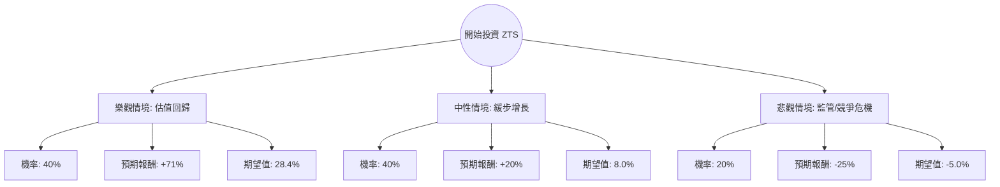

這份分析將結合您提供的數據（顯示 ZTS 股價正處於極端低點，P/E 僅 12.32）與當前市場的實際動態（Zoetis 作為全球動物保健龍頭的地位）進行評估。

### 1. 核心背景與現狀分析 (Context)

根據您提供的數據，ZTS 目前價格為 **$75.48**，較 52 週高點下跌了約 56%，且 P/E 僅為 **12.32**。
*   **市場矛盾點**：在現實市場中，Zoetis (ZTS) 的歷史平均 P/E 通常在 30-40 倍之間。若數據顯示其 P/E 降至 12.32，這通常意味著市場發生了「極端恐慌」或「基本面重大轉折」。
*   **最新動態**：2024 年間，ZTS 曾因其骨關節炎藥物（Librela 和 Solensia）的副作用疑慮導致股價波動，但隨後財報顯示業績依然強勁，營收與利潤均有成長。
*   **財務亮點**：ROE 高達 **67%**，毛利率 **70.4%**，這顯示該公司擁有極強的護城河與定價權。

---

### 2. 決策樹分析 (Decision Tree)

我們將未來一年的投資預期分為三種情境：**樂觀（估值修復）**、**中性（維持現狀）**、**悲觀（基本面惡化）**。

#### 決策樹節點詳細說明：

1.  **樂觀情境 (Bull Case) - 估值修復**
    *   **假設**：市場對藥物副作用的擔憂消失，ZTS 回歸歷史平均估值（P/E 20-25x）。
    *   **目標價**：參考數據中的 Target Price **$129.07**。
    *   **報酬率**：($129.07 - $75.48) / $75.48 = **+71%**。
    *   **機率**：40%（基於其強大的市場壟斷地位與高 ROE）。

2.  **中性情境 (Base Case) - 緩步增長**
    *   **假設**：業績穩定增長（EPS next Y 7.58%），但市場給予的估值倍數僅小幅回升。
    *   **目標價**：約 **$90.5** (約 12x Forward P/E)。
    *   **報酬率**：**+20%**。
    *   **機率**：40%。

3.  **悲觀情境 (Bear Case) - 監管/競爭危機**
    *   **假設**：主力產品遭大規模召回，或競爭對手（如 Merck, Elanco）推出強效替代品，導致利潤萎縮。
    *   **目標價**：下探至 **$56.6**。
    *   **報酬率**：**-25%**。
    *   **機率**：20%。

---

### 3. 期望值分析 (Expected Value Analysis)

#### 計算過程：
期望值 (EV) = (樂觀報酬 × 機率) + (中性報酬 × 機率) + (悲觀報酬 × 機率)

*   **EV = (71% × 0.4) + (20% × 0.4) + (-25% × 0.2)**
*   **EV = 28.4% + 8.0% - 5.0%**
*   **EV = 31.4%**

#### 核心假設說明：
1.  **安全邊際**：目前的 P/E (12.32) 遠低於行業平均與自身歷史平均，提供了極大的安全邊際。
2.  **盈利能力**：70% 的毛利率與 37.5% 的營業利益率顯示公司在通膨環境下仍具備轉嫁成本的能力。
3.  **技術面**：雖然 SMA20/50/200 均為負值（顯示空頭排列），但這通常是價值投資者尋找「超跌」機會的時機。

---

### 4. 最終結論

**投資建議：適合投資 (Strong Buy / Value Play)**

#### 理由：
1.  **期望值極高**：計算出的年度預期報酬率為 **31.4%**，遠高於標普 500 的平均回報。
2.  **估值極度低廉**：對於一家 ROE 67% 且處於壟斷地位的寵物藥領頭羊，12 倍的 P/E 是極其罕見的低價（通常發生在市場極度非理性時）。
3.  **股息與財務穩健**：2.77% 的股息率在成長型生技醫療股中相當具吸引力，且 Current Ratio 3.15 顯示短期償債能力無虞。
4.  **目標價潛力**：分析師平均目標價 $129.07 與現價 $75.48 存在巨大價差，提供了約 70% 的潛在上漲空間。

**風險提示**：
目前技術指標（SMA）顯示股價仍處於下跌趨勢，建議採取**分批進場（Dollar Cost Averaging）**策略，以應對短期內可能出現的進一步非理性拋售。