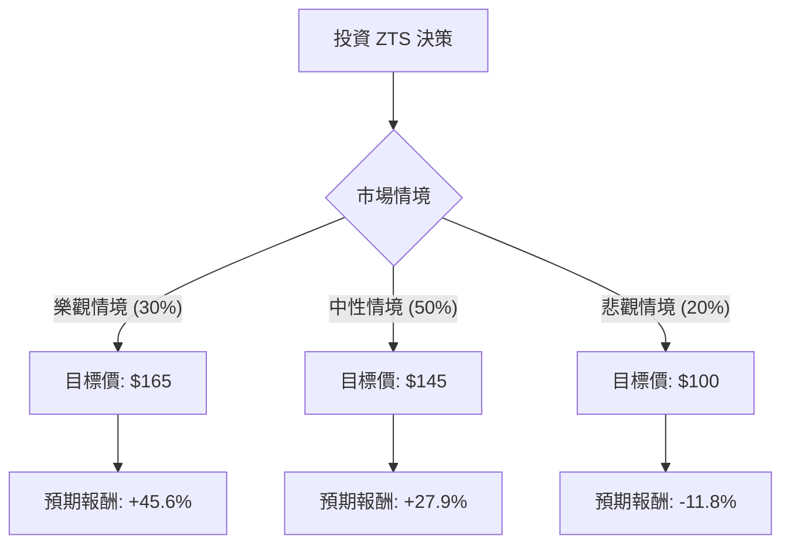

這份分析報告將結合您提供的數據與最新的市場動態（截至 2024 年第四季），利用**決策樹（Decision Tree）**與**期望值分析（Expected Value Analysis）**來評估 Zoetis (ZTS) 的投資價值。

---

### 1. 最新市場動態與背景分析 (Context)

在進入模型前，我們先整合最新資訊：
*   **基本面優勢**：ZTS 是全球動物保健龍頭，擁有極高的護城河。ROE 高達 66%，營業利益率 38%，顯示其極強的獲利能力與定價權。
*   **近期股價低迷原因**：股價處於 52 週低點（約 $113），主要受 Librela（犬用關節炎藥）副作用疑慮、高利率環境對高成長股的估值壓制，以及整體寵物消費支出放緩的擔憂影響。
*   **最新財報表現**：2024 年第三季財報顯示營收與利潤均超預期，且公司上調了全年指引。伴隨聯準會降息循環開啟，對 ZTS 這種高負債比（Debt/Eq 2.79）但現金流穩定的公司有利。
*   **估值水平**：目前 Forward P/E 約 15 倍，遠低於其歷史平均（約 30-35 倍），顯示估值已具備吸引力。

---

### 2. 決策樹分析 (Decision Tree)

我們預測未來一年的三種情境：**樂觀（牛市）**、**中性（基準）**、**悲觀（熊市）**。

#### 決策樹節點詳細說明：

| 節點 (情境) | 機率 (P) | 預測邏輯 | 預期股價 | 預期報酬率 (R) |
| :--- | :--- | :--- | :--- | :--- |
| **樂觀 (Bull)** | 30% | Librela 銷售爆發、降息超預期、估值修復至歷史均值。 | $165 | +45.6% |
| **中性 (Base)** | 50% | 業績穩定增長 8-10%、達到分析師平均目標價 ($149.73)。 | $145 | +27.9% |
| **悲觀 (Bear)** | 20% | 藥品監管風險增加、競爭加劇、宏觀經濟衰退導致寵物醫療支出下降。 | $100 | -11.8% |

---

### 3. 期望值分析 (Expected Value Analysis)

#### A. 核心假設
1.  **當前股價**：$113.35
2.  **持有期限**：12 個月。
3.  **股息收益**：1.79% (納入總報酬計算)。
4.  **估值修復**：假設中性情境下 P/E 回升至 20-22 倍。

#### B. 計算過程
期望值 (EV) = $\sum (機率 \times 預期報酬率)$

1.  **樂觀情境期望值**：$0.30 \times 45.6\% = 13.68\%$
2.  **中性情境期望值**：$0.50 \times 27.9\% = 13.95\%$
3.  **悲觀情境期望值**：$0.20 \times (-11.8\%) = -2.36\%$

**總預期報酬率 (Total EV)** = $13.68\% + 13.95\% - 2.36\% = \mathbf{25.27\%}$

加上股息收益 1.79%，**總期望回報率約為 27.06%**。

---

### 4. 綜合評估與最終結論

#### 數據亮點分析：
*   **安全邊際**：股價目前處於 52 週最低點（$113.30），且低於分析師平均目標價（$149.73）約 24%。
*   **財務體質**：ROE (66%) 與 Gross Margin (70.5%) 極其強悍，顯示公司在產業中具有壟斷性競爭力。
*   **技術面**：SMA20/50/200 均為負值，顯示短期趨勢仍弱，但這通常是價值投資者分批進場的機會。

#### 潛在風險：
*   **債務壓力**：Debt/Eq 2.79 偏高，需關注利息支出對淨利的侵蝕（雖然目前利息覆蓋倍數尚屬安全）。
*   **成長放緩**：EPS next Y 預期僅 7.73%，若未來無法維持雙位數增長，高 P/B (14.46) 可能面臨修正。

#### **最終結論：適合投資 (Suitable for Investment)**

**理由：**
1.  **期望值極高**：經風險加權後的預期報酬率高達 **25.27%**，遠高於市場平均水準。
2.  **估值處於歷史低位**：Forward P/E 15 倍對於一家擁有 70% 毛利率的產業龍頭而言，屬於「超跌」狀態。
3.  **下行風險有限**：股價已跌至 52 週低點，悲觀預期已大部分反映在股價中。
4.  **產業剛需**：寵物醫療屬於剛性需求，受經濟週期影響相對較小。

**建議策略：**
由於目前技術面（SMA）仍呈空頭排列，建議採取**分批進場（Dollar Cost Averaging）**策略，首批資金於 $113 附近建立基本倉位，若股價進一步下探至 $105-$110 區間則加碼。